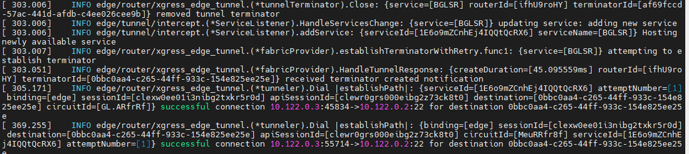

Use follwing setup to create the ziti network


Ziti controller configuration:

# 1- identities configuration: 
login to controller API in the path of ziti binary home directry:
```
./ziti edge login localhost:8441 
```
Create an identity for the open ziti clients and assign an attribute. I use "ubuntusg" for ubuntu tunneler and “ompc1” for window PC. We'll use this attribute when I'll configure the ssh service.
```
./ziti edge create identity user ompc1 -a window -o ompc1.jwt
./ziti edge create identity user ubuntusg -a ubuntu -o ubuntusg.jwt
```
Verification of Identity configuration:

```
root@OMSINCN:~/.ziti/quickstart/OMSINCN/ziti-bin/ziti-v0.27.5# ./ziti edge list identities
╭────────────┬─────────────────────┬────────┬────────────╮
│ ID         │ NAME                │ TYPE   │ ATTRIBUTES │
├────────────┼─────────────────────┼────────┼────────────┤
│ 2Be.AE7vjV │ ubuntusg            │ User   │ ubuntu     │
│ 8oY.X-0P3  │ Default Admin       │ User   │            │
│ Za3OWM7WjV │ sg-router           │ Router │ sgrouter   │
│ e7s-nE7vjV │ omwnd               │ User   │ ompc1      │
│ ifhU9roHY  │ bgl-router1         │ Router │ blrtr      │
│ rmVPzLyEc  │ OMSINCN-edge-router │ Router │            │
╰────────────┴─────────────────────┴────────┴────────────╯

```

Note: Admin type identities can access all the bind configuration without adding that identities into the dial policy. and user identities can access the only config that has assign the user into dial policy.

# Configuration of SSH service

2- Create the intercept.v1 and host.v1 configuration:

Create an intercept.v1 config. This config is used to instruct the client-side tunneler how to correctly intercept the targeted traffic and put it onto the overlay.

Create a host.v1 config. This config is used instruct the server-side tunneler how to offload the traffic from the overlay, back to the underlay.


BLR Host config
```
./ziti edge create config BLR-host-config host.v1 '{"protocol":"tcp", "address":"'"10.47.0.6"'", "port":22}'
```
BLR intercept config
```
./ziti edge create config BLR-intercept-config intercept.v1 '{"protocols": ["tcp"], "addresses": ["BLRCL.ziti"], "portRanges": [{"low": 22, "high": 22}]}'
```
SG host config
```
./ziti edge create config sghost.v1 host.v1 '{"protocol":"tcp", "address":"'"10.114.0.2"'", "port":22}'
```
sgintercept config
 
```
./ziti edge create config sgintercept intercept.v1 '{"protocols": ["tcp"], "addresses": ["sgclient.ziti"], "portRanges": [{"low": 22, "high": 22}]}'

```
Verification:
```
root@OMSINCN:~/.ziti/quickstart/OMSINCN/ziti-bin/ziti-v0.27.5# ./ziti edge list configs
╭────────────────────────┬──────────────────────┬──────────────╮
│ ID                     │ NAME                 │ CONFIG TYPE  │
├────────────────────────┼──────────────────────┼──────────────┤
│ 2gERkdMbLrkEjhLFvLfsg4 │ sghost.v1            │ host.v1      │
│ 2vPdGVT3vCH98l2JDJMIRx │ BLR-intercept-config │ intercept.v1 │
│ 4b58WogYO3gdX8M4pPE5zM │ BLR-host-config      │ host.v1      │
│ 6h7qQaAKKs94hBBYgAxwZe │ sgintercept          │ intercept.v1 │
╰────────────────────────┴──────────────────────┴──────────────╯
```
3- Services Configurations:

Create a service to associate the two configs created previously into a service. BGLSR use to create services for the BGL ER and server. SGRTRSR use to create the services for SG ER/ SG client.

```
./ziti edge create service BGLSR -c BLR-intercept-config,BLR-host-config -a blrrouter

./ziti edge create service SGRTRSR -c sgintercept,sghost.v1 -a sgrtrsr
```
Verification:
```
root@OMSINCN:~/.ziti/quickstart/OMSINCN/ziti-bin/ziti-v0.27.5# ./ziti edge list services
╭────────────────────────┬─────────┬────────────┬─────────────────────┬────────────╮
│ ID                     │ NAME    │ ENCRYPTION │ TERMINATOR STRATEGY │ ATTRIBUTES │
│                        │         │  REQUIRED  │                     │            │
├────────────────────────┼─────────┼────────────┼─────────────────────┼────────────┤
│ 1E6o9mZCnhEj4IQQtQcRX6 │ BGLSR   │ true       │ smartrouting        │ blrrouter  │
│ 5lJnz6KyrXx61IIOfLLBV5 │ SGRTRSR │ true       │ smartrouting        │ sgrtrsr    │
╰────────────────────────┴─────────┴────────────┴─────────────────────┴────────────╯
```

4- Dial and Bind Service policy:

Create a service policy for dial and bind the configurations. Its like same way as APPWAN doing in MOP. Bind policy will configured on hosting the services/server side configuration. In our case BLR ER act as bind services and SG router/ompc1/ubuntu tunneler acts as dial the bind services. If identities has admin type then they can access the all bind service policy without assigning into dial policy. If the identities has user/router type then we must have to assign thease identies into dial policy.


Following command with create the bind policy to bind the BLR server/10.47.0.5 using BLR ER(attributes blrtr)
```
./ziti edge create service-policy ssh.policy.bind Bind --service-roles '@BGLSR' --identity-roles "#blrtr"
```
Following command with create the bind policy to bind the SG ssh client/10.15.0.8  using SG ER(sgrtr) 10.15.0.6.
```
./ziti edge create service-policy sshsgbind Bind --service-roles '@SGRTRSR' --identity-roles "#sgrtr"
```
Following command with create the dial policy from SG ER(sgrouter)/ompc1 to dial the BLR server/10.47.0.5  to BLR ER.
```
./ziti edge create service-policy sshtoblrfromsgcl.dial Dial --service-roles '@BGLSR' --identity-roles "#sgrouter"
```
Following command will create the dial policy from ompc1 (window client to dial the Bangalore ssh server using Bangalore ER (BGLSR).
```
./ziti edge create service-policy sshtoblrfrompc.dial Dial --service-roles "@BGLSR" --identity-roles '#ompc1'
```
Following command will create the dial policy from ubuntu tunneler (ubuntusg)/BRL server/BLR ER (blrtr) to dial the SG ssh client using SG ER (SGRTRSR).

```
./ziti edge create service-policy sshtoblrfromtunneler.dial Dial --service-roles "@SGRTRSR" --identity-roles '@ubuntusg'
```
Verification:
```
root@OMSINCN:~/.ziti/quickstart/OMSINCN/ziti-bin/ziti-v0.27.5# ./ziti edge list service-policies
╭────────────────────────┬───────────────────────────┬──────────┬───────────────┬────────────────┬─────────────────────╮
│ ID                     │ NAME                      │ SEMANTIC │ SERVICE ROLES │ IDENTITY ROLES │ POSTURE CHECK ROLES │
├────────────────────────┼───────────────────────────┼──────────┼───────────────┼────────────────┼─────────────────────┤
│ 2a8yWpDXxo3j0um6Ea2kUL │ ssh.policy.bind           │ AllOf    │ @BGLSR        │ #blrtr         │                     │
│ 3me18dnmfEnRcqvIX7WNb0 │ sshtoblrfrompc.dial       │ AllOf    │ @SGRTRSR      │ #ompc1         │                     │
│ 7JI53KtE8xEkxExgWrAyky │ sshtoblrfromsgcl.dial     │ AllOf    │ @BGLSR        │ #sgrouter      │                     │
│ 7g5cKQxYJYpOzaf9k8pBwh │ sshtoblrfromtunneler.dial │ AllOf    │ @BGLSR        │ @ubuntusg      │                     │
│ sJQ1SvXCLeUYYcRoZozc   │ sshsgbind                 │ AllOf    │ @SGRTRSR      │ #sgrouter      │                     │
╰────────────────────────┴───────────────────────────┴──────────┴───────────────┴────────────────┴─────────────────────╯
```

5- ER policy(optional):

By default all the services will bind to all ER. We can manualy change the router policy using bellow.
```
./ziti edge create service-edge-router-policy ssh-erpolicy --edge-router-roles '#all' --service-roles '#all' --semantic 'AnyOf'

```
Verification
```
root@OMSINCN:~/.ziti/quickstart/OMSINCN/ziti-bin/ziti-v0.27.5# ./ziti edge list edge-router-policies                                     ╭────────────────────────┬───────────────────────────────┬──────────────────────┬──────────────────────╮
│ ID                     │ NAME                          │ EDGE ROUTER ROLES    │ IDENTITY ROLES       │
├────────────────────────┼───────────────────────────────┼──────────────────────┼──────────────────────┤
│ 3qIkMiF4scQBJ75I49brvz │ allEdgeRouters                │ #public              │ #all                 │
│ Za3OWM7WjV             │ edge-router-Za3OWM7WjV-system │ @sg-router           │ @sg-router           │
│ ifhU9roHY              │ edge-router-ifhU9roHY-system  │ @bgl-router1         │ @bgl-router1         │
│ rmVPzLyEc              │ edge-router-rmVPzLyEc-system  │ @OMSINCN-edge-router │ @OMSINCN-edge-router │
╰────────────────────────┴───────────────────────────────┴──────────────────────┴──────────────────────╯
```

Client testing Varification:

1- accessing the BLR ssh server(206.189.136.247) from SG ssh client(OMSGCL2)

add Ip route 100.64.0.0/10 in ssh client machine towards the SG ER

100.64.0.0/10 via 10.104.0.3 dev eth1 proto static


 

Log from the Bangalore ER 10.47.0.6


2- Verification from Ubuntu tunneler OMSGUBUNTU to access the BGLCL.ziti(SSH server) using BLR ER


Log from BLR ER 


 

3- Verification from ompc1 window pc to SSHSG client:


Log from OMSGER1


 

More usefull command from controller:
```
./ziti edge login localhost:8441

./ziti fabric list links

./ziti fabric list circuits

./ziti fabric list routers

./ziti fabric list services

./ziti fabric list terminators
```
Delete the Identity
```
./ziti edge delete identity user ompc1
```
Update the identity
```
./ziti edge update identity ubuntusg -a ubuntu
```
