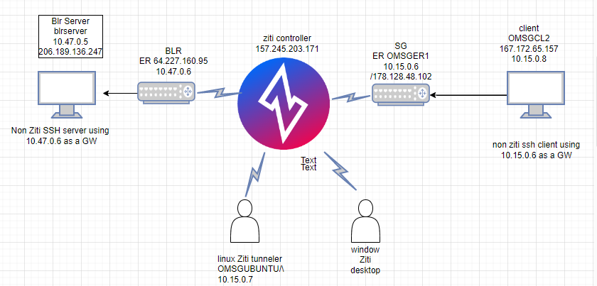

Use follwing setup to create the ziti network


Ziti controller configuration:

1- identities configuration: 

Create an identity for the ssh client and assign an attribute "ubuntusg" for ubuntu tunneler and “ompc1” for window PC. We'll use this attribute when authorizing the clients to access the ssh service.

Note: Create an identity for the ssh server if you are not using an edge-router with the tunneling option enabled. In our case we didn’t create the ssh server identity as BLR ER accting as a ER with tunnel options for SSH server.

access the HTTP service

Cli Method:

login to controller API in the path of ziti binary home directry:
```
./ziti edge login localhost:8441 
```

Same way we will configure the server side identites configuration.

Note: Admin type identities can access all the bind configuration without adding that identities into the dial policy. and user identities can access the only config that has assign the user into dial policy.

2- Create the intercept.v1 and host.v1 configuration:

Create an intercept.v1 config. This config is used to instruct the client-side tunneler how to correctly intercept the targeted traffic and put it onto the overlay.

Create a host.v1 config. This config is used instruct the server-side tunneler how to offload the traffic from the overlay, back to the underlay.


BLR Host config


BLR intercept config


SG host config


sgintercept config


 
```
./ziti edge create config BLR-intercept-config intercept.v1 '{"protocols": ["tcp"], "addresses": ["BLRCL.ziti"], "portRanges": [{"low": 22, "high": 22}]}'

./ziti edge create config BLR-host-config host.v1 '{"protocol":"tcp", "address":"'"10.47.0.6"'", "port":22}'

./ziti edge create config sgintercept intercept.v1 '{"protocols": ["tcp"], "addresses": ["sgclient.ziti"], "portRanges": [{"low": 22, "high": 22}]}'

./ziti edge create config sghost.v1 host.v1 '{"protocol":"tcp", "address":"'"10.114.0.2"'", "port":22}'
```

3- Services Configurations:

Create a service to associate the two configs created previously into a service. BGLSR use to create services for the BGL ER and server. SGRTRSR use to create the services for SG ER/ SG client.


 

CLI:
```
./ziti edge create service BGLSR -c BLR-intercept-config,BLR-host-config -a blrrouter

./ziti edge create service SGRTRSR -c sgintercept,sghost.v1 -a sgrtrsr
```


4- Dial and Bind Service policy:

Create a service policy for dial and bind the configurations. Its like same way as APPWAN doing in MOP. Bind policy will configured on hosting the services/server side configuration. In our case BLR ER act as bind services and SG router/ompc1/ubuntu tunneler acts as dial the bind services. If identities has admin type then they can access the all bind service policy without assigning into dial policy. If the identities has user/router type then we must have to assign thease identies into dial policy.


Following command with create the bind policy to bind the BLR server/10.47.0.5 using BLR ER(attributes blrtr)
```
./ziti edge create service-policy ssh.policy.bind Bind --service-roles '@BGLSR' --identity-roles "#blrtr"
```
Following command with create the bind policy to bind the SG ssh client/10.15.0.8  using SG ER(sgrtr) 10.15.0.6.
```
./ziti edge create service-policy sshsgbind Bind --service-roles '@SGRTRSR' --identity-roles "#sgrtr"
```
Following command with create the dial policy from SG ER(sgrouter)/ompc1 to dial the BLR server/10.47.0.5  to BLR ER.
```
./ziti edge create service-policy sshtoblrfromsgcl.dial Dial --service-roles '@BGLSR' --identity-roles "#sgrouter"

./ziti edge create service-policy sshtoblrfrompc.dial Dial --service-roles "@BGLSR" --identity-roles '#ompc1'

```
Following command with create the dial policy from ubuntu tunneler (ubuntusg)/BRL server/BLR ER (blrtr) to dial the SG ssh client using SG ER (SGRTRSR).

```
./ziti edge create service-policy sshtoblrfromtunneler.dial Dial --service-roles "@SGRTRSR" --identity-roles '@ubuntusg'
```

 

5- ER policy(optional):

By default all the services will bind to all ER. We can manualy change the router policy using bellow.
```
./ziti edge create service-edge-router-policy ssh-serp --edge-router-roles #all --service-roles #all
```

Varification:

1- accessing the BLR ssh server(206.189.136.247) from SG ssh client(OMSGCL2)

add Ip route 100.64.0.0/10 in ssh client machine towards the SG ER

100.64.0.0/10 via 10.104.0.3 dev eth1 proto static


 

Log from the Bangalore ER 10.47.0.6


2- Verification from Ubuntu tunneler OMSGUBUNTU to access the BGLCL.ziti(SSH server) using BLR ER


Log from BLR ER 


 

3- Verification from ompc1 window pc to SSHSG client.


Log from OMSGER1


 

More usefull command from controller:
```
./ziti edge login localhost:8441

./ziti fabric list links

./ziti fabric list circuits

./ziti fabric list routers

./ziti fabric list services

./ziti fabric list terminators
```
