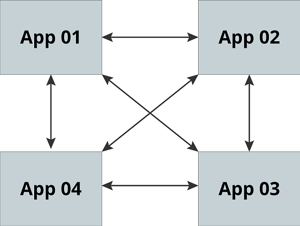

# Bootstrapping Trust

## Part 1: Encryption Everywhere

### Zero Trust

Bootstrapping Trust is a series highlighting a common problem dealing
with software systems that span multiple machines over any network. All
networks, private (like your office/data center) or public (like the
internet), should be considered insecure. Firewalls and segmented
networks are not enough. Even application specific networking is not
enough. The next step is to not trust the network.

This thought process is a new way of conceptualizing network security
and is referred to as "Zero Trust." Not that trust is not present, far
from it. Today's networks are the home to distributed software
solutions. Whether they are high scale mesh networks or small scale
client servers: there are distributed software running everywhere.
Distributed systems are rife with trust and trust issues. Zero Trust
means: "Zero Trust Without Verification." And it turns out that putting
that trust in pace isn't simple.

Whether you are an encryption expert or a newcomer, welcome! This series
is for you! It assumes you know nothing and takes you from soup to nuts
on why this is a problem and how we can apply encryption with a Zero
Trust model. The model described here is a feature of Ziti. Ziti is part
of the OpenZiti account on Github. The series starts with the basics and
dovetails into Ziti's Enrollment system, which bootstraps trust in a
Zero Trust environment.

The parts are as follows.

- [Part 1: Encryption Everywhere](./part-01.encryption-everywhere.md)
- [Part 2: A Primer On Public-Key Cryptography](./part-02.a-primer-on-public-key-cryptography.md)
- [Part 3: Certificates](./part-03.certificates.md)
- [Part 4: Certificate Authorities & Chains Of Trust](./part-04.certificate-authorities-and-chains-of-trust.md)
- [Part 5: Bootstrapping Trust](./part-05.bootstrapping-trust.md)

### Trust & Distributed Systems

Developing applications that are composed of distributed pieces of
software that require network connectivity amongst themselves is a
challenging problem to solve. Multiple pieces of software must be
configured with encryption to identify itself and to trust the other
parts of the software. This process is "bootstrapping trust." It
involves taking a system with no trust to one that has secure
connections amongst them that can verify each connection made. It is not
a simple task. It requires multiple levels of choices that need to be
compounded together into a secure system.

There are a few choices when it comes to securing those communications.
Some have higher barriers to entry than others. For example, sharing a
secret password used to power an encryption algorithm can provide
security. In general, it is easy to deploy software, either manually or
automatically, with that secret. However, it is also fundamentally weak
as there is only one secret in the system necessary to compromise the
entire system. It also does not individually identify the software in
the system, nor does it provide any real way to ensure that both sides
of the communication are not compromised. On top of that, there is no
way to revoke trust from any individual system, nor is there an easy way
to change that secret or abstract it to more secure environments such as
hardware security modules.

Taking it a step further, we can put individual secrets on each machine
that each other machine needs to know. If this secret is a password, we
now have multiple passwords that each identify the connection between
each machine. Having more secrets is slightly "better," but not great.
This solution requires the management of all those passwords. A
compromised machine now means that every password on that machine is
compromised, which hopefully is a subset of the password, so the impact
is somewhat limited. However, this is still a mess to manage.

The correct answer to this problem is public-key cryptography. This type
of encryption allows multiple secrets to exist, and those secrets
inherently identify both sides of a connection. On top of that,
public-key cryptography currently provides some of the most robust
encryption available today. It seems like a slam dunk! Alas, it
introduces some complex behaviors. Setup and management are not always
as easy as one would hope.


#### Setting It Up

So we have decided that public-key cryptography is the answer. What does
that mean? What do I have to do? Let us explore what would need to be
done by a human or a piece of software automating this process. Don't
worry if you don't get all of this; the gist is all you need for now.
Later parts will expand upon this terminology. In fact, after reading
parts two, three, and four, consider revisiting this part.

Consider the following diagrams of a "mesh" distributed system. This
system has multiple pieces of software, all connecting amongst
themselves. Consider what it means to accomplish this using public-key
cryptography.



In the diagram above, each system needs:

- a key pair for client & server connections
- to have the public keys of everyone it is connecting to

So what do we need to do? Drop into a CLI and start generating keys on
each machine. Do that by using these commands:

```
openssl ecparam -name secp256k1-genkey -param_enc explicit -out private-key.pem
```

```
openssl req -new -x509 -key private-key.pem -out server.pem -days 360
```

Voila - you now have a self-signed certificate that no one trusts. You
can repeat this for every piece of software in your mesh network, as it
initially will be deployed. Preferably, you log into each machine and
generate the private key there. Moving private keys on and off devices
is a security risk.

Then you will need to copy each public certificate to every other
machine and configure your software so that it trusts that certificate.
The system will need to repeat this process any time the system adds a
piece of software. If a machine is compromised, the analogous public
certificate will need to be untrusted on each node. To combat this
problem, Certificate Authorities (CA) can help!

#### CAs & Adding Complexity

A CA enables trust deferral from multiple individual certificates to a
single certificate. Meaning that instead of trusting each certificate,
each piece of software will trust the CA. The CA will be used to sign
every public certificate our software pieces need to use. How does
"signing" work? We will cover that in parts three and four, read on.

Here are the high-level steps:

1. create a CA configuration via OpenSSL CNF files
2. create the CA
3. using the CA's public key to sign all of the public certificates
4. distribute the CA's certificate to every machine
5. configure the machines certificate store or configure the software

For items one and two, the process can be a bit mystical. There is a
slew of options involved in managing a CA. To perform number three, you
will need to go through the processing of creating CSRs on behalf of the
piece of software, and someone will have to play the role of the CA and
resolve those CSRs. The last two steps will depend on the OS and
software.

All of these actions can all be done via a CLI or programmatically. You
will have to spend time and energy, making sure the options are
correctly set and learning about all the different capabilities and
extensions. Mistakes will inevitably occur. It is time-consuming to
debug why a specific public certificate is not working as intended. The
tools and systems that use the certificates are purposely vague in error
messages as not to reveal too much information to attackers.

#### Further Concerns

Once configured, there are still other concerns need to be taken into
account:

- What happens when systems are removed/added?
- What happens when a certificate expires?
- How does a system know not to trust a certificate anymore?
- What happens when private keys need to regenerate?

Remember, the systems deferred trust to the CA, which means it is
independent of the software. CAs do not automatically handle the
propagation of these types of events. CAs are data files on a storage
device. Issuing or revoking certificates does not generate any kind of
event without additional software. There is also the issue of
certificates expiring. That "-dash 360" puts a lifetime on each
certificate. You could make that incredibly long but exposes your system
to having incredibly old certificates around when encryption and the
methods to defeat it have had ample time to improve. Also, a private
key's strength might need enhancement by generating new keys. Replacing
private keys is necessary when with the advent of security
vulnerabilities and improved cryptography. New private keys
automatically require new certificates.

Even if we ignore all of those concerns: who did we trust to get this
system setup? Whatever or whoever that was was our seed of trust: the
thing we first trusted. So far, you could have imagined that a human was
doing all of this work. In that case, you are trusting a human operator
to properly configure all of the systems while accessing the most
sensitive parts of the process: the private keys. The seed of trust is
in that human. If this is a software system performing these actions,
that means that the system has to be trusted and most likely have access
to every other system coming online. That is workable, but what happens
when your system can have people external to your system request to add
software pieces to the network. How can that be handled? How do you
trust that system in the first place to trust it? Using a secret
password creates a single, exploitable, weak point. Public-key
cryptography could be put in place, but then we are in and
chicken-and-egg scenario. We are putting public-key cryptography in
place to put automate public-key cryptography.

There are many caveats to bootstrapping trust. In a dynamic distributed
system where pieces of software can come at the whim of network
operators, the issues become a mountain of concerns. Thankfully in Ziti,
a mechanism is provided that abstracts all of this process.

---

Written By: Andrew Martinez  
June 2020
