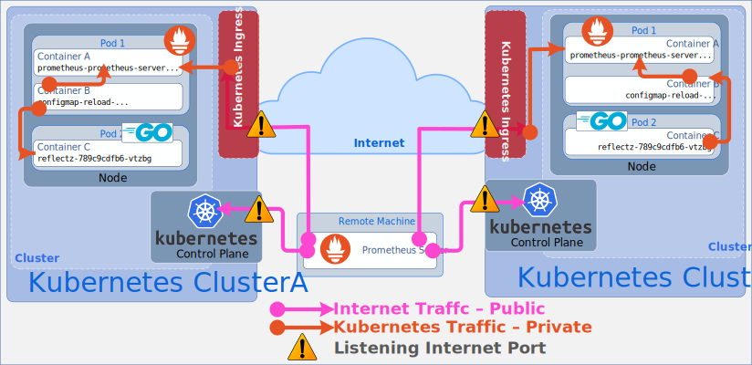

# Enable Prometheus to Scrape Anything from Anywhere

_This is part one of a two-part article. This article provides background and rationale of the project.
[The next article](./part2.md) will be a detailed explanation of the actual steps necessary to implement the solution._

## Prometheus

[Prometheus](https://prometheus.io/) is an incredibly popular [CNCF](https://www.cncf.io/projects/prometheus/)
project which has graduated the gauntlet of progressions to emerge as a "graduated" CNCF project. If you're familiar
with Prometheus, there are probably a couple of reasons people mainly choose to deploy it:
metrics collection and visualization and alerting.

Prometheus is also tremendously flexible. It has numerous available plugins and supports integrating with a wide number
of systems. According
to [this CNCF survey](https://www.cncf.io/blog/2022/03/08/cloud-native-observability-microsurvey-prometheus-leads-the-way-but-hurdles-remain-to-understanding-the-health-of-systems/)
, Prometheus leads the pack when it comes to the project people go to for observability. That is probably because
Prometheus is a CNCF project and is often considered the "default" solution to deploy on another wildly popular CNCF
project called [Kubernetes](https://kubernetes.io). One interesting aspect of Prometheus is that it generally favors a
poll-based approach to metrics collection as opposed to a push-based model.

### Poll-based?

I don't know about you, but historically when I've thought about a metrics collection agent I tend to think of an agent
that reads a log file or some kind of library that pushes rows into a giant data lake in the cloud. I don't generally
think about a solution that implements poll-based metrics. Often, this is because the target of a poll-based collecting
agent will probably be behind a firewall.

As you would expect, firewalls make it exceptionally difficult to implement a poll-based solution as firewalls have been
known to make a habit of preventing external actors from accessing a random http servers behind it! That is their
primary function after all!

The Prometheus project makes some [strong arguments](https://prometheus.io/docs/practices/pushing/) explaining the
benefits of a poll-based solution. They also realize that firewalls are important in creating a safe network and
understand the challenges firewalls create for such a solution. To deal with these situations the project also provides
a [PushGateway](https://prometheus.io/docs/instrumenting/pushing/). This allows solutions to push their data to a
location outbound of the firewall. Pushing data out of the firewall allows for metrics and alerting to function without
the worry (and maintenance heartache) of an open, inbound firewall hole.

### Acceptable Risk

Prometheus is often deployed into Kubernetes clusters but Prometheus can be deployed anywhere. Taking the operational
differences out of the equation, there is little difference between deploying Prometheus in a Kubernetes cluster and
deploying it in one's data center. Once deployed the needs will be the same. Prometheus will need to be authorized to
reach out and scrape the targets it needs to scrape. All too often this is done with relatively open network
permissions. Even though we all know it's not the most secure way of authorizing Prometheus, this is often considered "
safe enough" because we deployed Prometheus into a zone we consider "safe". Managing firewall rules to all the computers
Prometheus needs access to is feels like an impossible feat. There are just too many.

To add to our acceptable risk we will need to be able to access the Prometheus server in some way. We'll want to get at
the UI, see the charts and graphs and data it provides and use the server to it's fullest. For that we'll **of course**
need a hole in our firewall or in the case of Kubernetes we will probably deploy some form of  
[Kubernetes Ingress Controller](https://kubernetes.io/docs/concepts/services-networking/ingress-controllers/) to provide
users the ability to access the server.

What we need are better and richer control over our network. We need a better way of authorizing Prometheus without the
hassle of maintaining firewall rules on individual machines. We also need a way of doing this across multiple clouds,
multiple Kubernetes clusters and multiple data centers. If we are going to try to solve this problem. Let's solve it
once and for all!

## OpenZiti

The [OpenZiti](https://openziti.github.io) project allows us to solve all the problems outlined above. It is a
fully-featured, zero trust overlay network and allows the application of
[zero trust networking principles](https://en.wikipedia.org/wiki/Zero_trust_security_model) to be applied anywhere. This
includes bringing those zero trust principles directly into your application itself through one of the many SDKs
provided by the project. Let's take a look at an example and see what a setup might look like before and after applying
OpenZiti.

### Overview

Let's imagine that we have already deployed a solution using two Kubernetes clusters, ClusterA and ClusterB. It really
doesn't matter where the clusters are deployed. We are trying to illustrate a real-world situation where we have two
separate Kubernetes clusters that we want to manage. The clusters could be deployed in the same cloud provider, they
could be deployed in a private Kubernetes cluster, they could be deployed in different cloud providers. What's important
is that these clusters are available over the network. To enable access to the cluster will will then have to deploy
some form of ingress controller on both clusters. We'll also image a workload has been deployed on both of these
clusters as well. Those workloads will also provide a prometheus scrape target which we will then use from a federated
Prometheus instance.

#### Figure 1 - Before OpenZiti

### Taking a Closer Look

#### Listening Ports

Looking at the diagram above with a discerning eye towards security, there are some immediate observations which we can
make. One observation we already accepted from the overview is that these clusters must be exposed via the internet. At
first that doesn't seem like a big deal. We expose things on the internet all the time. This is a perfectly normal
action, one which is likely done every day somewhere in the world. It's so common we almost don't even think about it
until the time comes where we **need** to think about it. This ends up in an exposed port, listening somewhere in the
world. There might be a firewall with complex rules in place protecting this port, but it's just as likely that this
isn't the case. People might need to access the resources inside these clusters from anywhere.

#### Kubernetes API Exposed

The other observation we can make is that the Kubernetes API is fully exposed to the internet. This API is a very
high-value target and should be secured as strongly as possible. That probably means yet another complex firewall rule
to maintain.

#### "Trusted" Intra-cluster Traffic

The final point to note is that the traffic within the cluster is considered safe. As mentioned above, the Prometheus
server needs to be able to scrape the target workloads. That traffic is necessary to be considered safe. Also notice
that the pod for Prometheus contains a container named "configmap-reload" which is used to trigger a webhook on the
Prometheus server when the
[Kubernetes config map](https://kubernetes.io/docs/concepts/configuration/configmap/) changes. This is necessary when
changing the Prometheus config, adding new scrape configs etc.

---

### Applying Zero Trust Networking Principles Using OpenZiti

Now that we understand the basic setup and understand some possible problems, let's see if OpenZiti can help address one
or more of these issues. When applying OpenZiti the goal will be to strengthen our security posture for each of the
above items.

#### Figure 2 - After OpenZiti

### Taking a Closer Look After OpenZiti

#### No External Listening Ports

With a classic deployment as shown in the initial design, we saw that there will be ports exposed to the open internet.
In an ideal scenario there would be absolutely no ports exposed on the open internet **nor** in the "trusted networking
zone". It's immediately obvious after applying a solution using OpenZiti that those listening ports exposed by the
Kubernetes ingress controller are no longer deployed and thus are not longer exposed to the internet. That's one attack
vector eliminated. OpenZiti will initiate outbound mTLS connections among all the constituent pieces of the overlay
network. This means connections will being inside the trusted network zone and dial outbound links. Once established,
those connections are able to be used to safely transfer data between any participating edge node.

This capability really can't be emphasized enough. With OpenZiti and with applications which use an OpenZiti SDK such as
the ones shown there are no open ports to attack. This network is nearly impervious to the classical "land and expand"
technique so many bad actors look to exploit.

#### Kubernetes API no Longer Exposed

Another big benefit provided by OpenZiti is starting to come into focus as well. By having access into our clusters
provided through OpenZiti, we now are able to take the Kubernetes APIs for both clusters **entirely** off the open
internet. We will now allow Prometheus to monitor each Kubernetes cluster using the built-in capability Prometheus
already contains to federate information to a centralized, [zitified](~/articles/zitification/index.md) Prometheus
server.

To maintain our Kubernetes cluster we can now turn to [zitified](~/articles/zitification/index.md) tools such as the
ones provided by the OpenZiti project: [kubeztl](https://github.com/openziti-incubator/kubectl) and
[helmz](https://github.com/openziti-incubator/helm). Each of these tools have had an OpenZiti SDK embedded inside them
allowing you to still run the `kubectl` or `helm` commands you're used to only now you will need a strong, OpenZiti
identity in order to access the service. We're also not replacing the existing security constraints that the Kubernetes
ecosystem already provides. You can (and should) still secure your Kubernetes clusters using namespaces, roles, etc.

#### "Trusted" Intra-cluster Traffic

Lastly, let's turn our eyes toward the traffic running inside the Kubernetes cluster. Pay attention to the lines in
orange and the lines in dark blue. Orange lines represent "private" traffic; traffic that needs to traverse the private
network space.

Currently, we'll never be able to send traffic to the Kubernetes API via the overlay network. It doesn't have an
OpenZiti SDK embedded within it. That means both ClusterA and ClusterB will be forced to access the service via a port
that is exposed to the cluster network. Still, we have greatly improved the overall security posture of the cluster.
We're no longer able to access the Kubernetes API without first gaining access to the zero trust, overlay network and
being properly authorized to access the Kubernetes API.

Let's now focus on ClusterA. It contains a Prometheus server which decided against listening only on the OpenZiti
overlay. That means it will need to expose ports to the Kubernetes cluster as well. The container inside the Prometheus
pod will watch for configmap changes and will be forced to send unauthenticated webhook traffic to the Prometheus server
in order to trigger the config to reload. Still, accessing this cluster and the listening Prometheus server still
requires to be on the OpenZiti overlay. Also this Prometheus server does have an OpenZiti SDK built into it. We also
deployed the "reflectz" workload with an OpenZiti SDK built into it as well. That means the Prometheus server is now
able to scrape the "reflectz" workload exclusively over the OpenZiti overlay. **Only** authorized identities can access
that scrape data.

Contrast ClusterA with ClusterB. ClusterB deployed a Prometheus server with an embedded OpenZiti SDK and also chose to
provide its services exclusively by 'listening' on the OpenZiti overlay. We've also deployed the zitified
"reflectz" workload here as well. Notice how little traffic traverses the Kubernetes cluster. The only traffic which
needs to traverse the private networking space in ClusterB is to scrape the Kubernetes API. All other traffic is secured
by the OpenZiti overlay network. You will need a strong identity and you will need to be authorized on the overlay
before even being allowed to connect to the target service.

## OpenZiti-Enabled Prometheus

We are now coming to the final piece of the puzzle. We have protected both of our clusters using OpenZiti. Now we want
to bring all this data back to a centralized Prometheus server to make it easier on our user base. To do this we'll
again deploy an OpenZiti-enabled Prometheus server. This time we don't care where it is deployed except that we know we
are not deploying it into either of the Kubernetes clusters we are already using. Since the Prometheus servers are all
now accessible via the overlay network. We can literally deploy our server anywhere. It could be a developer server, it
could be deployed in some other cloud, it could be deployed in our private data center. Because it's part of the overlay
network it literally won't matter. It will just need outbound internet access, a strong identity and the access and
authorization to services and the OpenZiti overlay network will take care of the rest.

If you have made it this far you're might want to try all this for yourself. The [next article](./part2.md) will go 
into the details necessary to implement this solution. When complete you'll be able to deploy a zitified verison of 
Prometheus and give Prometheus the power to scrape anything from anywhere using OpenZiti.
