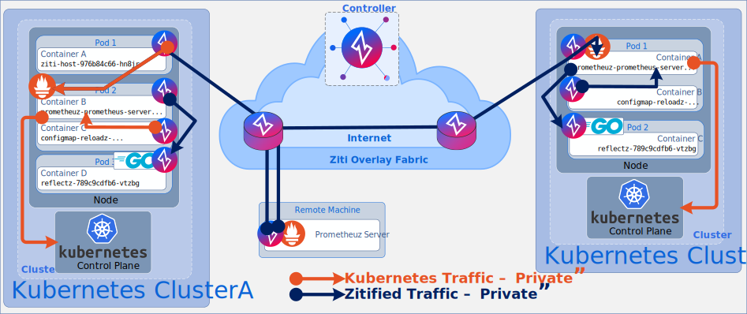
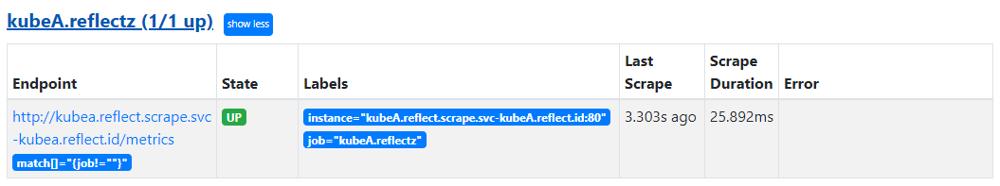
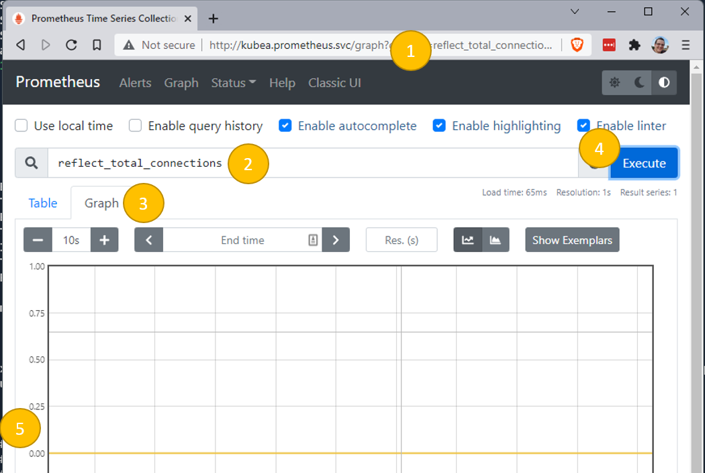
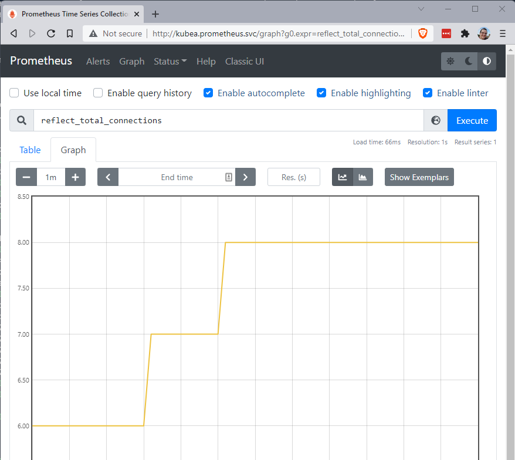

# Scraping Anything, Anywhere in Action

<style>
.flr {
  float: right;
}
</style>

_This is part three of a three-part article. This article builds on the previous two articles. Here we will take a look at what we built 
and use it to explore the power of a zitified Prometheus. See [part one](./part1.md) for the necessary background about the series. See 
[part two](./part2.md) for detailed instructions covering how to setup the environment you're about to explore_

## The Payoff

Ok. Here it is. We are at the end of the series and here is where we'll put it all together and really start to understand the sort of 
innovations you can create when you zitify an application. As a reminder, we are working with [Prometheus](https://prometheus.io/), a 
CNCF project which we will use to monitor a workload deployed in two separate [Kubernetes](https://kubernetes.io) clusters. To save you 
from flipping back to a previous article, here is what that solution looks like.



Now we are ready to start using our Prometheus servers. We'll use our OpenZiti overlay network to connect to a workload which will 
generate a metric we want to display in Prometheus. We'll then configure Prometheus to scrape the workload and put it on a graph to 
prove it works. Once that's complete, we'll play around with the setup and see if we really can scrape anything, anywhere. Let's begin.

## Developer Access

In the [previous article](./part2.md), we established our entire solution using the OpenZiti overlay, `kubectl` and `helm`. We saw 
everything get installed and it all "seems to work". But how do we **know** it works?  Let's provision an identity for yourself now and 
let's enroll it in your local tunneling app and find out. Go out and get [a tunneling client](~/ziti/clients/which-client.md) running 
locally. Once you have that installed, provision an identity and enroll it with your tunneling client. 

```text
ziti edge create identity user dev.client -a "prometheus-clients","reflectz-clients"
```

You should have access to six total services when this identity is enrolled:

```text
Service Name: kubeA.prometheus.svc
   Intercept: kubeA.prometheus.svc:80
Service Name: kubeA.reflect.svc
   Intercept: kubeA.reflect.svc.ziti:80
Service Name: kubeA.reflect.scrape.svc
   Intercept: kubeA.reflect.scrape.svc.ziti:80

Service Name: kubeB.prometheus.svc
   Intercept: kubeB.prometheus.svc:80
Service Name: kubeB.reflect.svc
   Intercept: kubeB.reflect.svc.ziti:80
Service Name: kubeB.reflect.scrape.svc
   Intercept: kubeB.reflect.scrape.svc.ziti:80
```

## ClusterA

With your developer access you should be able to navigate your browser to http://kubea.prometheus.svc/targets. 

> [!NOTE]
> We won't dwell on this for long in this article but notice that this is showing off another superpower of OpenZiti, private DNS. 
> Notice that you were able to browse to a totally fictious domain name: kubea.prometheus.svc. ".svc" is **not** a legitimate top level 
> domain. 
> [Look at the full list of top level domains starting with S](https://en.wikipedia.org/wiki/List_of_Internet_top-level_domains#S). You 
> won't find ".svc" on that list at this time


You should see the following. You might have noticed that the chart deployed has a few other containers we have not discussed yet. We'll 
not go into those containers in this article. What's important is that this Prometheus server has a few targets already for us to access. 
Neat, but this isn't what we want to actually monitor.

What we really want to monitor is the workload we deployed: `reflectz`. We can do this by editing the Prometheus configmap using 
`kubectl`. Let's go ahead and do this now:

```text
kubectl edit cm prometheuz-prometheus-server
```

This will open an editor in your terminal and allow you to update the config map for the pod. Once the editor is open, find the section 
labeled "scrape_config" and add the following entry:

```text
    - job_name: 'kubeA.reflectz'
      scrape_interval: 5s
      honor_labels: true
      scheme: 'ziti'
      params:
        'match[]':
          - '{job!=""}'
        'ziti-config':
          - '/etc/prometheus/scrape.json'
      static_configs:
        - targets:
          - 'kubeA.reflect.scrape.svc-kubeA.reflect.id'
```

This is yaml and yaml is sensitive to spaces. The block above is properly indented for the config that the helm chart installs. You 
should be able to simply copy it and add it under the scrape_config. Remember, there is a `configmap-reload` container in 
the pod which monitors the configmap. On successful edit, this container will notice and will issue a web hook to the 
`prometheus-server` container. The trigger is not immediate, don't worry if it takes a while. It can take around a minute for the 
trigger to fire. 

While we wait for the trigger, let's explain what this is doing. This is informing the Prometheus server to monitor a workload which can 
be found at the provided target of `kubeA.reflect.scrape.svc-kubeA.reflect.id`. Notice that no port is included in this target, and also 
notice that this is a very strange looking FQDN. That's because this is a zitified version of Prometheus. We have extended Prometheus to 
understand a "scheme" of `ziti`. When we configure this job with a scheme of ziti, we can then supply targets to the job which represent 
an OpenZiti service.  We need to supply the `ziti-config` node with the path to the identity we want Prometheus to use to issue the 
scrape. This will always be `/etc/prometheus/scrape.json` at this time. Should the community desire it, we can look into changing the 
location of the identity.

If you would like to tail the `configmap-reloadz` container, you can issue this one liner. This will instruct `kubectl` to tail the logs 
from `configmap-reloadz`. 

```text
pod=$(kubectl get pods | grep server | cut -d " " -f1); echo POD: $pod; kubectl logs -f "$pod" prometheus-server-configmap-reload
```

When the trigger happens for ClusterA you will see a message like the one below. Notice that `configmap-reloadz` is using the underlay 
network: `http://127.0.0.1:9090/-/reload`

```text
2022/04/23 20:01:23 config map updated
2022/04/23 20:01:23 performing webhook request (1/1/http://127.0.0.1:9090/-/reload)
2022/04/23 20:01:23 successfully triggered reload
```

### Config Reloaded

Once you've correctly updated the configmap, and `configmap-reloadz` detected the change and told Prometheus to reload. You'll see a new 
target has been reported by Prometheus at http://kubea.prometheus.svc/targets. You should now see "kubeA.reflectz (1/1 up)" showing. 
Congratulations! You have just successfully scraped a target from zitified Prometheus! Remember this workload does not listen on the 
Kubernetes underlay network. It's only accessible from the OpenZiti overlay. 



### Let's Graph It!

Cool, we have a target. The target can be scraped by Prometheus over the OpenZiti overlay. We're also able to securely access the 
Prometheus UI over the same OpenZiti overlay. Let's use the Prometheus UI to graph the data point we want to see, the
`reflect_total_connections` metric. 

1. Navigate to http://kubea.prometheus.svc/graph
2. enter `reflect_total_connections`
3. click Graph (notice I changed my time to '10s', located just under Graph)
4. click Execute
5. Notice there are no connections (0)



### Generate Some Data


Now let's change that graph of `reflect_total_connections` from 0 to 1 (or more). One of the services you will have access to will 
intercept `kubeA.reflect.svc.ziti:80`. 

> [!NOTE]
> If you are using Windows and Windows Subsystem for Linux (WSL) as I am, you **might** need to understand how get WSL to use your Ziti 
> Desktop Edge for Windows as your DNS resolver when inside WSL. Generally speaking this is as easy as editing /etc/resolv.conf and 
> adding the IP as the first nameserver: `nameserver 100.64.0.1` (or whatever the DNS IP is). Try it first, depending on how you setup 
> WSL it might 'just work' for you. You can also just use cygwin or any other netcat tool from Windows (not WSL) too.

Now we can use netcat to open a connection through this intercept a few times. The metric tracks the total number of connections to the 
reflect service. Connect, send some text, the use ctrl-c to disconnect. Do that a few times then click 'execute' again on the graph page.
You can see I did this over a minute and moved my total count on kubeA to 8, shown below.

```text
/tmp/prometheus$ nc kubeA.reflect.svc.ziti 80
kubeA reflect test
you sent me: kubeA reflect test
^C
/tmp/prometheus$ nc kubeA.reflect.svc.ziti 80
another reflect test
you sent me: another reflect test
^C
/tmp/prometheus$ nc kubeA.reflect.svc.ziti 80
another reflect test
you sent me: another reflect test
^C
```



### Scrape Something Else


# bob

a
# bob

a
# bob

a
