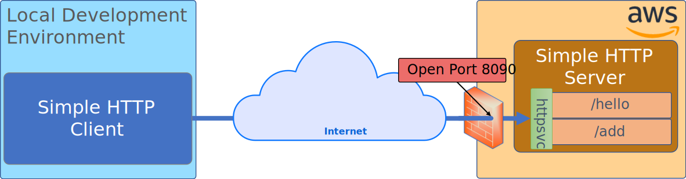
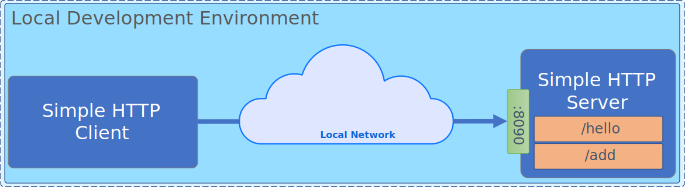
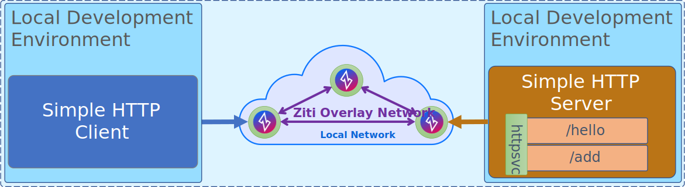
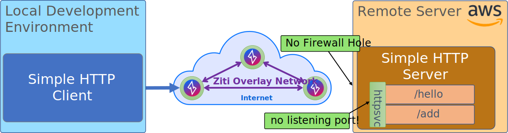

<link rel="stylesheet" href="/ziti/learning/http/index.css"/>

# Simple HTTP Client/Server

This example will show you how to start a very basic http server in your local dev environment and then attach to that
http server using a simple http client. After the http server and client are working properly, you can then take the
http example and convert it over to a zitified example. 

## Overview

Here's the operating scenario. You have developed an amazing web app. Now you want to host this app somewhere and make
it so your users can access it. Depicted below is a scenario where you are then trying to access that web app over the
internet from your local development environment. Here, your amazing web app is providing two amazing rest services:
`/hello` and `/add`. In order for you to access these services using your client, you will need to open a hole in the
firewall to allow traffic from your environment to access that server.

> [!div class="diagram"]
> **Simple, internet deployed HTTP Client/Server overview:**
>

To continue, choose the SDK you'd like to work with: 

# [C](#tab/ziti-sdk-c)

Tab content-1-1.

# [Go](#tab/ziti-sdk-go)

Tab content-2-1.

# [Swift](#tab/ziti-sdk-swift)

Tab content-3-1.

***

---

## Step 1 - Local Development

The first step towards zitifiying this example will be to get everything running locally. Pick the language of your 
choice from the 
This diagram shows the same overall architecture as the one above. Instead of communicating over the 
internet and
through an open hole in a firewall with two different operating systems, now we are keeping all our network traffic 
local. This means there's (probably) no firewall preventing your traffic from getting from the http client to the 
http server. 

> [!div class="diagram"]
> **Simple, locally deployed local dev Client/Server**
>

---

> [!div class="diagram"]
> **Simple, locally deployed dev Client/Server zitified**
>

---

> [!div class="diagram"]
> **Simple, internet deployed HTTP Server/Client zitified**
>

---

After  
and then how to convert that web server from being . Once running, you'll then code up a client to access that server.

