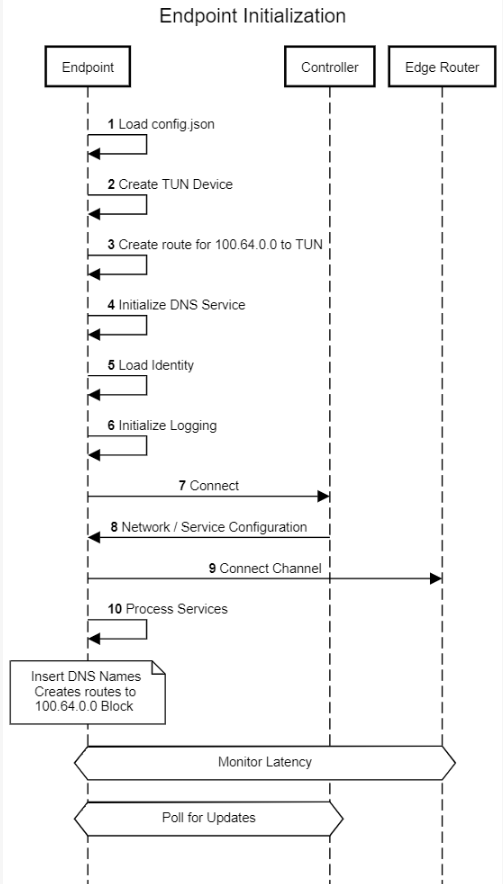

# Endpoint  Initialization

## Steps

1. Init - Load config.json
1. Create TUN device
1. Create route for 100.64.0.0 network to TUN
1. Initialize DNS service
1. Load identity
1. Initialize logging
1. Connect to controller
1. Download network configuration
1. Initialize Channels to Edge Routers
1. Initialize Services
	1.	Insert DNS names
	1.	Create routes for IPs to 100.64.0.0 block
1. Collect latency information for ER selection
1. Complete DNS initialization with Service names
1. Periodically check for updates to services or other network config.  Polling controlled by app, including desktop edges and tunnelers, 10 or 15 seconds in OpenZiti releesed software.
1. Update services, add or delete Edge Routers, etc. as necessary.

