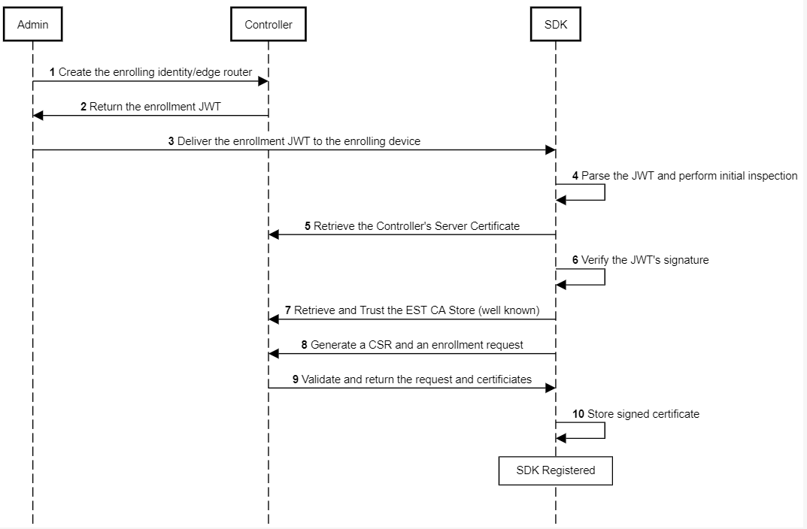

# Endpoint Registration

## Steps

1. A person with administrative rights to the Network instance creates a new identity.
2. The Ziti controller returns a JWT to be used as a one time token to register the new identity.
3. The administrator delivers the JWT to the endpoint by whatever means required.  This is the true bootstrapping of the trust model, and should be well defined.
4. The JWT is parsed and information, such as the name of the identity and the address of the controller are parsed from the token
5. The server certificate is retrieved from the controller.
6. The JWT's signature is cryptographically verified with the controller's public certificate.
7. The Certificate Authority public key is retrieved via the controller's .well-known endpoint.
    - The CA is added to the client as a trusted certificate.  This is the public key of the certificate used to sign all the certificates within the network instance, and is used to verify other nodes when connecting as well.
8. The endpoint generates a Certificate Signing Request and forwards it to the controller along with an enrollment request. 
    - The token value (jti) in the JWT is used as a unique identifier for the controller to verify the endpoint.  That token is held by the controller as well when created, and then deleted when it is "used", rending the JWT useless after the enrollment.
9. The controller validates the token value, and the information included in the CSR, signs the certificate, and returns it to the endpoint.
10. The ednpoint stores the signed certificate.
The endpoint is now registered to the network, and has all the necessary certificates to identify itself and participate.