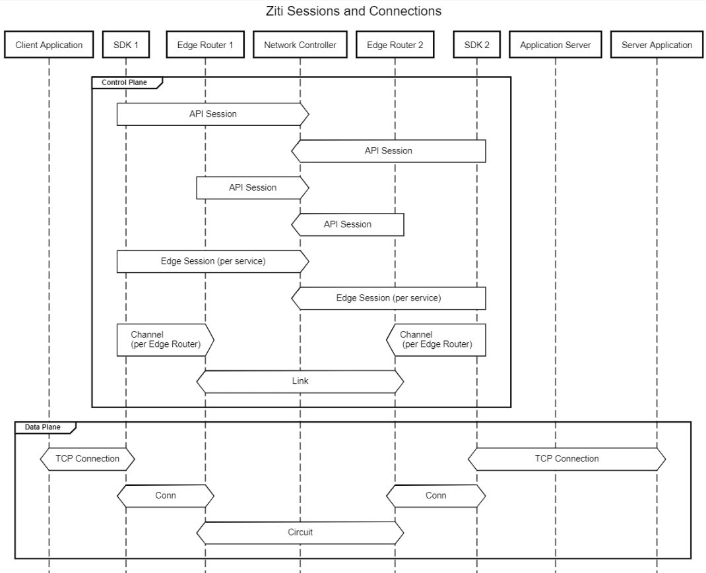

# Sessions and Connections

OpenZiti has a number of different conenction and session types.  It is important to understand the different scopes and uses of these connections in working with the project, developing, operating, and most importantly, troubleshooting.

## Control Plane
 1. The API Session is the first and primary session between and endpoint and the OpenZiti network isntance.  This session is created during attachment, after validating the certificates in both directions, and the endpoint name.  This makes the endpoint present on the network, and all endpoints and routers have API sessions to the Contoller(s)
2. The Edge Session is created with the API session authorization, and is specific to each service configured for the endpoint.  The edge session object holds information such as the service policies, parent API session, service ID, and other information the endpoint and network require to properly service each given service.
3. Channels are formed between the endpoitn and each Edge Router available and wihin the policies.  These chanels are monitored for latency to select best path, and are the control connections for incoming connections for hosted services.
4. Links connect Edge Routers logically.  Edge Routers can advertise a listener socket, which is distributed during client initialization to other Edge Routers.  All Edge Routers will attach to all others in a mesh, provided the policy dictates/allows it.  Each pair of routers will have one link per link type (TLS, WSS, etc.)  Links are a split connection, having both control plane and data plane messaging.

## Data Plane

  1. The TCP connections at eaither end of an OpenZiti connection are dependent on the implementation model.  If Tunnelers, or Edge Router with embedded Tunnelers are used, and the end device makes a TCP connection to gain entry to the OpenZiti network.  If the endpoints, both dialing and binding, or either one, is fully embedded via the SDK, these connections will not exist.
  2. The Connection is the flow speciic connection between the endpoint and the intial Edge Router.  Each service invocation will create an independent Connection, and data will flow over this to the Edge Router
  3. The Fabric Circuit is the path in the OpenZiti Network from initial to terminating Edge Router, comprised of one more more Edge Routers, and zero or more Links. (An initiating Edge Router may have a local terminator for the service) 

These terms in their full and abbreviaed forms appear in logs, metrics, and software, and are therefore ccritical terminaology to understand OpenZiti Networks.