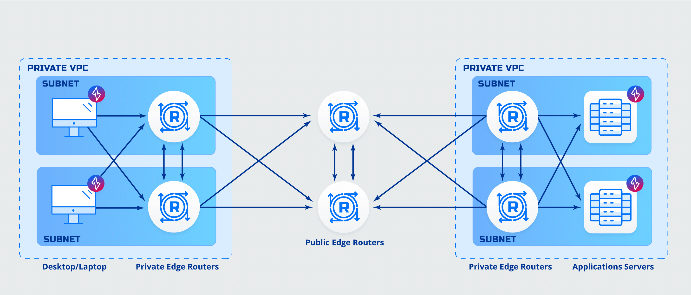
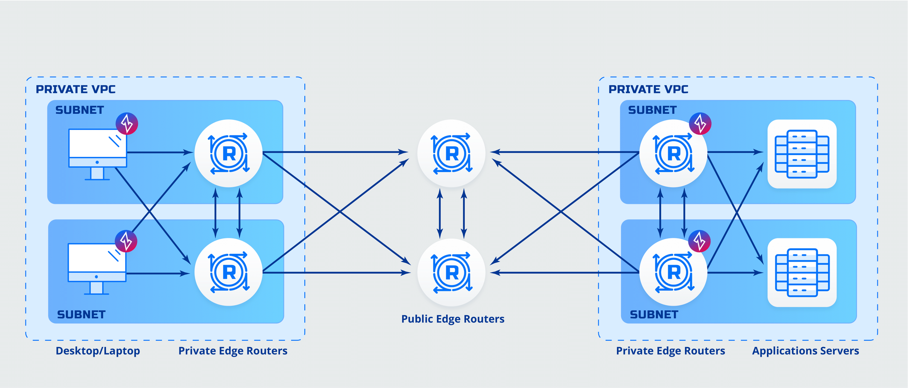

# Deployment Architectures

This article describes the various edge deployment architectures of Ziti Network. In all cases, the Controller and at least 2 Public Edge Routers are to be deployed for redundency. The Ziti Fabric connections are established between all Edge Routers but not Clients/SDKs. The Public Edge Routers would provide connection between Private Edge Routers and/or Clients/SDKs.

&nbsp;

---
**Notes:** 
- ***Deployments illustrated in this article can be combined into an aggregate deployment, i.e. can be mixed and matched.***
- ***Recommended configuration deployment of Public Edge Routers is to have only Ziti Edge enabled and of Private Edge Routers is to have both Ziti Edge and Tunnel enabled.***

- ***A Connection from Client to Public Edge Router is not fabric enabled, e.g. Deployments 1-2,5-7.***

---
&nbsp;

1. **Client to Client Deployment**
    &nbsp;

    
    - Clients are Ziti Desktop Edge (ZDE) type, Ziti Mobile Edge (ZME) type or SDK integrated.
    - Application has client software deployed or is SDK integrated.

    &nbsp;

    **Advantages:**
    - Client to Application Encryption 
    - No additional routing needed
    - No additional DNS entries needed

    &nbsp;
    
1. **Client to Router Deployment**
    &nbsp;
    
    
    - Clients are ZDE/ZME or SDK integrated.
    - Application is behind private router

    &nbsp;
    
    Advantages:
    - No software must be deployed to application servers
    - No additional routing needed
    - No additional DNS entries needed

    &nbsp;
    
1. **Router to Client Deployment**
    &nbsp;
    
    
    - Clients are behind Router
    - Application has client software deployed or is SDK integrated.

    &nbsp;
    
    Advantages:
    - No software must be deployed to clients

    &nbsp;
    
1. **Router to Router Deployment**
    &nbsp;
    
    
    - Clients are behind Router
    - Application is behind Router

    &nbsp;
    
    Advantages:
    - No software must be deployed to clients
    - No software must be deployed to application servers

    &nbsp;
    
1. **Remote (RoadWarrior) to Client Deployment**
    &nbsp;

    
    - Application has client software deployed or is SDK integrated.

    &nbsp;
    
    Advantages:
    - Client to Application Encryption 

    &nbsp;
    
1. **Remote (RoadWarrior) to Router Deployment**
    &nbsp;

    
    Advantages:
    - No software must be deployed to application servers

    &nbsp;
    
1. **Remote (RoadWarrior) to Client without Private Edge Routers Deployment**
    &nbsp;
    
    
    Advantages:
    - No need to deploy private edge routers
    - Client to Application Encryption 