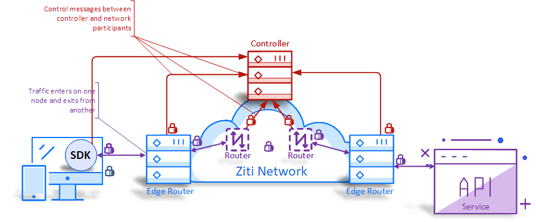

# Overview

## Why Ziti?
Ziti represents the next generation of secure networking for your applications and has arrived with the Ziti platform,
created by NetFoundry, Inc ! The Ziti Controller and the Ziti Edge Router combine to form a secure, Zero Trust
entry point into your network or as a secure zero-trust proxy to other hosted services.

## Getting started with Ziti

If you are looking to jump right in feet first you can follow along
this with our [up-and-running quickstart guide](quickstart.md).
The quickstart will leverage [docker](https://docs.docker.com/) and will
help you spin up a network in minutes.

## Overview of a Ziti Network

The Ziti Network (Ziti) is composed of the following building
blocks: Controller, Router, Edge Router, Edge Clients. These
components are used in conjunction to provide secure
connectivity between two points such as a client to a server. This
type of network is considered an overlay network because it
provides secure connectivity on top – or “overlaying” – existing
networking infrastructure.

Here's an overview of a network:

### ZITI CONTROLLER

The NetFoundry Ziti Controller is the central function of the
NetFoundry Ziti Network. The Controller provides the
configuration plane. It is responsible for configuring Ziti services
as well as being the central point for managing the identities
used by users, devices and the nodes making up the Ziti Network.
Lastly but critically, the Controller is responsible for
authentication and authorization for every connection in the Ziti
network.

The Controller must be configured with public key infrastructure
(pki). The configured pki is used to create secure, mutually
authenticated TLS (mTLS) network connections between any two
pieces of the Ziti Network. The Controller does not provide its
own pki but for the Controller to sign certificate requests (CSR)
the Controller will need to be configured with a key and
certificate used for signing. (Optionally, the Ziti CLI can be used
to generate a pki if needed)

The controller also supports using a third-party pki should the
operator of the Ziti Network have an existing pki they wish to
reuse. Utilizing a third-party CA pushes the burden of obtaining
and distributing properly signed certificates to the operator of
the Ziti network but for sophisticated customers this might make
overall management of the network easier.
The Controller uses an out of process database (Postgres) to
store the information needed to manage the network.

### ZITI ROUTER

Ziti Routers are the fundamental building blocks of the Ziti
Network. These routers are responsible for securely and reliably
delivering traffic from one Ziti Network node to the traffic’s
destination.

Routers are linked together to form a mesh network. This mesh is
constantly being monitored for latency and the fastest paths are
used when routing traffic to the destination. The monitoring also
allows for active failover to ensure a reliable network connection
even in the case of a node failure.

### ZITI EDGE Router

Another fundamental building block of the Ziti Network is the
Edge Router. The Edge Router is the entry point for Edge
Clients connecting to the Ziti Network. The Edge Router is a
specialized Router incorporating the functionality of a Router to
enable it to route traffic over the Ziti network as a Router would
to a given destination.

The Edge Router in combination with the Controller is responsible
for authenticating and authorizing Ziti Edge Clients.

### ZITI EDGE CLIENTS

Connecting to the Ziti Network requires a Ziti Edge Client. Edge
Clients are designed to work with both brownfield and greenfield
applications.

If the solution being developed includes developing new
software NetFoundry offers SDKs targeting various languages
and runtimes to provide fast, reliable and secure connectivity.
These SDKs provide the capabilities needed to securely connect
to the Ziti Network and are designed to be easily incorporated
into the target application.

When adding secure connectivity to an already existing solution
NetFoundry offers specialized Edge Clients called tunnelers
which provide seamless, secure connectivity and do not require
changes to the target application.

## USING ZITI

Once the Ziti Network is established and deployed the next step
is to configure the software-powered network. The three main
concepts necessary to configure a Ziti Network are: Identities,
Services, and AppWANs.

### SERVICES

A service encapsulates the definition of any resource that could
be accessed by a client on a traditional network. A Ziti Service is
defined by a strong, extensible identity, rather than by an
expression of an underlay concept. This means that services
defined on a Ziti Network have an almost limitless "namespace"
available for identifying services. A Ziti Service is defined by a
name and/or a certificate, rather than by a DNS name or an IP
address (underlay concepts). Services also declare a node where
traffic that exits the Ziti Network needs to be sent do before
exiting. It’s possible for the node traffic enters to be the same it
exits and it’s possible for traffic needing to traverse the Ziti
Network Routers to reach the correct node. Simply specifying the
node is all the end-user need do, the Ziti Network handles the
rest.

### IDENTITIES

Identities represent individual endpoints in the Ziti Network
which can establish connectivity. All connections made within the
Ziti Network are mutually authenticated using X509 Certificates.
Every Identity is mapped to a given certificate’s signature. Ziti
Edge Clients present this certificate when initiating connections
to the Ziti Network. The presented certificate is used by the Ziti
Network to authorize the client and enumerate the services the
Identity is authorized to use.

### AppWAN

The AppWAN is concept created to encapsulate the mapping
between services and identities in a software-powered network.
In the simplest terms, AppWANs are a group of services and a
group of identities. The act of adding a service to an AppWAN
will grant the identities in that AppWAN access to the given
service. Similarly adding an identity to an AppWAN will grant that
identity access to the services mapped in that AppWAN.
