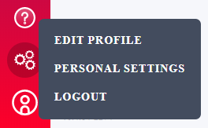

# Ziti Quickstart

This guide will get you up and running with a demonstrable service in only a few minutes.  
If you are unfamiliar with the relevant ziti concepts refer to the [overview](overview.md).

# From Nothing to Network 

To get started with Ziti here are the steps you will need to accomplish:

1. [Get Ziti](#start-ziti)
  1. Obtain, then change the default password
1. [Create an Identity](#create-an-identity)
  1. [Enroll the Identity](#create-a-service)
1. [Setup your first Network](#create-an-appwan)

## Start Ziti

### Getting Started in AWS

This guide will leverage an [Amazon Machine Image (AMI) delivered via the AWS Marketplace]
(https://netfoundry.io/todo-link-to-aws.ziti).
Using the image you will have an instance of Ziti to use as you please within minutes. If you are
unfamiliar AWS you'll want to take some time to come up to speed. You will need an account, and
you'll want to become familiar with the console. Start
[here](https://docs.aws.amazon.com/whitepapers/latest/aws-overview/introduction.html)
and when you feel ready - come back to this guide.

### Starting a Ziti Instance

NetFoundry has provided an [Amazon Machine Image (AMI) delivered via the AWS Marketplace]
(https://netfoundry.io/todo-link-to-aws.ziti) to make it easy for you to deploy a fully functional
Ziti-based network.  Follow the prompts and launch a new AMI.  You will need to make a few key decisions
that might affect your Ziti-based network.

> [!IMPORTANT]
> This is IMPORTANT. Make sure you consider and understand any security implications of the choices made
> when starting the AMI

* Virtual Private Cloud (VPC): for the instance to be put into. Choosing the VPC will determine what network
resources are available to your Ziti network
* Subnet: The subnet you choose further defines what resources the instance will have access to. If you have
a service that is not visible to the public internet and you wnat to use Ziti to secure that service
make sure you put the Ziti instance on the proper subnet
* Security Group: You will want to put the Ziti instance into a security group that allows access from
the public internet on ports: 22, 443, 1280, 3022.
  * port 22 - the default port that ssh uses. This is how you will log into the bare AMI after it is launched.
  * port 443 - a small UI is delivered via a web server that runs on port 443, using self-signed certificates
  * port 1280 - the preselected port the Ziti controller will serve its API over
  * port 3022 - the preselected port for data channels to the Ziti gateway

> [!IMPORTANT]
> Make sure you have the private key corresponding to the public key you choose.
> Without the private key - you will not be able to authenticate to the bare AMI.

### Obtain and Change the Default Password

When first launched - the AMI will deposit a file into the file system at
~/.config/ziti/ziti-controller/credentials.json.

> [!NOTE]
> Since this is your first Ziti deployment this system is expected to be transient. If the IP address or DNS entry
> changes (such as a system reboot) the image needs to be reconfigured becuase the certificates will no longer be valid.
> This file is used to reconfigure the system in this event and it happens automatically on startup.

Now, ssh to the newly created machine. Once there you can obtain the username and password for your
Ziti controller by issuing this command:

    jq -r .password ~/.config/ziti/ziti-controller/credentials.json

You can choose to keep this password or change it to something easier to remember. If you change the password, please
remember to use a strong password which is not easy to guess.

> [!TIP]
> Once the password is changed - update the credentials.json file with the current password if you want the system to
> automatically update the certificates in the event of the image losing its IP address or DNS entry.

# [Change via UI](#tab/tabid-1a)

These AMIs will be provided with a self-signed certificate generated during securely during the bootup process. See
[changing pki](manage/pki.md) for more information.

1. Log into the UI using the password obtained in the prior step
1. In the lower left corner, click the icon that looks like a person and choose "Edit Profile"  
  

1. Enter the current password along with a new/confirmed password and click "Save"  
  

# [Change via CLI](#tab/tabid-2a)

To change the administrator password using the CLI simply issue these two commands:

    #load the current user/password into an environment variables
    ctrl_user=$(jq -r .username ~/.config/ziti/ziti-controller/credentials.json)
    ctrl_passwd=$(jq -r .password ~/.config/ziti/ziti-controller/credentials.json)

> [!NOTE]
> You will need to login one time in order to use the ziti cli:

    ziticontroller=127.0.0.1
    cert=~/.config/ziti/pki/intermediate/certs/intermediate.cert
    ziti edge controller login https://${ziticontroller}:1280 -u $ctrl_user -p $ctrl_passwd -c $cert
   
    #update the admin user. This command will prompt you to enter the password
    ziti edge controller update authenticator updb -s
    
***

## Create an Identity

All connections to Ziti are mutually authenticated TLS connections. Identites map a given certificate to an identity
within the Controller. Read more about Identities [here](identities.md) Creating an identity via the UI or CLI is easy:

# [New User via UI](#tab/tabid-3b)

1. On the left side click "Edge Identities"
1. In the top right corner of the screen click the "plus" image to add a new identity
1. Enter the name of the identity you would like to create
1. Choose the type: Device, Service, User (choose User for now)
1. Click save

# [New User via CLI](#tab/tabid-4b)

To change the administrator password using the CLI simply issue these two commands:

    #creates a new user named "NewUser"
    ziti edge controller create identity user "NewUser" -o NewUser.jwt

***

### Enroll the New Identity

Identities are not truly enabled until they are enrolled. Enrollment is a complex process. NetFoundy has created a tool
specifically for this task to ensure safe and secure enrollment of identities.  

1. Download [the enroller](https://netfoundry.io/download/ziti/enroller) for your operating system.
1. Download the [jwt](https://jwt.io/introduction/) from the UI by clicking the icon that looks like a certificate (save
   the file as NewUser.jwt) or if you used the CLI from the output location specified when creating the user.
1. In a command line editor, change to the folder containing the jwt. Enroll the identity by running `ziti-enroller --jwt NewUser.jwt`

The ziti-enroller will output a new json file named `NewUser.json`. This file is precious and must be protected as it
contains the identity of the given user.

## Create a Service

With an identity created it's now time to create a service. Read more about Services [here](services.md).  For this
example we are going to choose a simple website that is [available on the open internet](http://eth0.me). This site will
return the IP address you are coming from. Click this link now and discover what the your external IP is.

# [New Service via UI](#tab/tabid-5c)

1. On the left side nav bar, click "Edge Services"
1. In the top right corner of the screen click the "plus" image to add a new service
1. Choose a name for the serivce. Enter "ethzero-ui"
1. Enter a host name for the service. Enter "ethzero.ziti.ui"
1. Enter port 80
1. Choose Router "ziti-gw01"
1. For Endpoint Service choose:
    * protocol = tcp
    * host = eth0.me
    * port = 80
1. Select "demo-c01" for the cluster
1. Leave Hosting Identities as is
1. Click save

# [New Service via CLI](#tab/tabid-6c)

To change the administrator password using the CLI simply issue these two commands:

    #load the default cluster id into an environment variable
    cluster=$(ziti edge controller list clusters | tr -s ' ' | cut -d ' ' -f4)

    #load the gateway id into an environment variable
    gateway=$(ziti edge controller list gateways | cut -d ' ' -f2)

    #update the admin user. This command will prompt you to enter the password
    ziti edge controller create service ethzero-cli "ethzero.ziti.cli" "80" "$gateway" "tcp:eth0.me:80" -c "$cluster"

***

## Create an AppWan

AppWANs are used to to authorize identities to services and allow you to choose the terminating node for traffic
destined to your service. [Read more about appwans here](appwans.md)

# [New Service via UI](#tab/tabid-7d)

1. On the left side nav bar, click "AppWANs"
1. In the top right corner of the screen click the "plus" image to add a new AppWAN
1. Choose a name for the AppWAN. Enter "my-first-appwan"
1. Choose the service(s) you want to add to the AppWAN. Make sure you pick ethzero-ui
1. Choose the identity you created before (NewUser)
1. Click save

# [New Service via CLI](#tab/tabid-8d)

To create an AppWAN using the CLI issue the following commands:

    #load the identity's id into an environment variable
    identity=$(ziti edge controller list identities | grep NewUser | cut -d " " -f2)

    #load the service id into an environment variable
    service=$(ziti edge controller list services | grep ethzero-cli | cut -d " " -f2)

    #update the admin user. This command will prompt you to enter the password
    ziti edge controller create app-wan my-first-cli-appwan -i $identity -s $service

***

## Test It

Ok, you're almost ready to test your Ziti setup! Now you need to acquire a pre-built client from NetFoundry. The
simplest way to test your setup is to get the [ziti-tunnel](http://netfoundry.io/ziti/downloads) for your OS. The
ziti-tunnel has a mode which acts as a proxy into the Ziti overlay network.  You will need the enrolled identity json
file created in the previous step and this will require running a command. Here are the steps to verify your Ziti
network and configuration are all working properly:

* Open a command prompt
* ensure ziti-tunnel and NewUser.json are in the same directory and cd to this directory
* run the ziti-tunnel in proxy mode:
  * `ziti-tunnel proxy -i NewUser.json ethzero-ui:1111`
  * `ziti-tunnel proxy -i NewUser.json ethzero-cli:2222`
* navigate your web browser to (or use curl) to obtain your IP address by going to http://localhost:1111/

At this point you should see the external IP address of your Amazon instance. Delivered to your machine safely and
securely over your Ziti network.
