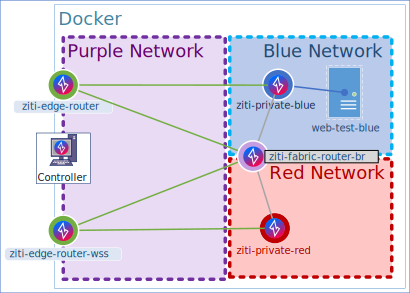

# Local - Docker Compose

If you are not familiar with it, [Docker Compose](https://docs.docker.com/compose/) is a tool for defining and running
multi-container Docker applications. It makes deploying multiple containers easy by using a declarative format defined
via yaml.

Ziti provides a Docker compose file that will get you up and running very quickly assuming you have both `docker`
and `docker-compose` already installed in your system.

## Preparation - Required Files

First, grab the compose file from the
[ziti repository](https://raw.githubusercontent.com/openziti/ziti/release-next/quickstart/docker/docker-compose.yml).

Using curl that would look like this:

```bash
curl -o docker-compose.yaml https://raw.githubusercontent.com/openziti/ziti/release-next/quickstart/docker/docker-compose.yml
```

Next, grab the
default [environment file](https://raw.githubusercontent.com/openziti/ziti/release-next/quickstart/docker/.env)
or just make a file in this folder that looks like this:

```bash
curl -o .env https://raw.githubusercontent.com/openziti/ziti/release-next/quickstart/docker/.env
```
or
```bash
cat > .env <<DEFAULT_ENV_FILE
ZITI_IMAGE=openziti/quickstart
ZITI_VERSION=latest
ZITI_CONTROLLER_RAWNAME=ziti-controller
ZITI_EDGE_CONTROLLER_RAWNAME=ziti-edge-controller
DEFAULT_ENV_FILE
```

## Running via Docker Compose

Once the compose file is downloaded and the `.env` file exists, you'll be able to start this network using
docker-compose just like you can with any other compose file: `docker-compose up`

> [!Note]
> Docker compose will name your containers based on the folder you were in when you started them. For me, I've made a folder
> named `docker` so all my containers start with `docker_`. You can influence how this works by adding
> `--project-name docker` (or whatever name you like) to your docker-compose up/down commands
> ```bash
> docker-compose --project-name docker up 
> ```
> 
### Stopping the Network

This docker-compose file will generate a volume mount as well as a **two** docker networks. When you issue 
`docker-compose --project-name docker down` the volume mapping will not be removed. If you wish to remove the volume, 
you'll need to specify the `-v` flag to the `docker-compose` command. Leave the `-v` off your command if you want to just 
stop the containers without losing the controller database and PKI.

## Deployment Diagram

This `docker-compose` file will create quite a few containers on your behalf. Here is an overview of the network that
will get created:



As you can see there's a fair bit going on in there, let's break it down. The first thing to notice is that the entire
image is within the scope of a Docker network. You'll see with this compose file there are three pieces of the overlay
which span the Docker network: the controller, an edge router, and a websocket-based edge router.  

### Deployment Simplified

The stock docker-compose.yml deploys many components and is somewhat complex. If you prefer a simplified deployment via 
Docker compose, one which only includes the basic controller and edge router combination you can instead download the 
[simplified-docker-compose.yml](https://git.io/JXQSt)
 
### Networks

Inside the Docker network you'll see there are three networks:
* the blue docker network
* the red docker network
* the purple "logical" network

Docker will ensure only the pieces within a given network, can only communicate within that network. This network
topology is designed to approximate, very loosely, what it would be like to have a publicly deployed network. The purple
network would approximate the internet itself, the blue network would represent a cloud provider's private network 
(such as AWS) and the red network could represent another cloud provider network (like Azure). Those details are not 
important, the important part is that the networks are totally private to one another. See more on this topic below in 
the "Testing" section.

####  Purple Network

There is no Docker network named "purple" in the compose file, it's entirely a logical construct. It is shown only for
clarity. All the assets in the purple network are in both the blue and red docker networks (which is why it's
referred to as purple). The assets in the purple network need to be in both the red and blue networks because the 
assets located in the blue and red networks need to communicate to the public edge routers and also need to communicate 
to the controller. If that's confusing, see the "Testing" section below which will hopefully make this more clear.

#### Red Network

The red network exists for demonstration only at this time. As you can see there are no assets inside the red network
other than the private, `ziti-private-red` router **and** the `ziti-fabric-router-br`. This means there's nothing in the
red network for Ziti to access. It would serve as a great place for you to put your own assets and explore using Ziti!

#### Blue Network

The blue network contains two important assets, the `ziti-private-blue` router and the `web-test-blue` server. Along
with those assets, the network also contains the `ziti-fabric-router-br`. Although the `web-test-blue` server does 
export a port by default (port 80 on your localhost, will translate to port 8000 on the `web-test-blue` server), you 
can use Ziti to access this server without the exported port.

#### The "Fabric" Router

The `ziti-fabric-router-br` exists to illustrate that you can create edge routers that are not necessarily fully public.
This is the only router which can communicate to **all** the other routers. The Ziti mesh may choose to use this router
if the algorithm indicates it's the fastest path. Perhaps we'll see more about this in future docs.

## Testing the Network

### Using Docker Locally

A quick note. If you are not well-versed with Docker you might forget that exposing ports in Docker is one thing,
but you'll also need to have a hosts entry for the containers you want to access from outside the Docker
network. This quickstart will expect that you understand this and for every router you add you will want to make
sure you add a host entry. In the docker-compose example you will want/need hosts entries for at least: 

- `ziti-edge-controller`,
- `ziti-edge-router`

And if you want to expose any other routers - of course you'll need/want to have entries for those as well.

### Testing

Now that we have used `docker-compose` to deploy a relatively complicated network, we can start testing it out to make
sure everything is in place and looks correct. Let's try it out.

To test, we will `docker-compose exe` into the running controller. 

```bash
docker-compose exec ziti-controller bash
```

Once exec'ed into the controller, the `ziti` CLI will be added to your PATH for you. There is also the `zitiLogin`
alias to make it easy for you to authenticate to the Ziti controller. Run `zitiLogin` now and ensure you're 
authenticated.

```bash
ziti@724087d30014:/openziti$ zitiLogin
Token: 55ec6721-f33b-4101-970a-412331bd7578
Saving identity 'default' to /openziti/ziti-cli.json
```

### Test - Edge Routers Online

Once authenticated, let's see if all our routers are online by running `ziti edge list edge-routers`:
```bash
ziti@724087d30014:/openziti$ ziti edge list edge-routers
id: BZ.Y7vMdAI    name: ziti-edge-router    isOnline: true    role attributes: {}
id: NELWwjMd8    name: ziti-private-blue    isOnline: true    role attributes: {}
id: l9-W7jMf8    name: ziti-fabric-router-br    isOnline: true    role attributes: {}
id: rqZW7vMdA    name: ziti-edge-router-wss    isOnline: true    role attributes: {}
id: xmiYwvMf8    name: ziti-private-red    isOnline: true    role attributes: {}
```

We can see all the routers are online - excellent.

### Test - Edge Router Identites

In this compose file, we have used a script that adds an identity for each of our edge routers as well. We can see those
by running `ziti@724087d30014:/openziti$ ziti edge list identities`:

```bash
ziti@724087d30014:/openziti$ ziti edge list identities
id: BZ.Y7vMdAI    name: ziti-edge-router    type: Router    role attributes: {}
id: NELWwjMd8    name: ziti-private-blue    type: Router    role attributes: {}
id: Q4Y-OTcwo    name: Default Admin    type: User    role attributes: {}
id: l9-W7jMf8    name: ziti-fabric-router-br    type: Router    role attributes: {}
id: rqZW7vMdA    name: ziti-edge-router-wss    type: Router    role attributes: {}
id: xmiYwvMf8    name: ziti-private-red    type: Router    role attributes: {}
````

Notice there is an identity for every router.

### Test - Network Connectivity Success

Recall that the controller should be able to contact both the red and blue edge routers. Let's use ping and verify:

```bash
ziti@724087d30014:/openziti$ ping ziti-private-red -c 1
PING ziti-private-red (172.29.0.2): 56 data bytes
64 bytes from 172.29.0.2: icmp_seq=0 ttl=64 time=0.387 ms
--- ziti-private-red ping statistics ---
1 packets transmitted, 1 packets received, 0% packet loss
round-trip min/avg/max/stddev = 0.387/0.387/0.387/0.000 ms
```

```bash
ziti@724087d30014:/openziti$ ping ziti-private-blue -c 1
PING ziti-private-blue (172.28.0.6): 56 data bytes
64 bytes from 172.28.0.6: icmp_seq=0 ttl=64 time=0.633 ms
--- ziti-private-blue ping statistics ---
1 packets transmitted, 1 packets received, 0% packet loss
round-trip min/avg/max/stddev = 0.633/0.633/0.633/0.000 ms
```

### Test - Network Connectivity Failure

Now let's exit the Ziti controller and instead attach to the private blue router by running this command:
`docker-compose exec ziti-private-blue bash`.  Once attached to the blue router we'll verify that we cannot
connect to the private red router:

```bash
ziti@e610d6b44166:/openziti$ ping ziti-private-red -c 1
ping: unknown host
```

Unknown host - the private blue router cannot connect to the red router.

### Test - Web Test Blue

While we're attached to the blue router - let's make sure we can connect to that `web-test-blue` server.  
```bash
ziti@e610d6b44166:/openziti$ curl http://web-test-blue:8000
<pre>
Hello World


                                       ##         .
                                 ## ## ##        ==
                              ## ## ## ## ##    ===
                           /""""""""""""""""\___/ ===
                      ~~~ {~~ ~~~~ ~~~ ~~~~ ~~ ~ /  ===- ~~~
                           \______ o          _,/
                            \      \       _,'
                             `'--.._\..--''
</pre>
```

Don't forget - you can also access this from the exported port 80 on your local machine too!
```bash
curl http://localhost:80
<pre>
Hello World


                                       ##         .
                                 ## ## ##        ==
                              ## ## ## ## ##    ===
                           /""""""""""""""""\___/ ===
                      ~~~ {~~ ~~~~ ~~~ ~~~~ ~~ ~ /  ===- ~~~
                           \______ o          _,/
                            \      \       _,'
                             `'--.._\..--''
</pre>
```

## Install Ziti Admin Console (ZAC) [Optional]

Once you have the network up and running, if you want to install the UI management console, the ZAC, [follow along with
the installation guide](~/ziti/quickstarts/zac/installation.md)

## Using the Overlay

Now you have your zero trust overlay network in place, you probably want to try it out. Head on over to
[the services quickstart](~/ziti/quickstarts/services/index.md) and start the journey to understanding how to use OpenZiti.
