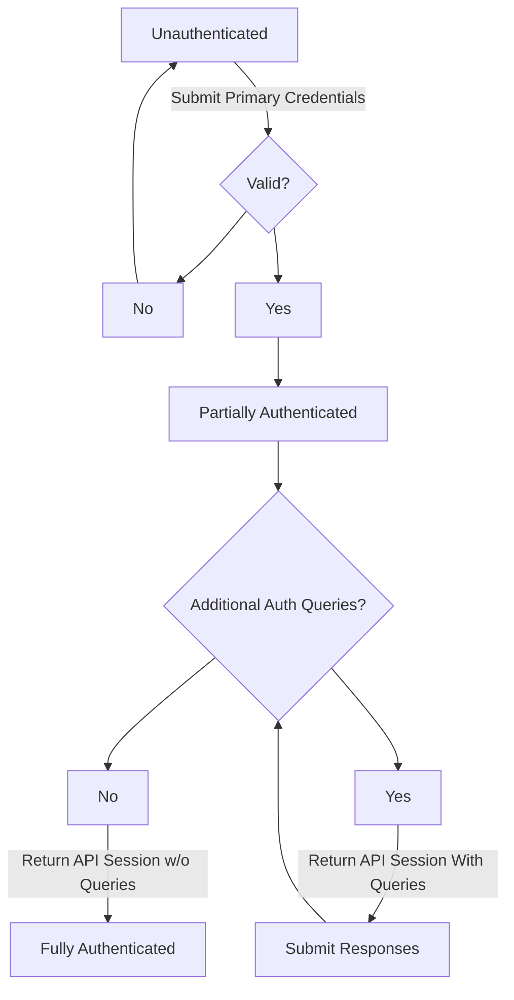

# Authentication

Authorization in Ziti Edge occurs when a client wishes to interact with the Ziti Edge Controller. API Sessions are
a high level security context that represents an authenticated session with either the Ziti Edge Client API
or the Ziti Edge Management API.

- Clients that are powered by a Ziti SDK that access services will authenticate with the Client API
- Clients that are managing a Ziti Network will authenticate with the Management API

# Authentication Flow

Below is diagram showing initial authentication for some client. The same model is used between the Edge Client API
and Edge Management API.

[](https://mermaid-js.github.io/mermaid-live-editor/edit#pako:eNp1kUtPwzAQhP_KyudW3HMApU1fFxQaHoK4B1Mv1CJZR34IRUn-O46bCiGVm9f6ZmY97thRS2QJ-zSiOcFjxiktn0h4d0Jy6igcygPM57d94d9r5SA3qhamhaVBORKisj0sumdRKXk3cFqMMCzLex1lkF6usvIV7YFTFqdVmQszqqsW0j9hnFaRWHeplMopTaKKCDx4NArtmLKOyGayPE_bMZPTNg79Hp03BGm-gwKtDTbwfaMvHj28lWt_LXzzr_xF_e7Qw66cCtmjbTTZuMjuvDmbsRpNLZQMxXacADgLKTVyloSjFOaLM05D4HwjQ_AqPFQblnyENnHGQvu6aOnIEmc8XqBMifBJ9UQNP7yGlbE)



In the above a client has provided primary authentication credentials (certificate, JWT, username password) and then
subsequently provided any secondary credentials necessary (JWT, TOTP, etc). The secondary credentials are requested 
via Authentication Queries and enable multi-factor authentication to occur.

The goal of authentication is to obtain an API Session. API Sessions are used to interact with the Ziti Controller that
is Edge enabled and Ziti Edge Routers. API Sessions for clients are represented by opaque tokens (JWT or
otherwise) that are provided as headers in HTTP requests and by values in protobuf messages for the Edge protocol
between routers and SDKs. API Sessions represent a security context that is used to determine authorization in the rest
of the Ziti system.

## API Sessions

API Sessions are represented by opaque strings and are provided in the HTTP header `zt-session` and in Edge Router
connection requests initiated by Ziti SDKs. API Sessions remain valid as long they have not timed out.

An API Sessions:

- can and are represented by a JSON data structure returned from the Client and Management APIs
  - returned from:
    - `POST /edge/management/v1/authenticate`
    - `GET /edge/management/v1/current-api-session`
    - `POST /edge/client/v1/authenticate`
    - `GET /edge/client/v1/current-api-session`
- can be referenced by an internal `id` and a security token that is in the format of a UUID

Example `POST /edge/management/v1/authenticate` response:

```json
{
  "data": {
    "_links": {
      "self": {
        "href": "./api-sessions/cl4zptpgqcrinn0hhgm7ek5ve"
      },
      "sessions": {
        "href": "./api-sessions/cl4zptpgqcrinn0hhgm7ek5ve/sessions"
      }
    },
    "createdAt": "2022-06-29T14:51:07.946Z",
    "id": "cl4zptpgqcrinn0hhgm7ek5ve",
    "tags": {},
    "updatedAt": "2022-06-29T14:51:07.946Z",
    "authQueries": [
      {
        "format": "alphaNumeric",
        "httpMethod": "POST",
        "httpUrl": "./authenticate/mfa",
        "maxLength": 6,
        "minLength": 4,
        "provider": "ziti",
        "typeId": "MFA"
      }
    ],
    "authenticatorId": "vxtlfvUj6",
    "cachedLastActivityAt": "2022-06-29T14:51:07.945Z",
    "configTypes": [],
    "identity": {
      "_links": {
        "auth-policies": {
          "href": "./auth-policies/default"
        },
        "authenticators": {
          "href": "./identities/vxtlfvUj6/authenticators"
        },
        "edge-router-policies": {
          "href": "./identities/vxtlfvUj6/edge-routers"
        },
        "enrollments": {
          "href": "./identities/vxtlfvUj6/enrollments"
        },
        "failed-service-requests": {
          "href": "./identities/vxtlfvUj6/failed-service-requests"
        },
        "posture-data": {
          "href": "./identities/vxtlfvUj6/posture-data"
        },
        "self": {
          "href": "./identities/vxtlfvUj6"
        },
        "service-policies": {
          "href": "./identities/vxtlfvUj6/service-policies"
        }
      },
      "entity": "identities",
      "id": "vxtlfvUj6",
      "name": "Default Admin"
    },
    "identityId": "vxtlfvUj6",
    "ipAddress": "127.0.0.1",
    "isMfaComplete": false,
    "isMfaRequired": true,
    "lastActivityAt": "2022-06-29T14:51:07.945Z",
    "token": "44a20395-1a0e-469d-ad9b-80df8dbbf8c4",
    "expirationSeconds": 1800,
    "expiresAt": "2022-06-29T15:21:07.945Z"
  },
  "meta": {}
}
```

API Sessions are defined in the Client and Management Open API 2.0 specifications under `currentApiSessionDetail`.

### Full vs Partial Authentication

API Sessions may exist in two states:

- Partially Authenticated - limited API access
- Fully Authenticated - full API access

Partial authentication occurs when a primary authentication method has been passed, but secondary Authentication Queries
remain outstanding. Ziti Edge models MFA challenges as Authentication Queries. Authentication Queries include information
that can be used to display user prompts or direct users to integrating websites for SSO. If no outstanding 
Authentication Queries are present for an API Session it is considered fully authenticated.

While partially authenticated, the API Session can only be used for a reduced set of operations on the Management
and Client APIs. These functions are limited to answering Authentication Queries and enrolling in MFA TOTP. While fully
authenticated the full suite of API operations is available.

#### Authentication Queries

Authentication Queries are represented on an API Session the property `authQuries` which is an array. An example 
MFA challenge represented as an Authentication Query is provided below.

```json
{
  ...
  "authQueries": [
    {
      "format": "alphaNumeric",
      "httpMethod": "POST",
      "httpUrl": "./authenticate/mfa",
      "maxLength": 6,
      "minLength": 4,
      "provider": "ziti",
      "typeId": "MFA"
    }
  ],
  ...
}
```

The existence of any Authentication Query on an API Session represents a partial authentication state. API Sessions
in this state will have reduced access to their target API. The data structure for Authentication Queries is defined
in the Client and Management Open API 2.0 specifications under the label `authQueryDetail`.

### Associated Data & Removal

API Sessions, may be used to create ephemeral certificates and sessions for service access. Additionally, API Sessions
are used to scope Posture Data. When an API Session is removed for any reason, all associated data is also removed.
As an example, when removing an API Session used to create a Session the Session will also be removed. Removing that
Session will also terminate any existing connections that used the security token associated with that Session and
prevent it from being used to establish new connections.

Removal of an API Session occurs in the following scenarios:

- timeout
- administrative removal
- client removal (logout)


### Timeout

The controller maintains a last accessed at timestamp for every API Session. This timestamp is used to determine whether
the session timeout has been reached, signaling an API Session removal. Activity that move the last accessed at timestamp
includes:

- Any maintained Edge Router connection
- Any valid Client or Management API interaction

The API Session timeout defaults to 30 minutes and can be configured in `edge.api.sessionTimeout` in the controller
configuration file.

```yaml
edge:
  api:
  ...
    # sessionTimeout - optional, default 30m
    # The number of minutes before an Edge API session will timeout. Timeouts are reset by
    # API requests and connections that are maintained to Edge Routers
    sessionTimeout: 30m
    ...
```

# Primary Authentication

Primary authentication in Ziti establishes and API Sessions identity principal and enabled Ziti to determine which
secondary authentication factors are necessary for an API Session to become fully authenticated. If no secondary
authentication factors are required the API Session becomes fully authenticated immediately without any further
interaction with the Client or Management API.

Primary authentication factors include:

- x509 certificates
- JWTs
- Username/password

Valid primary authentication methods can be restricted via [External JWT Signer](external-jwt-signers.md). An Identity can have one
[Authentication Policies](../authentication/authentication-policies.md) associated with it. This association is defined by the `authPolicyId` property on the 
identity. If no [Authentication Policy](../authentication/authentication-policies.md) is set for an Identity, a special system defined [Authentication Policy](../authentication/authentication-policies.md) with the
id of `default` will be used.

## x509 Certificate Primary Authentication

x509 authentication requires the client to initiate a HTTPs authentication request using a x509 client certificate that
is associated to the target Identity on an Authenticator. The client certificate can be issued by the Ziti Edge Controller's internal PKI or an external PKI. If an external PKI
is being used, it must be registered as a [3rd Party CA](third-party-cas.md) via the Ziti Edge Management API, verified, and have authentication
enabled. The client certificate must pass signature and CA chain-of-trust validation. All client, intermediate CA,
and root CA functionality supports RSA and EC keys.

Please note that intermediate CA certificates may be provided during authentication if necessary. The client certificate
should be in index zero and intermediate CA certificates in subsequent indexes.

To associate a client certificate with an Identity and Authenticator see the [Enrollment](../enrollment/enrollment.md) 
section.

Expired client certificates may be allowed via [Authentication Policies](authentication-policies.md) if desired.


## JWT Primary Authentication

JWT authentication requires that an [External JWT Signer](external-jwt-signers.md) be added via the Ziti Edge Management 
API. The definition of [External JWT Signer](external-jwt-signers.md) allows configuration of which JWT claim should be
used as a value to map against the unique `externalId` property on Identities. This mapping of JWT claim to `externalId`
is used to determine which Identity is authenticating.

The JWT must be provided in the HTTP request in the `Authentication` header with a value in the format of 
`Bearer <jwt>`. The JWT provided must pass signature, expiration, issuer, and audience validation as configured
on the [External JWT Signer](external-jwt-signers.md).

## Username/password

An internal username/password authentication system is provided for smaller deployments of Ziti. It is highly suggested
that all username/password authenticators be replaced by x509 certificate/JWT authentication mechanisms. Passwords
are stored individually salted and one-way cryptographically hashed using Argon2id.

Password policies may be enforced via [Authentication Policies](authentication-policies.md). Administrative [management
of passwords](password-management.md) is also available.

# Secondary Authentication

Secondary authentication is represented by a series of [Authentication Queries](#authentication-queries) on an API
Session in the `authQueries` property. At present the following secondary authentication mechanisms are supported:

- TOTP - Time-Based One-Time Password (aka Authenticator Apps)
- JWT - JSON Web Tokens

## TOTP: Time-Based One-Time Password

Ziti supports all authenticator application that implement [RFC6238](https://datatracker.ietf.org/doc/html/rfc6238)
which includes all major and popular TOTP applications such as Google Authenticator, Microsoft Authenticator, Authy, and
many others.

TOTP is configured per-identity and must be client initiated due to the symmetric key exchange that must take place.
Administrators can enforce TOTP usage through [Authentication Policies](authentication-policies.md) and 
[Posture Checks](../authorization/posture-checks.md). [Authentication Policy](authentication-policies.md) enforcement 
stops the client from transitioning between [partially authenticated](#full-vs-partial-authentication) and
[fully authenticated](#full-vs-partial-authentication) status. This stops a client from accessing any service information
or connect to any service. [Posture Check](../authorization/posture-checks.md) enforcement allows a client to
[fully authenticate](#full-vs-partial-authentication), but based on [Service Policy](../authorization/policies/overview.md) 
restrict connection to specific services.

