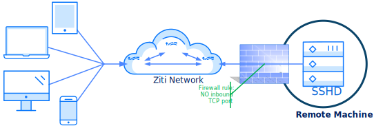

# Zitifying SSH

As we learned in the [opening post][1], "zitifying" an application means to embed a Ziti SDK into an application and leverage the power of a [Ziti Network][2] to provide secure, truly zero-trust access to your application no matter where in the world that application goes. In this post we are going to see how we have zitified `ssh` and why. Future posts will expand on this even further by showing how NetFoundry uses `zssh` to support our customers.

<iframe width="560" height="315" src="https://www.youtube.com/embed/WyZ8GRvtgGs" title="YouTube video player" allow="autoplay; picture-in-picture" allowfullscreen></iframe>

* * *

## Why SSH?

As I sit here typing these words, I can tell you're skeptical. I can tell you're wondering why in the world we would even attempt to mess with `ssh` at all. After all, `ssh` has been a foundation of the administration of not only home networks but also corporate networks and the internet itself. Surely if millions (billions?) of computers can interact every day safely and securely using `ssh` there is "no need" for us to be spending time zitifying `ssh` right? (Spoiler alert: wrong)

I'm sure you've guessed that this is not the case whatsoever. After all, attackers don't leave `ssh` alone just because it's not worth it to try! Put a machine on the open internet, expose `ssh` on port 22 and watch for yourself all the attempts to access `ssh` using known default/weak/bad passwords flood in. Attacks don't only come from the internet either! Attacks from a single compromised machine on your network very well could behave in the same way as an outside attacker. This is particularly true for ransomware-style attacks as the compromised machine attempts to expand/multiply. The problems don't just stop here either. DoS attacks, other zero-day type bugs and more are all waiting for any service sitting on the open internet.

A zitified `ssh` client is superior since the port used by `ssh` can be eliminated from the internet-based firewall preventing any connections whatsoever from any network client. In this configuration the `ssh` process is effectively "
dark". The only way to `ssh` to a machine configured in this way is to have an identity authorized for that [Ziti Network][2].

It doesn't stop there though. A Ziti Network mandates the use of a strong identity. You cannot access any services defined in a [Ziti Network][2] without having gone through the enrollment process to create a strong identity used for bidirectional authentication and authorization. With Ziti, you can't even connect to SSH without first being authorized to connect to the remote SSH server.

Contrast that to SSH. With SSH you need access the sshd port before starting the authentication process. This requires the port to be exposed to the network, exposing it to attack. With SSH you are also usually allowed to authenticate without providing a strong identity using a username and password. Even if you are choosing to use the more secure pub/private key authentication for SSH, the remote machine still needed the public key added to the authorized_keys file before allowing connections to it via SSH. This is all-too-often a step which a human will do, making the process of authorizing a user or revoking access relatively cumbersome. Ziti provides a secure, centralized location to manage authorization of users to services. Ziti makes it trivial to grant or revoke access to a given set of services to users immediately.

Lastly, Ziti provides support for continual authorization through the use of policy checks. These policy checks run continuously. If a user suddenly fails to meet a particular policy, access to the services provided via the [Ziti Network][2] are revoked immediately.

Cool right? Let's see how we did it and how you can do the same thing using a [Ziti Network][2].

#### Overview of SSH - notice how port 22 is open to inbound connections:


* * *

## How It's Done

There are a few steps necessary before being able to use `zssh`:

* Establish a [Ziti Network][4]
* Create and enroll two Ziti Endpoints (one for our `ssh` server, one for the client)
    * the `sshd` server will run `ziti-tunnel` for this demonstration. Conveniently it will run on the same machine I used to setup the [Ziti Network][2].
    * the client will run `zssh` from my local machine, and I'll `zssh` to the other endpoint
* Create the [Ziti Service][5] we'll use and authorize the two endpoints to use this service
* Use the `zssh` binary from the client side and the `ziti-tunnel` binary from the serving side to connect
* Harden `sshd` further by removing port 22 from any internet-based firewall configuration (for example, from within the security-groups wizard in AWS) or by forcing `sshd` to only listen on `localhost/127.0.0.1`

#### Overview of ZSSH - notice port 22 is no longer open to inbound connections:



After performing these steps you'll have an `sshd` server that is dark to the internet. Accessing the server via `ssh`
must now occur using the Ziti Network. Since the service is no longer accessible directly through a network, it is no longer susceptible to the types of attacks mentioned previously!

* * *

## Zssh in Action

Once the prerequisites are satisfied, we can see `zssh` in action. Simply download the binary for your platform:

* [linux][7]
* [windows][8]
* [MacOs][9]

Once you have the executable download, make sure it is named `zssh` and for simplicity's sake we'll assume it's on the path. A goal for `zssh` is to make the usage of the command very similar to the usage of `ssh`. Anyone familiar with `ssh` should be able to pick up `zssh` easily. As with most tooling, executing the binary with no arguments will display the expected usage. The general format when using `zssh` will be similar to that of `ssh`: `zssh <remoteUsername>@<targetIdentity>`

Below you can see me `zssh` from my local machine to the AWS machine secured by `ziti-tunnel`:

```text
./zssh ubuntu@ziti-tunnel-aws
INFO[0000] connection to edge router using token 95c45123-9415-49d6-930a-275ada9ae06f
connected.
ubuntu@ip-172-31-27-154:~$
```

It really was that simple! Now let's break down the current flags for `zssh` and exactly how this worked.

* * *

## Zssh Flags

We know that `zssh` requires access to a [Ziti Network][2] but it is not clear from the example above is where `zzsh`
found the credentials required to access the network. `zssh` supports three basic flags:

-i, --SshKeyPath string Path to ssh key. default: $HOME/.ssh/id_rsa -c, --ZConfig string Path to ziti config file. default: $HOME/.ziti/zssh.json -d, --debug pass to enable additional debug information -h, --help help for this command -s, --service string service name. default: zssh (default "zssh")

What you see above is exactly the output `zssh` provides should you pass the `-h/--help` flag or execute `zssh` without any parameters. The `-i/--SshKeyPath` flag is congruent to the `-i` flag for `ssh`. You would use it to supply your key to the `ssh` client. Under the hood of `zssh` is a full-fledged `ssh` client that works similarly to how `ssh` does. If your `~/.ssh/id_rsa` file is in the `authorized_keys` of the remote machine, then you won't need to specify the `-i/`
flag (as I didn't in my example). Using `zssh` requires the use of a public/private key in order for the `zssh` client to connect to the remote machine.

The `-c/--ZConfig` flag controls access to the network. A configuration file must be supplied to use `zssh` but does not need to be supplied as part of the command. By default, `zssh` will look at your home directory in a folder named `.ziti` for a file named `zssh.json`. In bash this is would be the equivalent of `$HOME`. In Windows this is the equivalent the environment variable named `USERPROFILE`. You do not need to supply this flag if a file exists at the default location. You can specify this flag to use `zssh` with other networks.

The `-s/--service` flag is for passing in a different service name other than "zssh". By default, the service name will be "zssh", but if you would like to access a different service use the `-s` flag followed by the service name.

The `-d/--debug` flag outputs additional information to assist you with debugging. For example:

```text
$ ./zssh ubuntu@ziti-tunnel-aws -d
INFO[0000]     sshKeyPath set to: /home/myUser/.ssh/id_rsa
INFO[0000]        ZConfig set to: /home/myUser/.ziti/zssh.json
INFO[0000]       username set to: ubuntu
INFO[0000] targetIdentity set to: ziti-tunnel-aws
INFO[0000] connection to edge router using token 95c45123-a234-412e-8997-96139fbd1938
connected.
ubuntu@ip-172-31-27-154:~$
```

Shown above is also one additional piece of information, the remote username. Shown in the example above I have `zssh`ed to an ubuntu image in AWS. When it was provisioned AWS used the username `ubuntu`. In order to `zssh` to this machine I need to tell the remote `sshd` server that I wish to attach as the `ubuntu` user. If your username is the same for your local environment as the remote machine you do not need to specify the username. For example, my local username is `cd` (my initials). When I `zssh` to my dev machine I can simply use `zssh ClintLinux`:

```text
$ ./zssh ClintLinux
INFO[0000] connection to edge router using token 909dfb4f-fa83-4f73-af8e-ed251bcd30be
connected.
cd@clint-linux-vm ~
```

Hopefully this post has been helpful and insightful. Zitifying an application is *POWERFUL*!!!!

The next post in this series will cover how we extended the same code we used for `zssh` and [zitified scp][10].

Have a look at the code over at [GitHub][11]

[1]: /blog/zitification/

[2]: /docs/learn/introduction/

[3]: ./ssh-overview.svg

[4]: /docs/learn/quickstarts/network/hosted

[5]: /docs/learn/core-concepts/services/overview

[6]: ./zssh-overview.svg

[7]: https://github.com/openziti-test-kitchen/zssh/releases/latest/download/zssh-linux-amd64

[8]: https://github.com/openziti-test-kitchen/zssh/releases/latest/download/zssh-windows-amd64.exe

[9]: https://github.com/openziti-test-kitchen/zssh/releases/latest/download/zssh-macos-amd64

[10]: /blog/zitification/zitifying-scp/

[11]: https://github.com/openziti-test-kitchen/zssh/tree/main/zssh/zssh