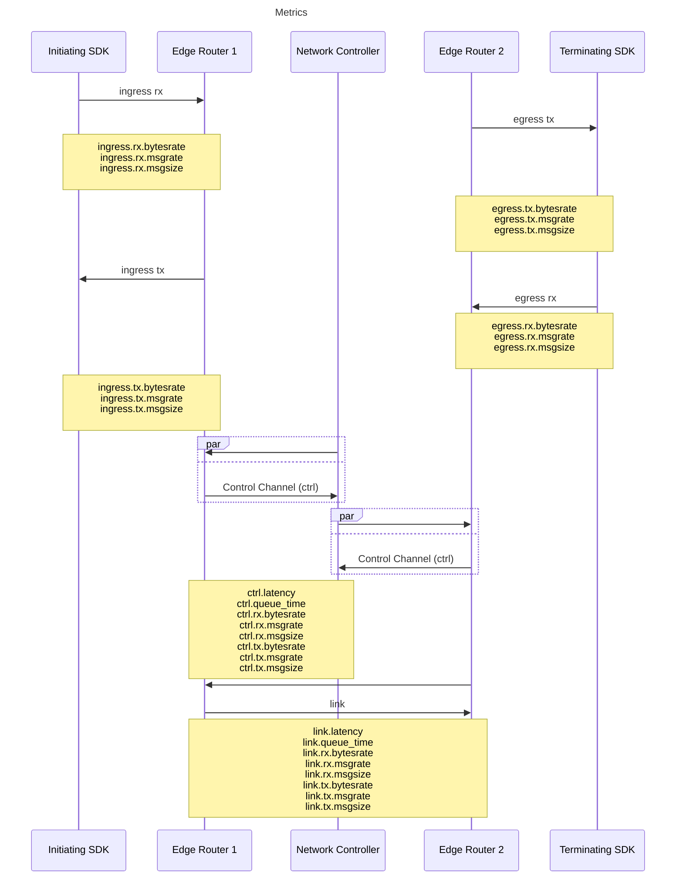

# Metrics 

OpenZiti systems provide a wide range of metrics for the monitoring of the network services, endpoints, and processes.  Some of the various metrics are visualized below to understand where they fall and what they measure in a network instance.  The bulk of the remaining metrics are measuring processes within the control plane, rather than network operation.

## Available Metrics
Metrics are reported to the log files, locale in /var/log/ziti by default.  There are 2 primary log files for metrics, utilization-metrics.log and utilization-usage.log.  These logs may be shipped to various reporting systems for easier visibility and monitoring.

| Metric | Type | Source | Description|
|------------------------|-----------|------------|-----------------------------------------------------------------------------------------------------|
|api-session.create | Histogram | controller | Time to create api sessions|
|api.session.enforcer.run | Timer | controller | How long it takes the api session policy enforcer to run|
|bolt.open_read_txs | Gauge | controller | Current number of open bbolt read transactions|
|ctrl.latency | Histogram | controller | Per control channel latency|
|ctrl.queue_time | Histogram | controller | Per control channel queue time (between send and write to wire)|
|ctrl.rx.bytesrate | Meter | controller | Per control channel receive data rate|
|ctrl.rx.msgrate | Meter | controller | Per control channel receive message rate|
|ctrl.rx.msgsize | Histogram | controller | Per control channel receive message size distribution|
|ctrl.tx.bytesrate | Meter | controller | Per control channel send data rate|
|ctrl.tx.msgrate | Meter | controller | Per control channel send message rate|
|ctrl.tx.msgsize | Histogram | controller | Per control channel send messsage size distribution|
|edge.invalid_api_tokens | Meter | router | Number of invalid api session token encountered|
|edge.invalid_api_tokens_during_sync | Meter | router | Number of invalid api session token encountered while a sync is in progress|
|egress.rx.bytesrate | Meter | router | Data rate of data received via xgress, originating from terminators. Per router.|
|egress.rx.msgrate | Meter | router | Message rate of data received via xgress, originating from terminators. Per router.|
|egress.rx.msgsize | Histogram | router | Message size distribution of data received via xgress, originating from terminators. Per router.|
|egress.tx.bytesrate | Meter | router | Data rate of data sent via xgress originating from terminators. Per router.|
|egress.tx.msgrate | Meter | router | Message rate of data sent via xgress originating from terminators. Per router.|
|egress.tx.msgsize | Histogram | router | Message size distribution of data sent via xgress, originating from terminators. Per router.|
|eventual.events | Gauge | controller | Number of background events pending processing|
|fabric.rx.bytesrate | Meter | router | Data rate of data received from fabric links|
|fabric.rx.msgrate | Meter | router | Message rate of data received from fabric links|
|fabric.rx.msgsize | Histogram | router | Message size distribution of data received from fabric links|
|fabric.tx.bytesrate | Meter | router | Data rate of data sent on fabric links|
|fabric.tx.msgrate | Meter | router | Message rate of data sent on fabric links|
|fabric.tx.msgsize | Histogram | router | Message size distribution of data sent on fabric links|
|identity.refresh | Meter | controller | How often an identity is marked, indicating that they need a full refresh of their service list|
|identity.update-sdk-info | Histogram | controller | Time to update identity sdk info|
|ingress.rx.bytesrate | Meter | router | Data rate of data received via xgress, originating from initiators. Per router.|
|ingress.rx.msgrate | Meter | router | Message rate of data received via xgress, originating from initiators. Per router.|
|ingress.rx.msgsize | Histogram | router | Message size distribution of data received via xgress, originating from initiators. Per router.|
|ingress.tx.bytesrate | Meter | router | Data rate of data sent via xgress originating from initiators. Per router.|
|ingress.tx.msgrate | Meter | router | Message rate of data sent via xgress originating from initiators. Per router.|
|ingress.tx.msgsize | Histogram | router | Message size distribution of data sent via xgress, originating from initiators. Per router.|
|link.dropped_msgs | Gauge | router | Number of messages dropped by the link forwarder.  Per link. |
|link.latency | Histogram | controller | Per link latency in nanoseconds|
|link.queue_time | Histogram | controller | Per link queue time (between send and write to wire)|
|link.rx.bytesrate | Meter | controller | Per link receive data rate|
|link.rx.msgrate | Meter | controller | Per link receive message rate|
|link.rx.msgsize | Histogram | controller | Per link receive message size distribution|
|link.tx.bytesrate | Meter | controller | Per link send data rate|
|link.tx.msgrate | Meter | controller | Per link send message rate|
|link.tx.msgsize | Histogram | controller | Per link send messsage size distribution|
|service.policy.enforcer.run | Timer | controller | How long it takes the service policy enforcer to run|
|service.policy.enforcer.run.deletes | Meter | controller | How many sessions are deleted by the service policy enforcer|
|services.list | Histogram | controller | Time to list services|
|session.create | Histogram | controller | Time to create a session|
|xgress.ack_duplicates | Meter | router | Number of duplicate acks received. Indicates over-eager retransmission|
|xgress.ack_failures | Meter | router | Number of failures sending acks|
|xgress.acks.queue_size | Gauge | router | Number of acks queued to send|
|xgress.blocked_by_local_window | Gauge | router | Number of xgress instances blocked because the windowing threshold has been exceeded locally|
|xgress.blocked_by_remote_window | Gauge | router | Number of xgress instances blocked because the windowing threshold has been exceeded remotely|
|xgress.dropped_payloads | Meter | router | Number of payloads dropped because the xgress receiver side couldn't keep up|
|xgress.retransmission_failures | Meter | router | Number of retransmission send failures|
|xgress.retransmissions | Meter | router | Number of payloads retransmitted|
|xgress.retransmits.queue_size | Gauge | router | Number of payloads queued for retransmission|
|xgress.rx.acks | Meter | router | Number of acks received|
|xgress.tx.acks | Meter | router | Number of acks sent|
|xgress.tx_unacked_payload_bytes | Gauge | router | Total payload data size that has been buffered but not acked yet|
|xgress.tx_unacked_payloads | Gauge | router | Number of payload messages that have been buffered but not yet acked|
|xgress.tx_write_time | Timer | router | Time to write payloads to the xgress receiver|