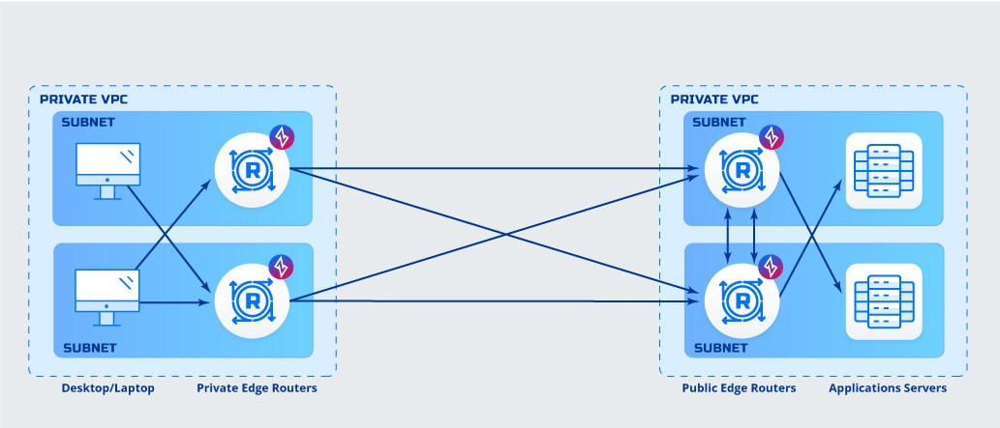

    ---    
1. **Router to Router Direct Deployment**
    &nbsp;
    
    

    **Details**
    - Hosted in private data centers, most likely scenario

    &nbsp;
    
    **Advantages:**
    - Peer to peer direct connection
    - No software must be deployed to clients
    - No software must be deployed to application servers

    &nbsp;
        
    **Disadvantages:**
    - Exposes private networks to inbound connections