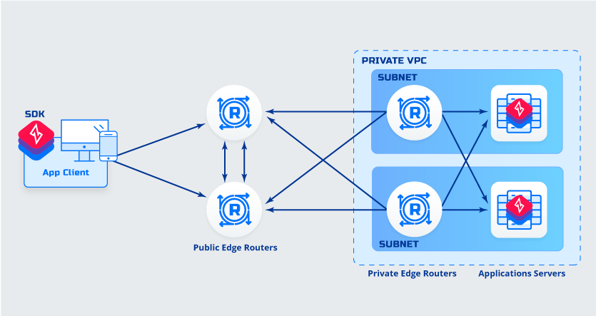
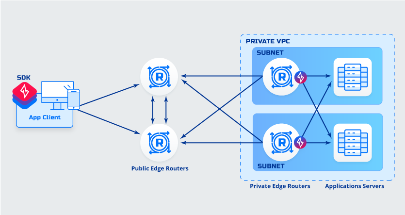

# ZTAA

This article describes the various edge deployments of ZiTi App Access. In all cases, the Controller and at least 2 Public Edge Routers are to be deployed for redundency. The Ziti Fabric connections are established between all Edge Routers but not Clients/SDKs. The Public Edge Routers would provide connection between Private Edge Routers and/or Clients/SDKs.

&nbsp;

:::info Note

- *Recommended configuration deployment of Public Edge Routers is to have only Ziti Edge enabled and of Private Edge Routers is to have Ziti Edge enabled with Tunnel option being required for cases where the Zero Trust domain ends at the private edge router.*

- *Acronyms used in this article:*
    - *ZDE - Ziti Desktop Edge*
    - *ZME - Ziti Mobile Edge*
    - *ZET - Ziti Edge Tunnel*
    
:::

&nbsp;

1. **Application to Application Deployment**
    &nbsp;

    

    :::info Details
    - Client is SDK integrated.
    - Application is SDK integrated.
    :::

    &nbsp;

    :::tip Advantages
    - Application to Application Encryption 
    - No additional routing needed
    - No additional DNS entries needed
    :::

    &nbsp;

    :::caution Disadvantages
    - None
    :::

    &nbsp;

    ---
1. **Application to Application without Private Edge Routers Deployment**
    &nbsp;
    
    

    :::info Details
    - Client is SDK integrated
    - Application is SDK integrated.
    :::

    &nbsp;
    
    :::tip Advantages
    - No need to deploy private edge routers
    - Application to Application Encryption 
    - No additional routing needed
    - No additional DNS entries needed
    :::

    &nbsp;
        
    :::caution Disadvantages
    - Fabric is not extended into application network
    :::

    &nbsp;

1. **Application to Host Deployment**
    &nbsp;

    

    :::info Details
    - Client is SDK integrated.
    - Application has a client software (ZET) deployed.
    :::

    &nbsp;

    :::tip Advantages
    - Application to Host Encryption 
    - No additional routing needed
    - No additional DNS entries needed
    :::

    &nbsp;

    :::caution Disadvantages
    - Software must be deployed to application servers
    - Requires defining explicit service for each application
    :::

    &nbsp;

    ---    
1. **Application to Router Deployment**
    &nbsp;
    
    

    :::info Details
    - Client is SDK integrated.
    - Application is behind private router
    :::

    &nbsp;
    
    :::tip Advantages
    - No software must be deployed to application servers
    - No additional routing needed
    - No additional DNS entries needed
    :::
        
    &nbsp;

    :::caution Disadvantages
    - Less secure, connection from private router to application is not protected
    :::

    &nbsp;

    ---
1. **Application to Host without Private Edge Routers Deployment**
    &nbsp;
    
    
    
    :::info Details
    - Client is SDK integrated
    :::

    &nbsp;

    :::tip Advantages
    - No need to deploy private edge routers
    - Application to host Encryption 
    :::

    &nbsp;
        
    :::caution Disadvantages
    - Fabric is not extended into application network
    - Application host has a client software (ZET) deployed
    :::
