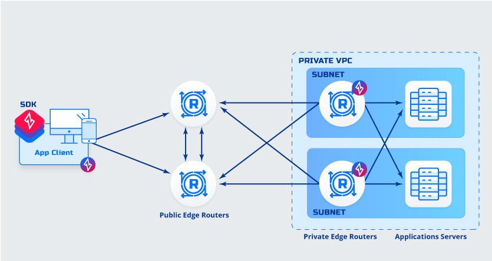
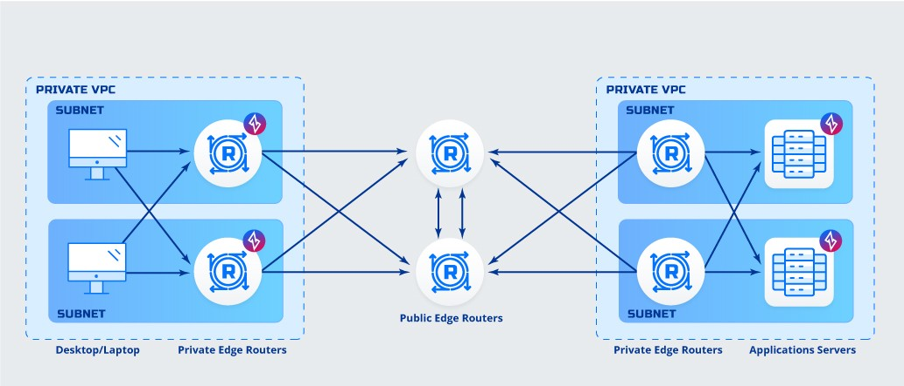
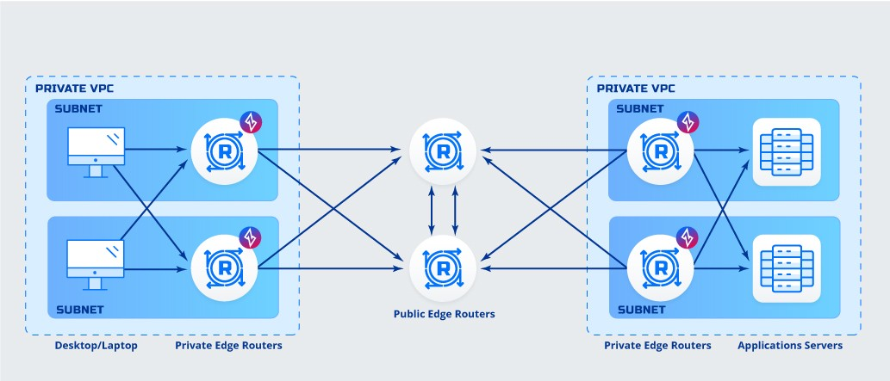
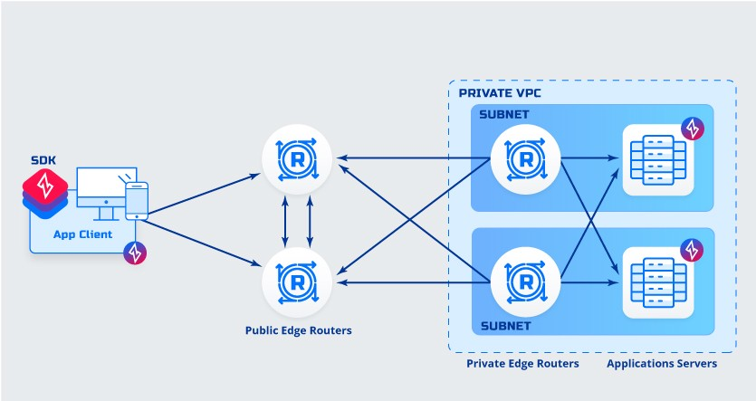
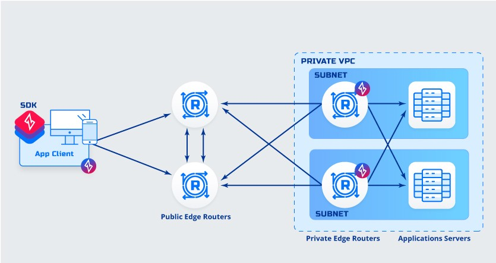
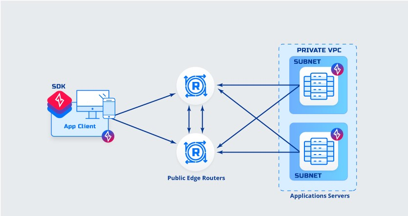
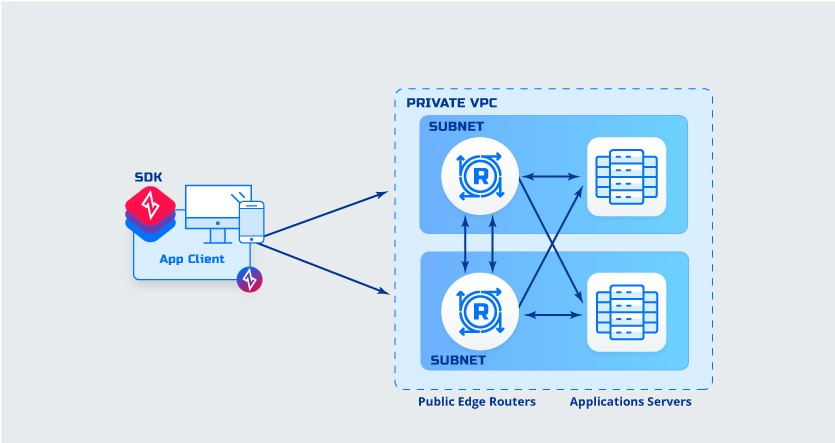

# Deployment Edge Architectures

This article describes the various edge deployment architectures of Ziti Network. In all cases, the Controller and at least 2 Public Edge Routers are to be deployed for redundency. The Ziti Fabric connections are established between all Edge Routers but not Clients/SDKs. The Public Edge Routers would provide connection between Private Edge Routers and/or Clients/SDKs.

&nbsp;

---
**Notes:** 
- ***Deployments illustrated in this article can be combined into an aggregate deployment, i.e. can be mixed and matched.***
- ***Recommended configuration deployment of Public Edge Routers is to have only Ziti Edge enabled and of Private Edge Routers is to have both Ziti Edge and Tunnel enabled.***

- ***A Connection from Client to Public Edge Router is not fabric enabled, e.g. Deployments 1-2,5-8.***

- ***Acronyms used in this article:***
    - ***ZDE - Ziti Desktop Edge*** 
    - ***ZME - Ziti Mobile Edge*** 
    - ***ZET - Ziti Edge Tunnel***

---
&nbsp;

1. **Client to Client Deployment**
    &nbsp;

    

    **Details**
    - Clients are ZDE/ZME or SDK integrated.
    - Application has a client software (ZET) deployed or is SDK integrated.

    &nbsp;

    **Advantages:**
    - Client to Application Encryption 
    - No additional routing needed
    - No additional DNS entries needed

    &nbsp;

    **Disadvantages:**
    - Software must be deployed to desktops/mobile Or SDK integrated
    - Software must be deployed to application servers Or SDK Integrated
    - Requires defining explicit service for each application

    &nbsp;

    ---    
1. **Client to Router Deployment**
    &nbsp;
    
    

    **Details**
    - Clients are ZDE/ZME or SDK integrated.
    - Application is behind private router

    &nbsp;
    
    **Advantages:**
    - No software must be deployed to application servers
    - No additional routing needed
    - No additional DNS entries needed
        
    &nbsp;

    **Disadvantages:**
    - Software must be deployed to desktops/mobile Or SDK integrated
    - Less secure, connection from private router to application is not protected

    &nbsp;
    
    ---
1. **Router to Client Deployment**
    &nbsp;
    
    

    **Details**
    - Clients are behind Router
    - Application has client software deployed or is SDK integrated.

    &nbsp;
    
    **Advantages:**
    - No software must be deployed to clients

    &nbsp;
        
    **Disadvantages:**
    - Less secure, connection from clients to router is not protected
    - Static Routing or Load Balancer is needed to direct traffic toward Routers
    - Clients must be configured use Routers as first DNS entry if using named services.

    &nbsp;
    
    ---
1. **Router to Router Deployment**
    &nbsp;
    
    

    **Details**
    - Clients are behind Router
    - Application is behind Router

    &nbsp;
    
    **Advantages:**
    - No software must be deployed to clients
    - No software must be deployed to application servers

    &nbsp;
            
    **Disadvantages:**
    - Less secure, connection from clients to router is not protected
    - Less secure, connection from private router to application is not protected
    - Static Routing or Load Balancer is needed to direct traffic toward Routers
    - Clients must be configured use Routers as first DNS entry if using named services.

    &nbsp;
    
    ---
1. **Remote Client to Client Deployment**
    &nbsp;

    

    **Details**
    - Application has client software deployed or is SDK integrated.

    &nbsp;
    
    **Advantages:**
    - Client to Application Encryption 

    &nbsp;
        
    **Disadvantages:**
    - Software must be deployed to application servers Or SDK Integrated

    &nbsp;

    ---    
1. **Remote Client to Router Deployment**
    &nbsp;

    
    
    **Advantages:**
    - No software must be deployed to application servers

    &nbsp;
        
    **Disadvantages:**
    - Less secure, connection from router to application server is not protected

    &nbsp;
    
    ---
1. **Remote Client to Client without Private Edge Routers Deployment**
    &nbsp;
    
    
    
    **Advantages:**
    - No need to deploy private edge routers
    - Client to Application Encryption 

    &nbsp;
        
    **Disadvantages:**
    - Fabric is not extended into application network

    &nbsp;

    ---    
1. **Remote Client to Router Direct Deployment**
    &nbsp;
    
    

    **Details**
    - Hosted in private data centers, most likely scenario

    &nbsp;
    
    **Advantages:**
    - Peer to peer direct connection
    - No software must be deployed to application servers

    &nbsp;
        
    **Disadvantages:**
    - Exposes private networks to inbound connections
    - Software must be deployed to clients Or SDK Integrate

    &nbsp;

    ---    
1. **Router to Router Direct Deployment**
    &nbsp;
    
    

    **Details**
    - Hosted in private data centers, most likely scenario

    &nbsp;
    
    **Advantages:**
    - Peer to peer direct connection
    - No software must be deployed to clients
    - No software must be deployed to application servers

    &nbsp;
        
    **Disadvantages:**
    - Exposes private networks to inbound connections
