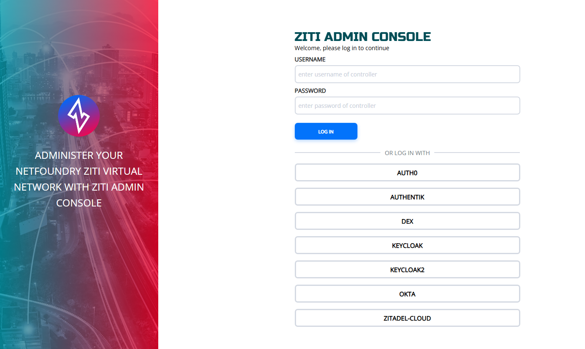

# Ziti Admin Console (ZAC)

The Zit Admin Console (ZAC) allows using external JWT signers for authentication. To use the ZAC with an external
authentication provider, an external JWT signer must be configured. There are numerous 
[Identity Providers](./identity-providers/README.mdx) documented.

If you want to use an identity provider that is not documented, please express your interest over in our 
[Discourse forum](https://openziti.discourse.group/).

## Steps to Use an External JWT Signer for ZAC Auth

To use an external JWT signer for authentication with the ZAC you will need to do a few steps.

1. Configure the IdP to allow calling back to the ZAC. Generally, the ZAC is hosted by the controller at `/zac`. To 
   configure your IdP to allow calling back to the callback url for the ZAC at the url of your controller + `/zac/callback`.
   For example, if your ZAC is located at `http://controller.example.com` the callback URL to configure in the IdP would
   be `http://controller.example.com/zac/callback`.
2. If necessary, create a new identity that is an administrator.
3. Configure the external JWT signer correctly. See the [Identity Providers Guides](./identity-providers/README.mdx) for
   assistance.
4. Navigate to the root of your ZAC at http://controller.example.com/zac. You will see a button for each of the external
   JWT signers configured.
5. Click the appropriate signer

