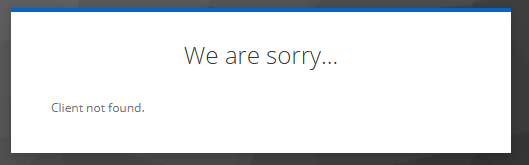
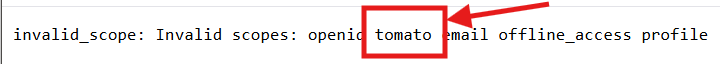

import Details from '@theme/MDXComponents/Details';

# Troubleshooting OIDC

Getting an external authentication to successfully configured can be a difficult process. The 1.5+ version of the `ziti`
CLI contains a subcommand that will hopefully help administrators get the configuration correct.

The `ziti ops verify ext-jwt-signer oidc` subcommand is specifically useful to iterate through the process of setting up
an external JWT signer for OIDC.

## Usage

:::info
_All `ziti` CLI commands and subcommands have very good help available by simply typing `--help`._

<Details>

<summary>`ziti ops verify ext-jwt-signer oidc` Usage</summary>

```
Usage:
  ziti ops verify ext-jwt-signer oidc [flags]

Available Commands:


Flags:
      --access-token          Display the full Access Token to the screen. Use caution.
  -s, --additional-scopes     List of additional scopes to add
      --authenticate          Also attempt to authenticate using the supplied ext-jwt-signer
      --controller-url        The url of the controller
      --id-token              Display the full ID Token to the screen. Use caution.
  -r, --redirect-url          The expected redirect URL to listen to
      --refresh-token         Display the full Refresh Token to the screen. Use caution.

Flags related to logging in:
      --ca                    additional root certificates used by the Ziti Edge Controller
  -c, --client-cert           A certificate used to authenticate
  -k, --client-key            The key to use with certificate authentication
  -e, --ext-jwt               A file containing a JWT from an external provider to be used for authentication
  -f, --file                  An identity file to use for authentication
      --ignore-config         If set, does not use values from nor write the config file. Required values not specified will be prompted for.
  -p, --password              password to use for authenticating to the Ziti Edge Controller, if -u is supplied and -p is not, a value will be prompted for
      --read-only             marks this login as read-only. Note: this is not a guarantee that nothing can be changed on the server. Care should still be taken!
  -t, --token                 if an api token has already been acquired, it can be set in the config with this option. This will set the session to read only by default
  -u, --username              username to use for authenticating to the Ziti Edge Controller
  -y, --yes                   If set, responds to prompts with yes. This will result in untrusted certs being accepted or updated.

Common flags for all commands:
  -i, --cli-identity          Specify the saved identity you want the CLI to use when connect to the controller with
  -j, --output-json           Output the full JSON response from the Ziti Edge Controller
      --output-request-json   Output the full JSON request to the Ziti Edge Controller
      --timeout               Timeout for REST operations (specified in seconds)
      --verbose               Enable verbose logging
```

</Details>

:::

The `verify ext-jwt-signer oidc` subcommand allows you to supply a few key values to initiate and complete an
[Authorization Code Flow with PKCE or PKCE flow](https://oauth.net/2/pkce/). Running the command will produce output 
into the terminal including:
* the ID token
* the Access token
* the Refresh token

## An Example 

Assume you have deployed a Keycloak instance and are looking to test the external JWT signer configuration. After 
following the appropriate documentation, you are ready to authenticate but experience a failure. Assuming the following:
* the controller exists at `https://controller.example.com`
* the external JWT signer is named `Keycloak`
* the Keycloak server is at `https://keycloak.example.com`
* the Keycloak server has a realm named `demo`

Issue this command (or similar for your environment) to initiate a PKCE flow and attempt to authenticate to the 
controller.

```text
ziti ops verify ext-jwt-signer oidc --controller-url https://controller.example.com --authenticate Keycloak
```

---

### Common Output

:::tip[User passes `--authenticate` to actually attempt to authenticate to the controller and succeeds]

<Details>

<summary>A full, successful `--authenticate` request</summary>

```
Saving identity 'default' to C:\Users\user\.ziti\ziti-cli.json
INFO    using supplied redirect url: http://localhost:20314/auth/callback
INFO    found external JWT signer
INFO      - issuer: https://keycloak.example.com/realms/demo
INFO      - clientId: browzer-keycloak-ext-jwt-signer
INFO    supplied issuer matches discovered issuer: https://keycloak.example.com/realms/demo
INFO    attempting to authenticate to external provider
Waiting up to 30s for external auth...Done!
INFO    ID token payload:
{
  "exp": 1743024461,
  "iat": 1743024161,
  "auth_time": 1743024106,
  "jti": "408d455f-39cc-4419-839a-b04690a911e6",
  "iss": "https://keycloak.example.com/realms/demo",
  "aud": "browzer-keycloak-ext-jwt-signer",
  "sub": "4cc0dc60-a467-4a84-80cc-fb1f7ece13ea",
  "typ": "ID",
  "azp": "browzer-keycloak-ext-jwt-signer",
  "sid": "1e06051f-7da3-4c2e-bb99-3fd876769729",
  "at_hash": "hUBhaVV8_lNYO0MeNLUs7g",
  "acr": "0",
  "email_verified": false,
  "name": "user D",
  "preferred_username": "lastname",
  "given_name": "user",
  "family_name": "D",
  "email": "user.lastname@netfoundry.io"
}
INFO    access token payload:
{
  "exp": 1743024461,
  "iat": 1743024161,
  "auth_time": 1743024106,
  "jti": "5f66aa27-7dec-428c-92e2-9f6dedf8fbb9",
  "iss": "https://keycloak.example.com/realms/demo",
  "aud": "openziti",
  "sub": "4cc0dc60-a467-4a84-80cc-fb1f7ece13ea",
  "typ": "Bearer",
  "azp": "browzer-keycloak-ext-jwt-signer",
  "sid": "1e06051f-7da3-4c2e-bb99-3fd876769729",
  "acr": "0",
  "allowed-origins": [
  ],
  "realm_access": {
    "roles": [
      "offline_access"
    ]
  },
  "scope": "openid offline_access email profile",
  "email_verified": false,
  "name": "user D",
  "preferred_username": "lastname",
  "given_name": "user",
  "family_name": "D",
  "email": "user.lastname@netfoundry.io"
}
INFO    refresh token payload:
{
  "iat": 1743024161,
  "jti": "1afdf26c-5859-1c9f-b708-bb39da06540b",
  "iss": "https://keycloak.example.com/realms/demo",
  "aud": "https://keycloak.example.com/realms/demo",
  "sub": "4cc01c60-a461-4a84-80cc-1b1f7ece13ea",
  "typ": "Offline",
  "azp": "browzer-keycloak-ext-jwt-signer",
  "sid": "4e06058f-7da3-4c2e-bb99-3fd876769729",
  "scope": "openid roles offline_access web-origins email acr profile basic"
}
INFO    attempting to authenticate to controller with specified target token type: ACCESS
Token: 11a50719-e0b1-4cd1-d3a3-17187cb8ff5d
INFO    login succeeded
```

</Details>

:::

:::danger[The `issuer` on the external JWT signer has a trailing slash (`/`) but no trailing slash should be provided]

<Details>

<summary>The `issuer` has a trailing slash but should not</summary>

```
Saving identity 'default' to C:\Users\user\.ziti\ziti-cli.json
INFO    using supplied redirect url: http://localhost:20314/auth/callback
INFO    found external JWT signer
INFO      - issuer: https://keycloak.example.com/realms/demo/
INFO      - clientId: browzer-keycloak-ext-jwt-signer
FATAL   error creating relying party error creating relyingParty issuer does not match
```

</Details>

:::

:::danger[The JWKS URI is wrong/not accessible or the controller cannot verify the certificate]

<Details>

<summary>JWKS URL is bad (numerous causes)</summary>

The tool will check the issuer that is mapped with the issuer discovered by the OpenID discovery document.
```
Saving identity 'default' to C:\Users\user\.ziti\ziti-cli.json
INFO    using supplied redirect url: http://localhost:20314/auth/callback
INFO    found external JWT signer
INFO      - issuer: https://keycloak.example.com/realms/demo/
INFO      - clientId: browzer-keycloak-ext-jwt-signer
FATAL   error creating relying party error creating relyingParty issuer does not match
```

</Details>

:::

:::danger[The external JWT signer `Client ID` is incorrect]

<Details>

<summary>Bad Client ID</summary>

**NOTE:** This image is an example of Keycloak providing an error indicating the Client ID is incorrect.



</Details>

:::

:::danger[configured a scope that cannot be requested]

<Details>

<summary>`tomato` is an invalid scope to request</summary>

**NOTE:** This image is an example of Keycloak providing an error indicating the `tomato` scope is not allowed to be
requested. For example, many IdPs do not allow requesting the `offline_access` scope.



</Details>

:::

:::danger[Mapped a claim that doesn't exist]

<Details>

<summary>The `claim` mapped is invalid</summary>

This error results in a generic error:
```text
FATAL   error authenticating with token: unable to authenticate to https://ctrl.example.com/edge/management/v1. Status code: 401 Unauthorized, Server returned: {
    "error": {
        "code": "INVALID_AUTH",
        "message": "The authentication request failed",
        "requestId": "VWxMYLJCw"
    },
    "meta": {
        "apiEnrollmentVersion": "0.0.1",
        "apiVersion": "0.0.1"
    }
}
```

However, the controller will have a helpful log that indicates the issue. In this case a typo when typing email resulted
in `emaila`:
```text
claims property [emaila] was not found in the claims
```

</Details>

:::
:::danger[There is no identity with the expected external id]

<Details>

<summary>The external id doesn't match</summary>

This error results in a generic error:
```text
FATAL   error authenticating with token: unable to authenticate to https://ctrl.example.com/edge/management/v1. Status code: 401 Unauthorized, Server returned: {
    "error": {
        "code": "INVALID_AUTH",
        "message": "The authentication request failed",
        "requestId": "VWxMYLJCw"
    },
    "meta": {
        "apiEnrollmentVersion": "0.0.1",
        "apiVersion": "0.0.1"
    }
}
```

However, the controller will have a helpful log that indicates the issue. In this case the external id was not found.
You will see an error similar to 
```text
error during authentication policy and identity lookup by claims type [external id] and claimed id 
[user.lastname@netfoundry.io]: INVALID_AUTH: The authentication request failed
```

</Details>

:::


