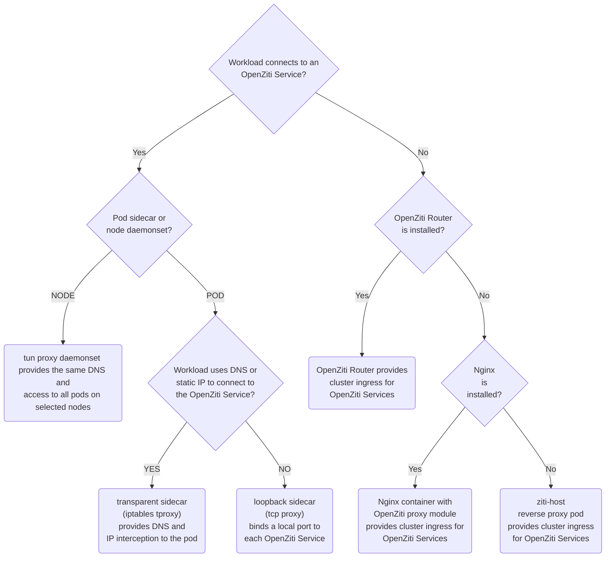

This guide will help you discover the best strategy and tool for connecting a Kubernetes workload with OpenZiti. This overview page links to separate child pages for each strategy and tool.

## Strategies and Solutions

As you can see in the chart above, there are several strategies and solutions for connecting a Kubernetes workload with OpenZiti. The following sections describe each strategy and solution in more detail. These are organized into two main categories: cluster ingress to workloads with OpenZiti, and intercepting workload egress with OpenZiti.

### Intercepting Workload Egress with OpenZiti

An OpenZiti Tunneler can be used to intercept workload egress with OpenZiti. One important thing to know is that the OpenZiti Tunneler that is used in this way may also be used to "host" OpenZiti Services in order to provide workload ingress.

#### Node Proxy Daemonset

You can deploy a daemonset of privileged `ziti-edge-tunnel run` pods on selected nodes. These pods can be used to intercept workload egress with OpenZiti. The pods can be configured to bind OpenZiti Services to a local port on the node, or to bind OpenZiti Services to a local port on the pod. For more information, see the [node proxy](./kubernetes-daemonset/) page.

#### Transparent Proxy Sidecar

You can deploy a transparent proxy sidecar to intercept workload egress with OpenZiti. The sidecar provides a DNS nameserver that is used by the workload application to resolve OpenZiti Service addresses. The sidecar container runs `ziti tunnel tproxy` to create IPTables TPROXY rules in the pod. For more information, see the [transparent proxy sidecar](./kubernetes-sidecar/) quickstart.

#### Loopback Proxy Sidecar

You can deploy a loopback proxy sidecar for workload egress to OpenZiti Services. The sidecar binds OpenZiti Services to a local port on the pod's loopback interface, e.g., 127.0.0.1:8443. The workload application must be configured to connect to the local port. There is not yet a dedicated guide for this mode of operation, and the differences are few in comparison to the [transparent proxy sidecar](./kubernetes-sidecar/) quickstart.

1. The sidecar container runs `ziti tunnel proxy` instead of `ziti tunnel tproxy`.
2. The sidecar container does not need the CAP_NET_ADMIN capability.
3. The sidecar container does not need a `dnsPolicy` or explicit nameserver.

### Cluster Ingress to Workloads with OpenZiti

Any OpenZiti Tunneler can be used to "host" an OpenZiti Service. Typically, this hosting begins a few moments after an OpenZiti Service becomes authorized for the OpenZiti Identity in use by the SDK. This section is about different ways to deploy an OpenZiti Tunneler to provide cluster ingress to workloads.

#### OpenZiti Router

The OpenZiti Router can perform several functions for an OpenZiti Network. One of these functions is to provide cluster ingress to workloads with OpenZiti. This is done by creating the router with tunneler mode enabled, and then installing the OpenZiti Router with Helm with the tunneler mode set to `host` (the default). For more information, see the [OpenZiti Router](../hosting/kubernetes-router/) page.

#### Nginx Proxy Module

The OpenZiti Nginx Proxy Module can be used to provide cluster ingress to workloads with OpenZiti. The module binds OpenZiti Services to an Nginx stream context and forward requests to the configured upstreams. Unlike the rest of these solutions, the Nginx module is not a full tunneler. The main difference for writing OpenZiti configurations for the module is that it will honor the upstreams that are set in the Nginx configuration, ignoring the `host.v1` addresses set in the OpenZiti config. For more information, see the [OpenZiti Nginx Proxy Module](../../securing-apis/aks-api-with-nginx-ziti-module/) guide.

#### ziti-host Reverse Proxy Pod

The `ziti-host` Helm chart deploys a headless service and can be used to provide cluster ingress to workloads. The pod runs `ziti-edge-tunnel run-host` to bind OpenZiti Services and forwards requests arriving via OpenZiti to their configured host addresses inside the cluster. For more information, see the [ziti-host](./kubernetes-host/) page.
