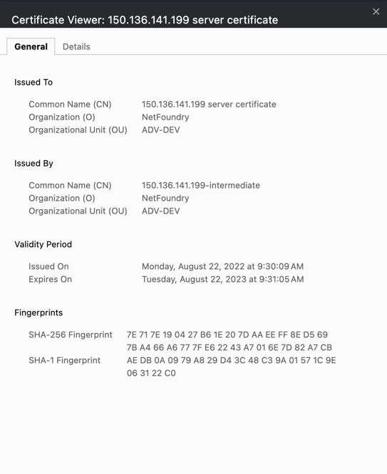

The following are examples of how an invalid server cert will present itself on a running OpenZiti Network. There are certs 
for the edge API and the control plane, so it's important to check for both as they will likely share the same expiry 
date.

## Behavior
An expired cert will manifest behavior in a few expected ways. 
1. From an edge client or tunneler, an identity will show as `unavailable`. Reviewing the logs will generally indicate 
some sort of certificate error. Something along the lines of `failed to verify certificate`, `certificate has expired`,
or something mentioning an error relating to `x509`
2. From a browser, if you attempt to access your controller, for example, by visiting 
`https://controller-ip:1234/edge/client/v1/version` you may see an indication of a certificate error from the browser. 
Ultimately, the controller is not accessible despite being online.


3. From the `ziti` CLI, if you attempt to log into the controller you will get an error to the effect of 
`certificate is expired or invalid`, `unable to retrieve certificate authority`, or `bad certificate`
4. Viewing the controller logs, you may see errors similar to `TLS handshake error`, `bad certificate`, or 
`certificate failure`.

## Verification
The following commands are useful in viewing the status of the current certs for the control and edge/API planes.

Substitute the address and port as necessary.
```
# Example for edge/API plane
openssl s_client -connect 150.136.141.199:8441 | grep "NotBefore"

# Example for control plane
openssl s_client -connect localhost:6262 | grep "NotBefore"
```
### Example Output
As shown, the start and end dates for all certificates in the chain will be displayed.
```
v:NotBefore: Sep 12 13:36:59 2023 GMT; NotAfter: Sep 11 13:37:55 2024 GMT
v:NotBefore: Aug 22 13:29:51 2022 GMT; NotAfter: Aug 19 13:30:41 2032 GMT
```

## Resolution
If you determine that your certs have expired. Check out the [Renew Client/Server Certs](renew-cert.md) guide.