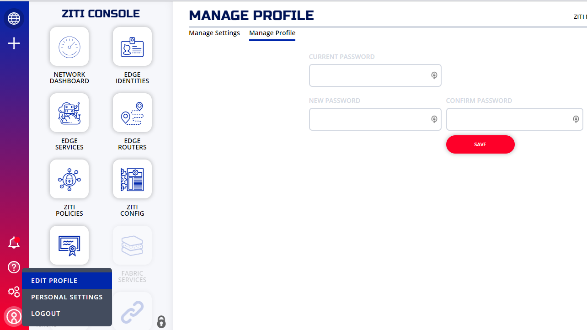

import CliChangeUpdb from '../_cli-change-password.md'

Follow these instructions to change your OpenZiti admin password. If you used one of the `expressInstall` quickstarts, also update `ZITI_PWD` in `~/.ziti/quickstart/$(hostname -s)/$(hostname -s).env` to match — that variable is used by the `zitiLogin` function.

## Use the `ziti` CLI {#ziti-cli}

1. To use the CLI, you'll need to be logged in. [Link to instructions](/reference/40-command-line/login.mdx)

1. <CliChangeUpdb/>

## Use the Ziti Console {#ziti-console}

If you installed the console (ZAC) in your quickstart network then you can [sign in with your current password](../get-started/zac/index.mdx#sign-in-and-use-zac) and change it.

Click on the person icon on the lower left and then select "Edit Profile" as shown to change your password.

