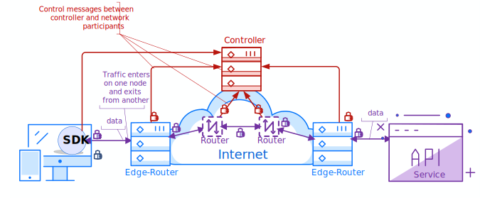

**OpenZiti** is a free and open source project focused on bringing Zero Trust to any application. The project provides all the pieces required to implement or integrate Zero Trust into your solutions.

* An overlay network
* Tunneling Applications for all operating systems
* Numerous SDKs making it easy to add Zero Trust concepts directly into your application
Ziti makes it easy to embed Zero Trust, programmable networking directly into your app. With Ziti you can have Zero Trust, high performance networking on any Internet connection, without VPNs!

:running: If you are looking to jump right in, feet first, you can follow along with one of our 
[Quickstart Guides](../quickstarts/network/index.md). 

:office: If you are looking for a managed service to help you run a truly global, scalable network browse over to [NetFoundry, Inc](http://netfoundry.io).

The Ziti Network (Ziti) is composed of the following building
blocks: Ziti Controller, Ziti Router, Ziti Clients. These
components are used in conjunction to provide secure
connectivity between two points such as a client to a server. This
type of network is considered an overlay network because it
provides secure connectivity on top – or “overlaying” – existing
networking infrastructure.

Here's an overview of a network topology:

