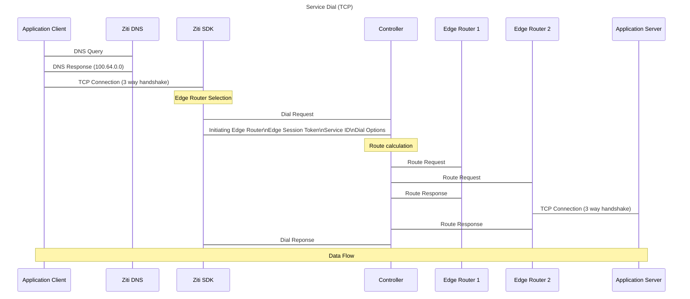

# Service Dial 

## Steps

1. If the service being dialed is a DNS named service, rather than just an IP, the system will look perform a DNS query to resolve the name.  Otherwise, skip to step 3.  
2. The Ziti DNS resolver will respond with an IP in the 100.64.0.0 range to steer the traffic into the software.  
3. The client will then make a TCP connection with the SDK.  This may be done in a number of ways, a tunneler client on the host, a gateway tunneler or edge router within the LAN, or it may be skipped, and a direct socket opend using one of the SDKs.  Assuming there is TCP involved for this example, the TCP handshake occurs.
om4. The SDK will selectt he best Edge Router to initiate the fabric circuit from it's choices.  The primary selection criteria is latency.  The SDK constantly polls the Edge Routers it has awareness of, and monitors the latency of the messaging.  The least latenct router available for this service will be selected. 
4. The SDK will issue a Dial Request to the Controller.  This message will include the service being dialed, the selected initial Edge Router, and authentication information
5. Following authentication, the Controller will begin detemining the current best path for the circuit across the fabric.  The actual routing path is calculated using the Dijkstra algorithm, similar to OSPF and other IP routing protocols.  That process ends with the least cost path in terms of latency.  That path cost is added to the static, dynamic, and precedence costs associated with the service terminators.  Precedence is a configuration option in a hot standby redundancy configuration, static costs are mapped via config, and dynamic costs are the result of successes and failures in previous setups.  Once all the terminators are costed, the minimum cost value will determine the best path and be returned.
6. Once the best path has been computed, the Controller will send requests to the Edge Routers to create the actual path.  Each Edge Router will complete the necessary steps and respond.  If the terminating edge router is a combined router/tunneller, and the end service requires a TCP connection, this will be created before a successful message is sent, to ensure connectivity.
7. The response messages from the routers, once all recieved, indicate the circuit is configure, and ready for traffic.
8. A dial response to the initial Edge Router then begins the flow of data.

There are a number of error codes associated with Service Dials.  Messages can time out, the end server may not respond to the TCP SYN packet, or send a RST, terminators can be in an unavailable state, and others.  Error codes for the fabric circuit creation process are available on [Circuit Dial Error Codes](../../../../guides/05-troubleshooting/20-circuit-create-error-codes.md)
