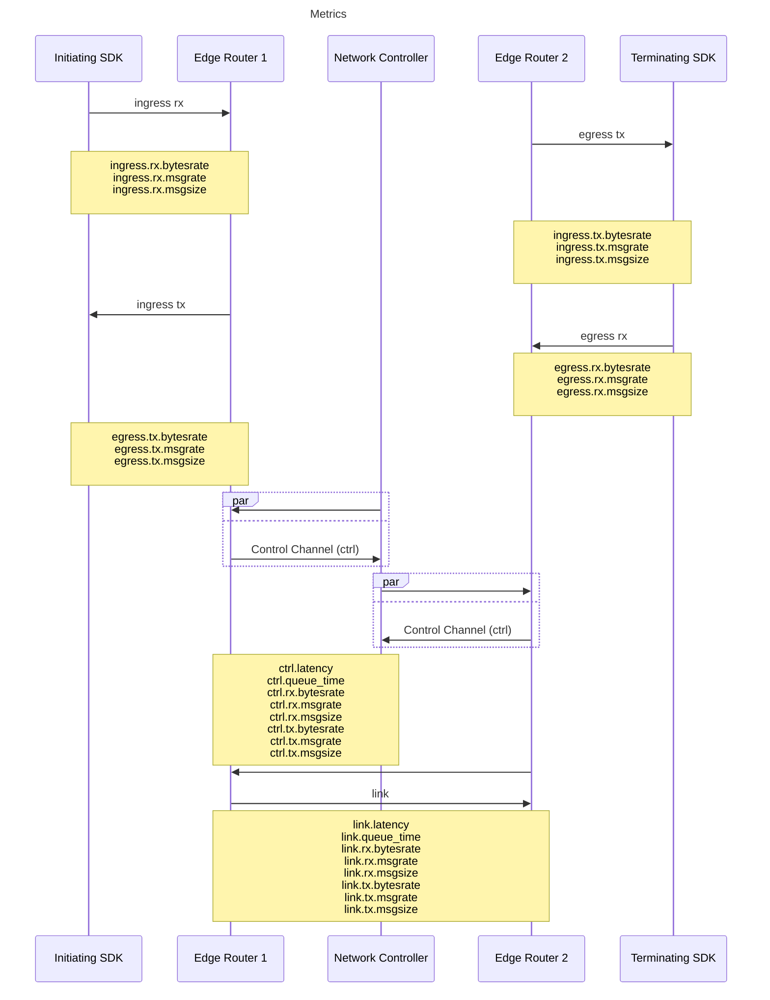

# Sequence Diagram 

OpenZiti systems provide a wide range of metrics for the monitoring of the network services, endpoints, and processes.  Some of the various metrics are visualized below to understand where they fall and what they measure in a network instance.  The bulk of the remaining metrics are measuring processes within the control plane, rather than network operation.

