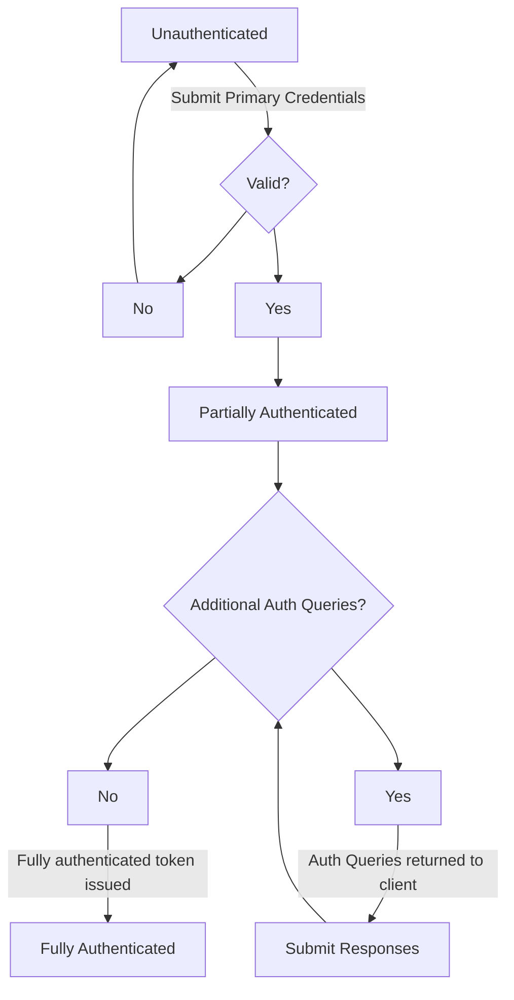

Authentication in OpenZiti occurs when a client proves its identity to the controller. The goal of authentication is
to obtain a security token representing a fully authenticated session, which the client then presents on subsequent
API requests to access services and manage the network.

OpenZiti supports two authentication systems:

- **[OIDC Authentication](10-oidc.md)** - the current, preferred authentication system. The controller acts as an
  [OpenID Connect](https://openid.net/connect/) provider. Clients authenticate through a PKCE flow and receive
  standard JWT access, ID, and refresh tokens. All new clients and SDKs use OIDC authentication.

- **[Legacy Authentication](./20-legacy-auth.md)** - the original authentication system. Clients submit credentials
  directly to the Edge Client or Edge Management API and receive an opaque `zt-session` token. Legacy authentication is
  **deprecated** and will be removed in a future release. Existing clients should migrate to OIDC.

## Authentication flow

Both OIDC and legacy authentication follow the same conceptual flow: a client submits a primary credential to
establish its identity, then satisfies any secondary factors requested by the controller before gaining full access.



While partially authenticated, a client has proven its primary identity but has not yet satisfied all required
secondary factors. The set of operations available during partial authentication differs between OIDC and legacy
authentication. See each section for details.

## Primary Authentication

Primary authentication establishes the authenticating [Identity](80-identities.md). It is the first step in all
authentication flows.

Primary authentication factors include:

- **x509 certificates** - the client presents a TLS client certificate associated with an [Identity](80-identities.md)
- **External JWTs** - the client presents a JWT issued by a configured
  [External JWT Signer](70-external-jwt-signers.mdx)
- **Username/password** - the client submits a username and password stored in the internal UPDB authenticator

Valid primary authentication methods for an [Identity](80-identities.md) are controlled by its
[Authentication Policy](50-authentication-policies.md). If no
[Authentication Policy](50-authentication-policies.md) is assigned to an
[Identity](80-identities.md), the system `default` policy applies.

### Authenticators

Some primary authentication mechanisms require per-identity credentials to be stored on the controller. These
credentials are stored as **authenticators** and are associated with the identity that owns them.

- **x509 certificate** authenticators are created through the [enrollment](../enrollment.mdx) process.
- **Username/password** authenticators are managed through [password management](95-password-management.md) and
  [certificate management](60-certificate-management.md).
- **External JWT** authentication does not use an authenticator. Instead, the identity is matched at authentication
  time by comparing a claim from the presented JWT (identified by `claimsProperty` on the
  [External JWT Signer](70-external-jwt-signers.mdx)) against the identity's `externalId` field. No persistent
  credential is stored on the controller.

Authenticators for an identity may be listed via the CLI:

```bash
ziti edge list authenticators
```

or via the [Edge Management API](/docs/openziti/reference/developer/api/edge-management-api-reference):

```http
GET /edge/management/v1/authenticators
```

## Secondary Authentication

Secondary authentication provides additional assurance beyond the primary credential. It is represented as a set of
[Authentication Queries](../sessions.md#authentication-queries) that the controller returns after successful primary
authentication. The client must satisfy all outstanding queries before becoming fully authenticated.

Supported secondary authentication factors:

- **TOTP** - a time-based one-time password from an authenticator app (Google Authenticator, Authy, etc.)
- **External JWT** - a JWT from a required [External JWT Signer](70-external-jwt-signers.mdx) that must be
  present on every request

Secondary factors are configured per-identity through [Authentication Policies](50-authentication-policies.md).

## API Sessions

After successful authentication, the controller issues a security token representing the authenticated session. This
token is used to authorize all subsequent requests. The format of the token differs between OIDC and legacy
authentication:

- In **OIDC authentication**, the token is a standard JWT access token provided in the `Authorization: Bearer` header
- In **legacy authentication**, the token is an opaque UUID provided in the `zt-session` header

API Sessions have configurable timeouts and are removed on logout, administrative action, or expiry. See the
[Sessions](../sessions.md) documentation for details on API Session lifecycle and data removal behavior.
