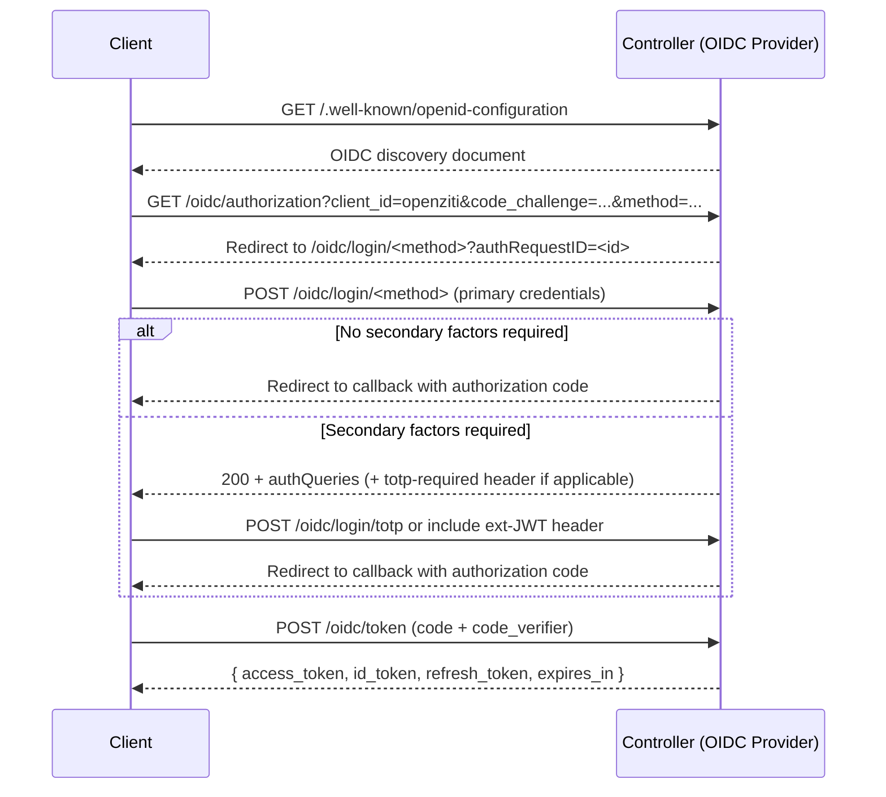

# OIDC Authentication

The OpenZiti controller is an [OpenID Connect (OIDC)](https://openid.net/connect/) provider. When edge is enabled,
it exposes a standards-compliant OIDC server that clients use to authenticate and receive security tokens. These
tokens are then used to authorize subsequent API calls and service access.

OIDC authentication uses the [Authorization Code Flow with PKCE](https://oauth.net/2/pkce/) (Proof Key for Code
Exchange), which is the recommended flow for native and mobile clients. All OpenZiti SDKs and tunnelers implement this
flow automatically. The PKCE flow is designed for public clients that cannot safely store a client secret.

Upon successful authentication, the controller issues three tokens:

- **Access Token** - a short-lived JWT used to authorize all API requests
- **ID Token** - a JWT containing identity information about the authenticated user
- **Refresh Token** - a longer-lived token used to obtain a new access token when the current one expires

The access token replaces the legacy `zt-session` opaque token as the primary credential for API requests. Both
mechanisms remain supported. See [Using Tokens](#using-tokens) for details.

## OIDC Endpoints

The controller exposes a standard OIDC discovery document that clients use to locate all authentication endpoints.
The discovery document is available at:

```
GET /.well-known/openid-configuration
```

The OIDC provider path prefix is `/oidc`. All OIDC protocol endpoints (authorization, token, JWKS, etc.) are
exposed under this prefix and are listed in the discovery document. The discovery document also appears at
`/oidc/.well-known/openid-configuration` for compatibility with clients that include the path prefix when
constructing the discovery URL.

Key endpoints returned by the discovery document include:

| Endpoint | Path | Purpose |
|----------|------|---------|
| Authorization | `/oidc/authorization` | Initiates the PKCE authentication flow |
| Token | `/oidc/token` | Exchanges a code for tokens, also used for token refresh |
| JWKS | `/oidc/keys` | Returns the public keys used to verify tokens |
| End Session | `/oidc/end_session` | Terminates the OIDC session (logout) |
| Userinfo | `/oidc/userinfo` | Returns claims about the authenticated identity |

Authentication-specific login endpoints are exposed under `/oidc/login/` and are described in the
[Authentication Flow](#authentication-flow) section.

## Configuration

### Default Configuration

OIDC is enabled automatically whenever the `edge` section is present in the controller configuration. By default,
the controller co-locates the OIDC API on the same web listener as the edge-client API. No explicit configuration
is required for basic operation.

### Token Durations

Token lifetimes are configured in the `edge.oidc` section of the controller configuration file. The defaults are
suitable for most deployments:

```yaml
edge:
  oidc:
    # (optional, default 30m) Lifetime of issued access tokens. Minimum 1m.
    # Must be at least 1 minute shorter than refreshTokenDuration.
    accessTokenDuration: 30m

    # (optional, default 30m) Lifetime of issued ID tokens. Minimum 1m.
    idTokenDuration: 30m

    # (optional, default 24h) Lifetime of issued refresh tokens.
    # Must be at least 1 minute longer than accessTokenDuration.
    refreshTokenDuration: 24h
```

Shortening `accessTokenDuration` reduces the window during which a stolen access token is usable.
Shortening `refreshTokenDuration` forces clients to re-authenticate more frequently. When `refreshTokenDuration`
is set, it must be at least one minute longer than `accessTokenDuration`. The controller enforces this and
adjusts values that violate the constraint.

### OIDC Bind Point

The `edge-oidc` binding is the API binding label for the OIDC server. By default, the controller automatically
adds the `edge-oidc` binding to any web listener that hosts `edge-client`, even when it is not explicitly listed.
This automatic co-location is the recommended approach for most deployments.

To configure the OIDC binding explicitly, for example to specify allowed redirect URIs, add it to the `apis`
list of the appropriate web listener:

```yaml
web:
  - name: public-api
    bindPoints:
      - interface: 0.0.0.0:443
        address: controller.example.com:443
    apis:
      - binding: edge-client
      - binding: edge-oidc
        options:
          redirectURIs:
            - "http://localhost:*/auth/callback"
            - "http://127.0.0.1:*/auth/callback"
```

The `redirectURIs` option controls which callback URLs the OIDC provider will accept. Wildcard `*` is supported
in the port position to allow clients that listen on a dynamically assigned local port (common in native
application flows). The defaults permit localhost callbacks. Production deployments should review this list.

#### Disabling Auto-Binding

To suppress the automatic co-location of `edge-oidc` with `edge-client` and require explicit configuration, set
`disableOidcAutoBinding` to `true`:

```yaml
edge:
  api:
    # (optional, default false) When true, the OIDC API is only bound where explicitly configured
    # in the web section. The default false automatically adds edge-oidc to every listener
    # that hosts edge-client.
    disableOidcAutoBinding: true
```

With `disableOidcAutoBinding: true`, OIDC is only available on listeners where `edge-oidc` is explicitly listed
as an API binding.

### Separate OIDC Bind Points

The OIDC endpoint can be served from a different network interface or port than the edge-client or edge-management
APIs. This is useful when the OIDC authorization flow must be reachable from a browser (requiring a hostname with
a valid TLS certificate) while the other APIs are on a separate internal interface.

To bind the OIDC API independently, add a named server to the `web` section that hosts only `edge-oidc`:

```yaml
web:
  - name: internal-apis
    bindPoints:
      - interface: 10.0.0.1:443
        address: controller.internal:443
    apis:
      - binding: edge-management
      - binding: edge-client
      - binding: edge-oidc
        options:
          redirectURIs:
            - "http://localhost:*/auth/callback"

  - name: public-oidc
    bindPoints:
      - interface: 0.0.0.0:8443
        address: auth.example.com:8443
    apis:
      - binding: edge-oidc
        options:
          redirectURIs:
            - "https://app.example.com/auth/callback"
```

In multi-bind-point deployments, the OIDC issuer URL is derived from the bind point address that the client
connects to. Each bind point issues tokens with an `iss` claim that reflects the address used for that connection.
Clients must use the same address for token verification as they used for authentication.

:::note
When `disableOidcAutoBinding` is false (the default) and `edge-oidc` is listed explicitly in at least one
listener, auto-binding is suppressed and the explicit configuration is used as-is.
:::

## Authentication Flow

Authentication proceeds in two phases: primary authentication establishes the identity. Secondary authentication
(if required) satisfies additional factors such as TOTP or a required external JWT.



### Step 1 - Discover Endpoints

Clients retrieve the OIDC discovery document to learn the authorization and token endpoint URLs:

```
GET /.well-known/openid-configuration
```

### Step 2 - Initiate Authorization

The client constructs a PKCE authorization request. The controller's OIDC client ID is `openziti`.

```
GET /oidc/authorization
  ?response_type=code
  &client_id=openziti
  &redirect_uri=http%3A%2F%2Flocalhost%3A20314%2Fauth%2Fcallback
  &scope=openid
  &code_challenge=<base64url-sha256-of-verifier>
  &code_challenge_method=S256
  &method=<auth-method>
```

The optional `method` parameter hints at the intended primary authentication method (`password`, `cert`,
`ext-jwt`). If omitted, the controller selects the method based on whether a client TLS certificate was presented.
The authorization endpoint responds with a redirect to the appropriate login URL.

### Step 3 - Submit Primary Credentials

The controller redirects the client to a login URL of the form:

```
/oidc/login/<method>?authRequestID=<id>
```

The `authRequestID` value identifies the in-progress authentication request. The client POSTs credentials to the
same URL. See [Primary Authentication](#primary-authentication) for method-specific request formats.

### Step 4 - Satisfy Secondary Factors (if required)

If the identity's [Authentication Policy](50-authentication-policies.md) requires secondary factors, the login
endpoint returns HTTP `200` with a JSON body listing the outstanding
[Authentication Queries](../sessions.md#authentication-queries) rather than redirecting to the callback. The client
satisfies each query and resubmits. See [Secondary Authentication](#secondary-authentication) for details.

### Step 5 - Exchange Code for Tokens

Once all authentication factors are satisfied, the controller redirects to the client's `redirect_uri` with an
authorization code. The client exchanges the code for tokens:

`POST /oidc/token`

```text
grant_type=authorization_code
&code=<authorization-code>
&redirect_uri=<redirect-uri>
&client_id=openziti
&code_verifier=<pkce-verifier>
```

`Content-Type: application/x-www-form-urlencoded`

A successful response:

```json
{
  "access_token": "eyJhbGci...",
  "id_token": "eyJhbGci...",
  "refresh_token": "...",
  "token_type": "Bearer",
  "expires_in": 1800
}
```

## Primary Authentication

Primary authentication establishes which [Identity](80-identities.md) is authenticating. The method is determined by the login
URL path and the credentials submitted. All login endpoints accept either `application/json` or
`application/x-www-form-urlencoded` request bodies.

All requests include the `authRequestID` from the authorization redirect, either as a query parameter (GET) or in
the request body (POST).

### Username / Password (UPDB)

`POST /oidc/login/username`

```json
{
  "authRequestId": "<auth-request-id>",
  "username": "my-identity",
  "password": "my-password"
}
```

Username/password is the simplest primary method. It is disabled by default in production-oriented
[Authentication Policies](50-authentication-policies.md) in favor of certificate or JWT authentication.

### Client Certificate

`POST /oidc/login/cert`

```json
{
  "authRequestId": "<auth-request-id>"
}
```

Certificate authentication requires that the HTTP connection to the controller use a client TLS certificate
associated with the target identity. The body is empty. The controller reads the certificate from the TLS
handshake. The certificate must be issued by the OpenZiti PKI or a registered and enabled
[3rd Party CA](30-third-party-cas.md).

### External JWT (ext-jwt)

`POST /oidc/login/ext-jwt`

HTTP Header: `Authorization: Bearer <jwt-from-external-provider>`

```json
{
  "authRequestId": "<auth-request-id>"
}
```

External JWT authentication requires a valid JWT from a configured
[External JWT Signer](70-external-jwt-signers.mdx) in the `Authorization` header. The controller validates the
JWT's signature, expiration, issuer, and audience against the matching External JWT Signer configuration, then
maps the configured claim to an identity.

## Secondary Authentication

Secondary authentication is triggered when the identity's [Authentication Policy](50-authentication-policies.md)
requires additional factors beyond the primary credential. Outstanding secondary factors are represented as
Authentication Queries on the in-progress auth request.

When secondary factors remain unsatisfied, the login endpoint returns HTTP `200` with the pending queries instead
of redirecting to the callback URL:

```json
{
  "authQueries": [
    {
      "typeId": "MFA",
      "format": "alphaNumeric",
      "httpMethod": "POST",
      "httpUrl": "/oidc/login/totp",
      "minLength": 6,
      "maxLength": 6,
      "provider": "ziti"
    }
  ]
}
```

Clients can also fetch outstanding auth queries at any point during an in-progress authentication:

`GET /oidc/login/auth-queries?id=<auth-request-id>`

### Response Headers During Secondary Auth

When TOTP is required, the controller sets the `totp-required` header on the response:

```
totp-required: true
```

Clients can use this header to detect that TOTP is required without parsing the `authQueries` body.

### TOTP (Time-Based One-Time Password)

If the [Authentication Policy](50-authentication-policies.md)'s `secondary.requireTotp` is `true`, the client must provide a TOTP code generated
by an authenticator application (Google Authenticator, Authy, Microsoft Authenticator, etc.) after primary
authentication succeeds.

`POST /oidc/login/totp`

```json
{
  "id": "<auth-request-id>",
  "code": "123456"
}
```

On success, the controller redirects to the callback URL with the authorization code. On failure, the response
returns HTTP `400` with an error indicating the code was invalid.

#### TOTP Enrollment During an OIDC Flow

If the identity's [Authentication Policy](50-authentication-policies.md) requires TOTP but the identity has not yet enrolled in TOTP, enrollment
can be completed mid-OIDC-flow. The auth request remains active while enrollment is completed.

**Start enrollment:**

`POST /oidc/login/totp/enroll`

```json
{
  "authRequestId": "<auth-request-id>"
}
```

Response:

```json
{
  "isVerified": false,
  "provisioningUrl": "otpauth://totp/my-identity?issuer=controller.example.com&secret=JBSWY3DPEHPK3PXP",
  "recoveryCodes": ["abc123", "def456", "..."]
}
```

The `provisioningUrl` is an `otpauth://` URI that authenticator applications understand, typically displayed as a
QR code. The recovery codes are one-time-use backup codes.

**Verify enrollment:**

`POST /oidc/login/totp/enroll/verify`

```json
{
  "authRequestId": "<auth-request-id>",
  "code": "123456"
}
```

A successful verification confirms that the authenticator application is correctly configured. The controller
saves the TOTP configuration and from this point forward, the identity's Authentication Policy will require a
TOTP code on every authentication.

**Cancel enrollment:**

`DELETE /oidc/login/totp/enroll`

```json
{
  "authRequestId": "<auth-request-id>"
}
```

This abandons the in-progress enrollment and allows a fresh enrollment to be started.

### External JWT as a Secondary Factor

When the [Authentication Policy](50-authentication-policies.md)'s `secondary.requireExtJwt` is set to an External JWT Signer ID, every API
request must include a valid JWT from that signer in addition to the primary access token. During an OIDC flow,
the controller checks for the secondary JWT at the time of primary authentication.

The secondary JWT is provided in the `Authorization` header alongside the primary credential during the login
request:

`POST /oidc/login/ext-jwt` or `POST /oidc/login/username`

HTTP Header: `Authorization: Bearer <secondary-jwt>`

The controller evaluates the secondary JWT against the required External JWT Signer. If the JWT is valid, the
secondary factor is satisfied and authentication proceeds to the callback. If it is missing, expired, or invalid,
authentication is blocked and the applicable `WWW-Authenticate` challenge is returned.

After the OIDC flow is complete and an access token has been issued, the secondary JWT requirement is re-evaluated
on every subsequent API request (see [WWW-Authenticate Headers](#www-authenticate-headers)).

## Partial Authentication

An OIDC authentication request is **partially authenticated** when primary credentials have been accepted but one or
more secondary factors remain outstanding. The authorization code has not yet been issued, so no access token
exists yet. The client is still in the middle of the OIDC login flow.

During partial authentication, only the OIDC login endpoints are accessible. These include:

| Action | Endpoint |
|--------|----------|
| List outstanding auth queries | `GET /oidc/login/auth-queries?id=<authRequestId>` |
| Submit a TOTP code | `POST /oidc/login/totp` |
| Start TOTP enrollment | `POST /oidc/login/totp/enroll` |
| Verify and complete TOTP enrollment | `POST /oidc/login/totp/enroll/verify` |
| Cancel TOTP enrollment | `DELETE /oidc/login/totp/enroll` |

The primary authentication endpoints (`/oidc/login/username`, `/oidc/login/cert`, `/oidc/login/ext-jwt`) may be
retried with corrected credentials if the initial attempt failed, but the authorization code is only issued once
all secondary factors are satisfied and the controller redirects to the callback URL.

No Edge Client or Edge Management API calls can be made during partial authentication in OIDC. There is no token to
present until the full OIDC flow completes.

## Tokens

### Access Token

The access token is a short-lived JWT that authorizes API requests. It is used as a Bearer token in the
`Authorization` header:

```
Authorization: Bearer <access-token>
```

The access token's `sub` claim contains the OpenZiti [Identity](80-identities.md) ID. The token also carries OpenZiti-specific custom
claims (prefixed `z_`) used by the controller to reconstruct session context without a database lookup on every
request. Access tokens expire after `edge.oidc.accessTokenDuration` (default 30 minutes).

Selected custom claims in the access token:

| Claim | Description |
|-------|-------------|
| `z_asid` | API session ID associated with this token |
| `z_ia` | Whether the identity is an administrator |
| `z_ct` | Configuration type IDs requested during authentication |
| `z_t` | Token type (`a` for access) |
| `z_ice` | Whether the API session certificate is extendable |

### ID Token

The ID token is a standard OIDC JWT that contains identity information about the authenticated user. It is
returned alongside the access token but is not used to authorize API calls. SDKs may use the ID token to display
user information or to confirm the identity of the authenticated user.

### Refresh Token

The refresh token is an opaque token (not a JWT) that can be exchanged for a new access token without requiring
the user to re-authenticate. It expires after `edge.oidc.refreshTokenDuration` (default 24 hours).

## Using Tokens

### OIDC Bearer Token (Current)

Include the access token in the `Authorization` header for all API calls:

```
Authorization: Bearer <access-token>
```

This applies to both the edge-client API and the edge-management API.

### Legacy zt-session Token

The legacy `zt-session` authentication mechanism remains supported for backward compatibility. Clients that
authenticate via the legacy `POST /edge/client/v1/authenticate` or `POST /edge/management/v1/authenticate`
endpoints receive an opaque `zt-session` token. This token is included in requests using the `zt-session` header:

```
zt-session: <token>
```

New clients and SDKs should use OIDC bearer tokens. The legacy `zt-session` mechanism may be deprecated in a
future release.

## Refreshing an Access Token

When an access token expires, use the refresh token to obtain a new one without re-authentication. This requires
the `offline_access` scope to have been requested during the initial authorization.

`POST /oidc/token`

```text
grant_type=refresh_token
&refresh_token=<refresh-token>
&client_id=openziti
```

`Content-Type: application/x-www-form-urlencoded`

A successful response returns a new set of tokens:

```json
{
  "access_token": "eyJhbGci...",
  "id_token": "eyJhbGci...",
  "refresh_token": "...",
  "token_type": "Bearer",
  "expires_in": 1800
}
```

The old refresh token is invalidated when a new one is issued. Store the new refresh token for future refreshes.

When the refresh token itself expires, the client must initiate a full authentication flow again.

## Response Headers

The controller returns several headers on every authenticated API response that describe the session lifetime:

| Header | Description |
|--------|-------------|
| `expiration-seconds` | Seconds remaining until the current API session expires |
| `expires-at` | Absolute datetime at which the current API session expires |

For OIDC-based sessions, "session expiry" is the expiry of the access token. Clients can monitor these headers
to proactively refresh the access token before it expires.

## WWW-Authenticate Headers

On HTTP `401 Unauthorized` responses, the controller includes one or more `WWW-Authenticate` headers that describe
exactly what token is missing, expired, or invalid. Clients can parse these headers to determine the corrective
action required.

The header follows [RFC 6750](https://datatracker.ietf.org/doc/html/rfc6750) (Bearer Token Usage) with extended
fields for OpenZiti-specific authentication schemes.

### No Token Provided

When a request is made without any supported security token, the response includes challenges for both the OIDC
bearer scheme and the legacy zt-session scheme:

```
WWW-Authenticate: zt-session realm="zt-session" error="missing" error_description="no matching token was provided",
                  Bearer realm="openziti-oidc" error="missing" error_description="no matching token was provided"
```

### OIDC Access Token Errors

When a Bearer token is provided but is invalid or expired:

```
WWW-Authenticate: Bearer realm="openziti-oidc" error="expired" error_description="token expired"
```

```
WWW-Authenticate: Bearer realm="openziti-oidc" error="invalid" error_description="token is invalid"
```

### External JWT Errors (Primary)

When the Authentication Policy requires a primary External JWT signer and it is absent, expired, or invalid, the
challenge includes the signer's ID and issuer to help clients identify which IdP to authenticate against:

```
WWW-Authenticate: Bearer realm="openziti-primary-ext-jwt"
                         error="missing"
                         error_description="no matching token was provided"
                         id="<ext-jwt-signer-id>"
                         issuer="<ext-jwt-signer-issuer>"
```

### External JWT Errors (Secondary Factor)

When a secondary External JWT requirement is not satisfied on an ongoing API request:

```
WWW-Authenticate: Bearer realm="openziti-secondary-ext-jwt"
                         error="expired"
                         error_description="token expired"
                         id="<ext-jwt-signer-id>"
                         issuer="<ext-jwt-signer-issuer>"
```

The `id` field contains the ID of the [External JWT Signer](70-external-jwt-signers.mdx) that must be satisfied.
The `issuer` field contains the expected JWT issuer, which clients can use to initiate the correct OIDC flow with
the appropriate identity provider.

### Error Values Summary

| `error` value | Meaning |
|---------------|---------|
| `missing` | No token of the required type was provided |
| `invalid` | A token was provided but failed validation (bad signature, wrong audience, etc.) |
| `expired` | A token was provided but has passed its expiration time |

### Realm Values Summary

| `realm` value | Meaning |
|---------------|---------|
| `openziti-oidc` | The OpenZiti OIDC access token (Bearer) |
| `zt-session` | The legacy zt-session opaque token |
| `openziti-primary-ext-jwt` | A primary External JWT Signer requirement |
| `openziti-secondary-ext-jwt` | A secondary (ongoing) External JWT Signer requirement |
