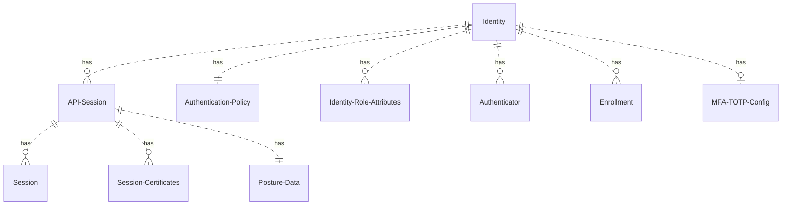

# Identities

Ziti Edge defines a top level entity called an Identity. An Identity is a security principal that can bind (host) or
dial (connect) to services over a network. An Identity may be a human who uses one or more devices, a device
itself, a single account on a multi-user device, an application, or a set of applications. What determines what an
Identity is only limited by the intent of its use, its security configuration, and where/how it stores its credentials.

If an Identity represents a human that is using an SSO provider that ties into Ziti Edge's
[External JWT Signers](./50-external-jwt-signers.md) the human operator can move from device to device using whichever Ziti
enabled applications that allow them to authenticate. If the Identity can only authenticate via a x509 Client
Certificate where the private key is stored in a hardware back keystore on a device, such that the key can not be moved,
the identity is tied to that hardware. Further if the Identity's credentials are stored in an OS-backed user specific
storage mechanism (e.g. Windows Credential Manager) it is that accounts Identity.


## Identity ER Diagram

Below is a diagram that show the high-level relationships between an Identity and various important entities and within
a network. This diagram does not show all entities, simply the ones tied closest to an Identity. For example,
the Role Attributes on an Identity are used by selectors defined on policies to act on the identity. However, the 
policies and selectors are not modeled here.



## Creating

Creating an identity alone may not be enough to make it usable. An identity will also need a valid primary
authentication mechanism. Depending on that mechanism it may also need to complete [enrollment](/learn/core-concepts/security/enrollment.md#clients).

Please note that all authentication mechanisms also require a properly configured [authentication policy](./auth)

The following [primary authentication](./auth#primary-authentication) mechanisms require post-creation enrollment:

- Ziti PKI x509 Client Certificate
- 3rd Party x509 Client Certificate
- Username Password (UPDB)

The following do not require enrollment, but must have a properly configured [External JWT Signer](./external-jwt-signers)

- JWT

### Creating w/ No Authenticators/Enrollments

Note: This identity will not be able to authenticate

#### Ziti CLI

It is currently not possible to create and identity without an enrollment option through the CLI. It can be completed
by creating and identity then deleting the default certificate enrollment.

```text
ziti edge create identity [device|service|user] <name>
ziti edge delete enrollment where "identity=<id>"
```

#### Edge Management API

`POST /edge/management/v1/identities`

```text
{
  "name": "Roger Wilco",
  "isAdmin": false
}
```

### Creating w/ Ziti PKI Client Cert Enrollment

Note: This identity will be using the default [authentication policy](./auth) which allows certificate authentication

#### Ziti CLI

`ziti edge create identity [device|service|user] <name> `

#### Edge Management API

`POST /edge/management/v1/identities`
```text
{
  "name": "Roger Wilco",
  "isAdmin": false,
  "enrollment": {
    "ott": true
  }
}
```

### Creating w/ 3rd Party CA Client Cert Enrollment
Note: This identity will be using the default [authentication policy](./auth) which allows certificate authentication

#### Ziti CLI:

It is currently not possible to create identities with a 3rd party certificate enrollment through the CLI.

#### Edge Management API

`POST /edge/management/v1/identities`
```text
{
  "name": "Roger Wilco",
  "isAdmin": false,
  "enrollment": {
    "ottca": "<id-to-3rd-party-ca>"
  }
}
```

### Creating w/ Username/Password Enrollment
Note: This identity will be using the default [authentication policy](./auth) which allows UPDB authentication

#### Ziti CLI:

`ziti edge create identity [device|service|user] <name> --updb <username>`

#### Edge Management API

`POST /edge/management/v1/identities`
```text
{
  "name": "Roger Wilco",
  "isAdmin": false,
  "enrollment": {
    "updb": "<username>"
  }
}
```

### Creating w/ JWT Authenticator
Note: A valid [External JWT Signer](./external-jwt-signers) must be created and an [authentication policy](./auth)
must be defined that allows the identity to authenticate with that signer.

#### Ziti CLI:

`ziti edge create identity [device|service|user] <name> --external-id "externalJWTId"`

#### Edge Management API

`POST /edge/management/v1/identities`
```text
{
  "name": "Roger Wilco",
  "isAdmin": false,
  "externalId": "externalJWTId"
}
```

## Deleting

Deleting an Identity removes all directly associated data. This includes:

- [API Sessions](/learn/core-concepts/security/sessions.md#api-session)
  - [Sessions](../sessions#session)
  - [Posture Data](/learn/core-concepts/security/authorization/posture-checks.md#posture-data)
  - [Session Certificates](./20-api-session-certificates.md)
- Identity Role Attributes
- [Authenticators](./auth.md#authenticators)
- [Enrollments](/learn/core-concepts/security/enrollment.md)
- [MFA TOTP Configuration](./70-totp.md)

It does not remove entities are that re-usable between Identities:

- [Authentication Policies](./30-authentication-policies.md)
- [Service Policies](/learn/core-concepts/security/authorization/policies/overview.mdx)
- [Edge Router Policies](/learn/core-concepts/security/authorization/policies/overview.mdx)

Deleting an Identity immediately removes it and all current and future access it would have to a network and its
Services.
