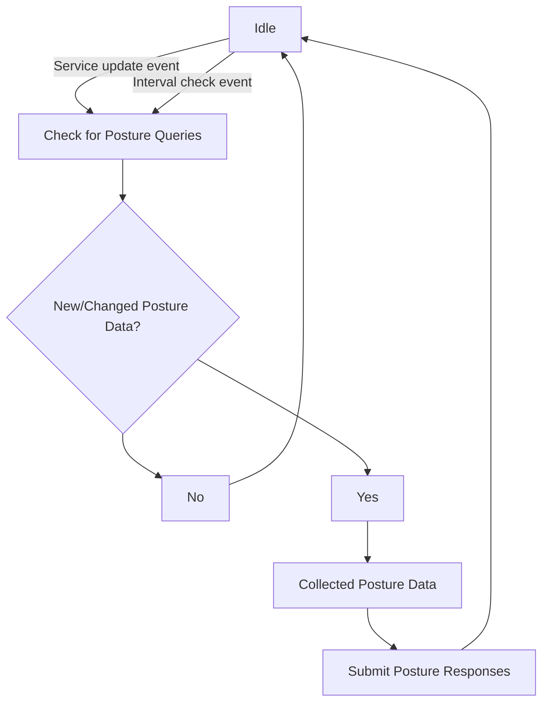

# Authorization

After becoming fully authenticated, an identity is now restricted by Policies and by Posture Checks.
Policies act as static authorization configuration and are split into distinct policy types for enforcing different
types of authorization. They are documented in detail in the `Policies` section. Posture Checks are dynamic and
continuous authorization. Telemetry from endpoints and from external systems can be used to make dynamic authorization
decisions. They are detailed in the `Posture Check` section.

## Authentication Policies

[Authentication Policies](../authentication/authentication-policies) define which primary and secondary authentication methods are allowed for an individual
identity and can be read more about in the [Authentication Policies](../authentication/authentication-policies) section.
