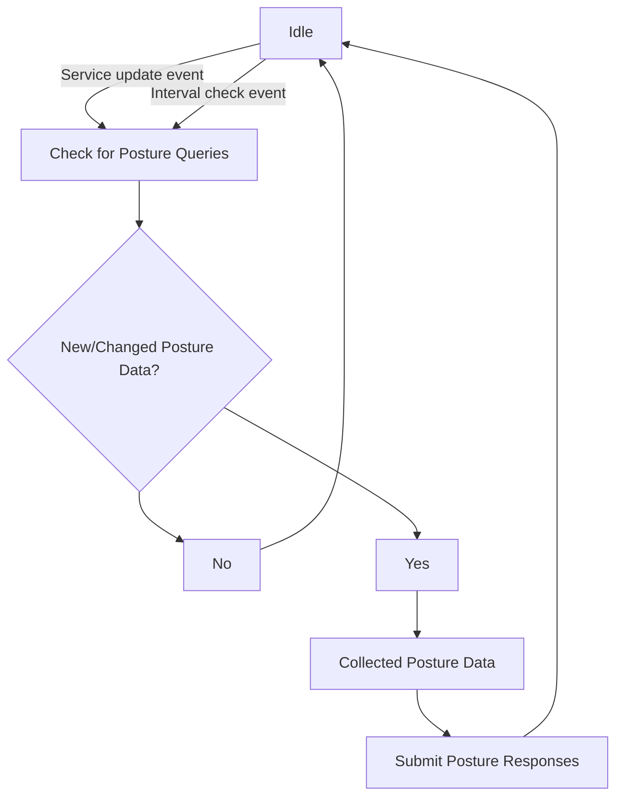

# Authorization

After becoming [fully authenticated](../sessions.md#full-vs-partial-authentication), an identity may now 
discover services and Edge Routers available on the network via the Edge Client API they are authorized to access.
Both service and Edge Router authorization are controlled through [policies](policies/overview.mdx). Additionally,
service policies may have additional requirements for authorization based on the environment or attributes of a
client in the form of [Posture Checks](posture-checks.md).

Authorization to connect to an Edge Router affects the Edge Router that are discoverable by a client. This will be 
reflected when listing a Edge Router directly and receiving a list of them during Session creation.

