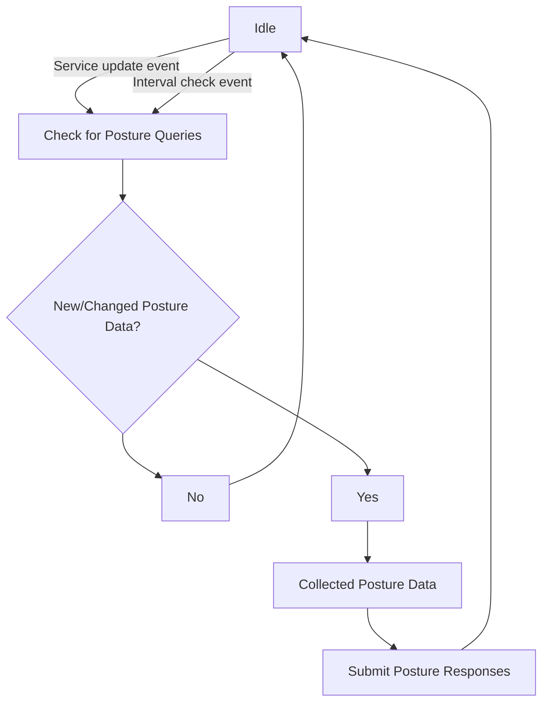

# Authorization

After becoming [fully authenticated](../authentication/auth.md#full-vs-partial-authentication), an identity may now 
discover services and Edge Routers available on the network via the Edge Client API they are authorized to access.
Both service and Edge Router authorization are controlled through [policies](policies/overview.mdx). Additionally,
service policies may have additional requirements for authorization based on the environment or attributes of a
client in the form of [Posture Checks](posture-checks.md).

Authorization to connect to an Edge Router affects the Edge Router that are discoverable by a client. This will be 
reflected when listing a Edge Router directly and receiving a list of them during Session creation.

# Sessions

Sessions represent access to a specific service for dialing or binding. They are scoped to the 
[API Session](../authentication/auth.md#api-sessions) that is used to create them. They are requested from the
controller by a client through the Edge Client API. The result of that request is a security token representing
the session and a list of Edge Routers that the client may use to dial or bind the service through.

Sessions are removed when the parent [API Session](../authentication/auth.md#api-sessions) is removed, 
[policies](policies/overview.mdx) are changed to deny access, or when [Posture Checks](posture-checks.md) enter an 
invalid state for the target service.

