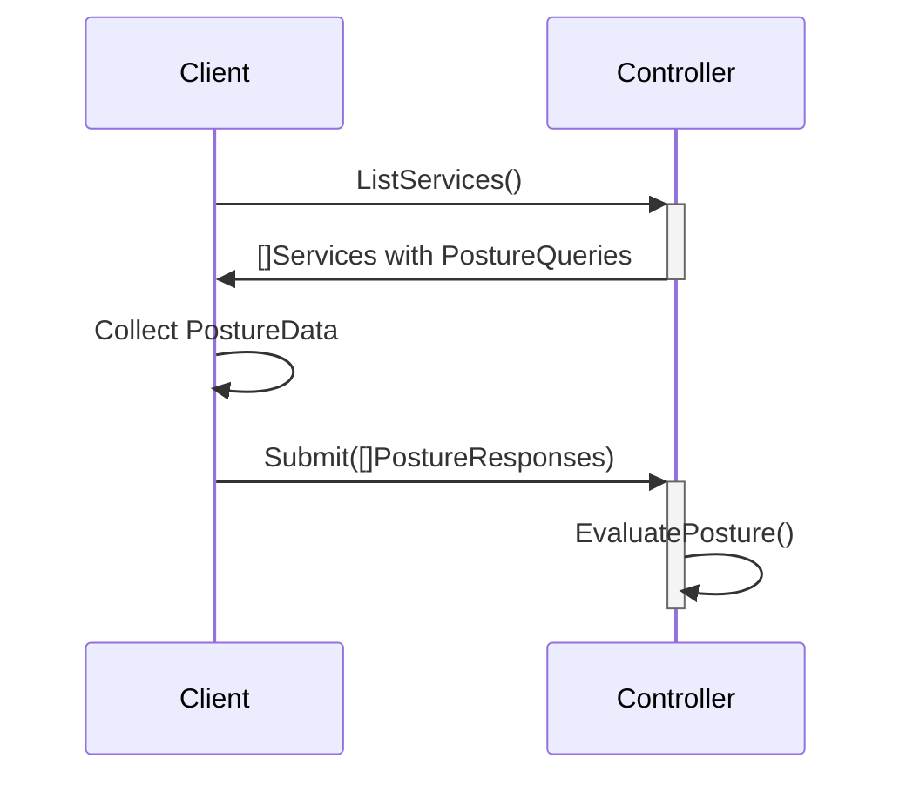

# Legacy Posture Checks

Legacy Posture Checks apply to [API Sessions](../../sessions.md#api-session) established using the legacy
`zt-session` authentication method. In this model, the SDK submits Posture Data to the **controller** via REST API,
and the controller is responsible for evaluating all Posture Checks and determining whether service access is granted.

## Posture Data {#posture-data}

Environmental state is saved as Posture Data, a set of values describing the current state of the client device.
Posture Data is provided to the controller via Posture Responses sent from the client. Posture Responses are
constructed from Posture Queries which the controller reports to the client per service when listing services.



The controller continuously re-evaluates posture as new Posture Responses arrive and as time passes (for
timeout-based checks). If a check transitions to a failing state, the controller revokes access to affected
services and may terminate active Sessions.

## Evaluation

Posture Checks are event-based and are evaluated as events are encountered. Once a failure state begins, the
associated Service Policies restrict access accordingly. The [MFA Posture Check](#mfa) is an exception. It
defines grace periods for lock/unlock and wake events.

## Access

A single service may be granted to a client through multiple Service Policies. Only one of those policies needs to
be in a passing state for access to be granted. Creating two Service Policies, one with Posture Checks and one
without, for the same service and client will result in the client always having access, because the policy
without Posture Checks always passes.

## Associating

Posture Checks are associated to [Service Policies](../policies/overview.mdx) through
[Roles and Role Attributes](../policies/overview.mdx#roles-and-role-attributes). Attributes on each Posture Check
will be selected for on Service Policies via the `postureCheckRoles` property as an array of selected roles.
Service Policies are associated to Identities in the same fashion via `identityRoles` and the attributes on
Identities.

## Types {#types}

The following Posture Check types are currently defined:

- [OS / OS Version](#os-os-version) - requires a specific operating system and optionally a specific version or versions
- [MAC Address](#mac-address) - requires the client has a specific MAC address associated with its hardware
- [MFA](#mfa) - requires the client currently has MFA TOTP enabled
- [Multi Process](#multi-process) - requires a client be running one or more applications
- [Windows Domain](#windows-domain) - requires the client be a member of a specific domain

### Operating System {#os-os-version}

The `OS` Posture Check type is used to verify a client's operating system and optionally its version.

Supported OS types:

- Windows
- Windows Server
- Linux
- MacOS
- iOS
- Android

Versions may be validated with any valid [Semver 2.0](https://semver.org/) statement. This includes the ability to
specify ranges by major, minor, and patch levels. For operating systems that do not have an explicit patch level,
the build number is used instead.

#### Semver examples

- `>=1.2.7 <1.3.0` matches 1.2.7, 1.2.8, and 1.2.99, but not 1.2.6, 1.3.0, or 1.1.0
- `>=1.2.7` matches 1.2.7, 1.2.8, 2.5.3, and 1.3.9, but not 1.2.6 or 1.1.0
- `1.2.7 || >=1.2.9 <2.0.0` matches 1.2.7, 1.2.9, and 1.4.6, but not 1.2.8 or 2.0.0

#### Creating

##### OpenZiti CLI

```bash
ziti edge create posture-check os windows-and-android -o "WINDOWS:>10.0.0,ANDROID:>6.0.0" -a check-attribute1
```

##### Edge Management API

`POST /edge/management/v1/posture-checks`

```json
{
  "typeId": "OS",
  "name": "windows-and-android",
  "operatingSystems": [
    {
      "type": "WINDOWS",
      "versions": [">10.0.0"]
    },
    {
      "type": "ANDROID",
      "versions": [">6.0.0"]
    }
  ],
  "attributes": ["check-attribute1"]
}
```

### MAC Address {#mac-address}

The `MAC` Posture Check type is used to verify a client's network interface MAC addresses. A client presenting
MAC addresses not included in the check will fail.

#### Creating

##### OpenZiti CLI

```bash
ziti edge create posture-check mac mac-list -m "14-B2-2C-E5-F0-61" -m "D5-22-E8-B7-FF-48" -a check-attribute1
```

##### Edge Management API

`POST /edge/management/v1/posture-checks`

```json
{
  "typeId": "MAC",
  "name": "mac-list",
  "macAddresses": ["14-B2-2C-E5-F0-61", "D5-22-E8-B7-FF-48"],
  "attributes": ["check-attribute1"]
}
```

### MFA {#mfa}

The `MFA` Posture Check type enforces [MFA TOTP](/learn/core-concepts/security/authentication/90-totp.md)
configuration on a client. Posture Checks enforce access authorization. For authentication-level MFA enforcement,
see [Authentication Policies](/learn/core-concepts/security/authentication/50-authentication-policies.md#secondary).

MFA Posture Checks support forcing a client to re-submit a valid TOTP on timeout, after locking/unlocking a
device, or waking a device from sleep.

- `timeoutSeconds` - how long a TOTP submission is valid. Values `0` and `-1` represent no timeout.
- `promptOnUnlock` - when `true`, requires re-submission after a lock/unlock event. The client is given a
  five-minute grace period before the check begins to fail.
- `promptOnWake` - when `true`, requires re-submission after a wake event. The client is given a five-minute
  grace period before the check begins to fail.

#### Creating

##### OpenZiti CLI

```bash
ziti edge create posture-check mfa my-mfa-check -s 3600 -w -u -a check-attribute1
```

##### Edge Management API

`POST /edge/management/v1/posture-checks`

```json
{
  "typeId": "MFA",
  "name": "my-mfa-check",
  "timeoutSeconds": 3600,
  "promptOnWake": true,
  "promptOnUnlock": true,
  "attributes": ["check-attribute1"]
}
```

### Multi Process {#multi-process}

The `PROCESS_MULTI` Posture Check type verifies that one or more programs are running on the client. It can
optionally check a SHA-256 hash and digital signers on Windows.

- `semantic` - `AllOf` requires all listed processes to be running. `OneOf` requires at least one.
- `path` - the binary path to check.
- `hashes` - valid SHA-256 hashes of the binary.
- `signerFingerprints` - SHA-1 thumbprints of valid signing certificates (Windows only).

#### Creating

##### OpenZiti CLI

```bash
ziti edge create posture-check process-multi my-proc-multi AnyOf "Windows,Linux" "C:\\program1.exe,/usr/local/program1" -a check-attribute1
```

##### Edge Management API

`POST /edge/management/v1/posture-checks`

```json
{
  "typeId": "PROCESS_MULTI",
  "name": "my-proc-multi",
  "semantic": "OneOf",
  "processes": [
    {
      "os": "WINDOWS",
      "path": "C:\\program1.exe",
      "hashes": ["421c76d77563afa1914846b010bd164f395bd34c2102e5e99e0cb9cf173c1d87"],
      "signerFingerprints": ["79437f5edda13f9c0669b978dd7a9066dd2059f1"]
    },
    {
      "os": "LINUX",
      "path": "/usr/local/program1",
      "hashes": ["b16d66911a4657945bf1929bc1a9d743168b819d9b19d1519eb29ffb3db140a4"],
      "signerFingerprints": ["882106ca75dc47a5ffd055e640b30c2e01789521"]
    }
  ],
  "attributes": ["check-attribute1"]
}
```

### Windows Domain {#windows-domain}

The `DOMAIN` Posture Check type verifies that a Windows client has joined a specific Windows domain.

#### Creating

##### OpenZiti CLI

```bash
ziti edge create posture-check domain domain-list -d domain1 -d "domain2" -a check-attribute1
```

##### Edge Management API

`POST /edge/management/v1/posture-checks`

```json
{
  "typeId": "DOMAIN",
  "name": "domain-list",
  "domains": ["domain1", "domain2"],
  "attributes": ["check-attribute1"]
}
```

## Troubleshooting

The following Edge Management API endpoints are available for diagnosing posture check issues with legacy sessions.

### Viewing Identity Posture Data

It is possible to view an [Identity](../../authentication/80-identities.md)'s current Posture Data as reported to
the controller.

#### Request

`GET /edge/management/v1/identities/<id>/posture-data`

#### Response

```json
{
  "data": {
    "apiSessionPostureData": {},
    "domain": {
      "lastUpdatedAt": "2022-08-03T11:03:29.451Z",
      "postureCheckId": "-GIxFATMg",
      "timedOut": false,
      "domain": "MYDOMAIN"
    },
    "mac": {
      "lastUpdatedAt": null,
      "postureCheckId": "",
      "timedOut": false,
      "addresses": null
    },
    "os": {
      "lastUpdatedAt": "2022-08-03T11:03:29.375Z",
      "postureCheckId": "OZimG0oGR",
      "timedOut": false,
      "build": null,
      "type": "windows",
      "version": "10.0.19044"
    },
    "processes": [
      {
        "lastUpdatedAt": "2022-08-03T11:03:49.803Z",
        "postureCheckId": "62yttIAeJ",
        "timedOut": false,
        "signerFingerprints": []
      }
    ]
  },
  "meta": {}
}
```

### Viewing failed service requests

It is possible to view the last fifty failed service requests due to Posture Check failure for an Identity.

#### Request

`GET /edge/management/v1/identities/<id>/failed-service-requests`

#### Response

```json
{
  "meta": {},
  "data": [
    {
      "apiSessionId": "ckytwv9811tqz15mzoyfi1uvb",
      "policyFailures": [
        {
          "policyId": "Nk43EwJKE",
          "policyName": "TestPolicy1",
          "checks": [
            {
              "actualValue": {
                "passedMfa": false,
                "passedOnUnlock": false
              },
              "expectedValue": {
                "passedMfa": true,
                "passedOnWake": true
              },
              "postureCheckId": "5Ucbw.tjo0",
              "postureCheckName": "TestCheck1",
              "postureCheckType": "MFA"
            }
          ]
        }
      ],
      "serviceId": "iGoRLhrx0",
      "serviceName": "TestService1",
      "sessionType": "Dial",
      "when": "2022-01-25T10:18:45.257Z"
    }
  ]
}
```
