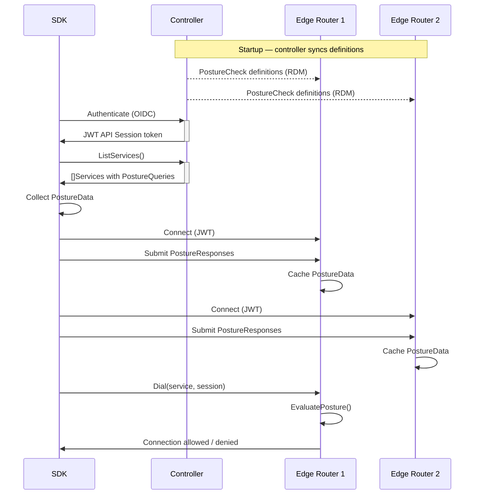

# OIDC Posture Checks

OIDC Posture Checks apply to [API Sessions](../../sessions.md#api-session) established using OIDC authentication
(JWT bearer tokens). In this model, the SDK submits Posture Data directly to **each edge router** it connects
through, rather than to the controller. The edge router is then responsible for evaluating Posture Checks at the
time of each dial or bind and continuously throughout the connection.

This design reduces controller load, moves enforcement closer to the data plane, and enables posture evaluation
to scale horizontally with edge routers.

## Posture Data {#posture-data}

Posture Check definitions are created and managed on the controller (or on any controller in an HA deployment).
The controller distributes these definitions to all edge routers via the **Router Data Model (RDM)**, a
synchronized state that routers subscribe to and keep current. Each edge router stores the full set of Posture
Check definitions locally.

When an SDK authenticates via OIDC and connects to an edge router, it submits Posture Responses directly to that
router over the established SDK connection. Each router it connects through receives its own copy of the Posture
Data. The router caches this data per API Session and uses it when evaluating dial and bind requests.



The SDK continues to submit updated Posture Responses to all connected edge routers as device state changes
(for example, as a process starts or stops, or an MFA TOTP times out).

## Evaluation

Posture Checks are evaluated by the edge router at the time of each dial or bind request. The router consults
its local cache of Posture Data for the API Session, combined with the Posture Check definitions received from
the controller, to determine whether access should be granted.

Evaluation is also continuous. As posture state changes are submitted to the router, active connections to
services whose Posture Checks are no longer satisfied are terminated.

## Access

A single service may be granted to a client through multiple Service Policies. Only one of those policies needs
to be in a passing state for access to be granted. Creating two Service Policies, one with Posture Checks and
one without, for the same service and client will result in the client always having access, because the policy
without Posture Checks always passes.

## Associating

Posture Checks are associated to [Service Policies](../policies/overview.mdx) through
[Roles and Role Attributes](../policies/overview.mdx#roles-and-role-attributes). Attributes on each Posture Check
will be selected for on Service Policies via the `postureCheckRoles` property as an array of selected roles.
Service Policies are associated to Identities in the same fashion via `identityRoles` and the attributes on
Identities.

## Types {#types}

The following Posture Check types are supported. Definitions are created on the controller and synchronized to
edge routers automatically.

- [OS / OS Version](#os-os-version) - requires a specific operating system and optionally a specific version or versions
- [MAC Address](#mac-address) - requires the client has a specific MAC address associated with its hardware
- [MFA](#mfa) - requires the client currently has MFA TOTP enabled
- [Multi Process](#multi-process) - requires a client be running one or more applications
- [Windows Domain](#windows-domain) - requires the client be a member of a specific domain

### Operating System {#os-os-version}

The `OS` Posture Check type verifies a client's operating system and optionally its version.

Supported OS types:

- Windows
- Windows Server
- Linux
- MacOS
- iOS
- Android

Versions may be validated with any valid [Semver 2.0](https://semver.org/) statement. This includes the ability to
specify ranges by major, minor, and patch levels. For operating systems that do not have an explicit patch level,
the build number is used instead.

#### Semver examples

- `>=1.2.7 <1.3.0` matches 1.2.7, 1.2.8, and 1.2.99, but not 1.2.6, 1.3.0, or 1.1.0
- `>=1.2.7` matches 1.2.7, 1.2.8, 2.5.3, and 1.3.9, but not 1.2.6 or 1.1.0
- `1.2.7 || >=1.2.9 <2.0.0` matches 1.2.7, 1.2.9, and 1.4.6, but not 1.2.8 or 2.0.0

#### Creating

##### OpenZiti CLI

```bash
ziti edge create posture-check os windows-and-android -o "WINDOWS:>10.0.0,ANDROID:>6.0.0" -a check-attribute1
```

##### Edge Management API

`POST /edge/management/v1/posture-checks`

```json
{
  "typeId": "OS",
  "name": "windows-and-android",
  "operatingSystems": [
    {
      "type": "WINDOWS",
      "versions": [">10.0.0"]
    },
    {
      "type": "ANDROID",
      "versions": [">6.0.0"]
    }
  ],
  "attributes": ["check-attribute1"]
}
```

### MAC Address {#mac-address}

The `MAC` Posture Check type verifies a client's network interface MAC addresses. A client presenting MAC
addresses not included in the check will fail.

#### Creating

##### OpenZiti CLI

```bash
ziti edge create posture-check mac mac-list -m "14-B2-2C-E5-F0-61" -m "D5-22-E8-B7-FF-48" -a check-attribute1
```

##### Edge Management API

`POST /edge/management/v1/posture-checks`

```json
{
  "typeId": "MAC",
  "name": "mac-list",
  "macAddresses": ["14-B2-2C-E5-F0-61", "D5-22-E8-B7-FF-48"],
  "attributes": ["check-attribute1"]
}
```

### MFA {#mfa}

The `MFA` Posture Check type enforces [MFA TOTP](../../authentication/90-totp.md)
configuration on a client. Posture Checks enforce access authorization. For authentication-level MFA enforcement,
see [Authentication Policies](../../authentication/50-authentication-policies.md#secondary).

MFA Posture Checks support forcing a client to re-submit a valid TOTP on timeout, after locking/unlocking a
device, or waking a device from sleep.

- `timeoutSeconds` - how long a TOTP submission is valid. Values `0` and `-1` represent no timeout.
- `promptOnUnlock` - when `true`, requires re-submission after a lock/unlock event. The client is given a
  five-minute grace period before the check begins to fail.
- `promptOnWake` - when `true`, requires re-submission after a wake event. The client is given a five-minute
  grace period before the check begins to fail.

#### Creating

##### OpenZiti CLI

```bash
ziti edge create posture-check mfa my-mfa-check -s 3600 -w -u -a check-attribute1
```

##### Edge Management API

`POST /edge/management/v1/posture-checks`

```json
{
  "typeId": "MFA",
  "name": "my-mfa-check",
  "timeoutSeconds": 3600,
  "promptOnWake": true,
  "promptOnUnlock": true,
  "attributes": ["check-attribute1"]
}
```

### Multi Process {#multi-process}

The `PROCESS_MULTI` Posture Check type verifies that one or more programs are running on the client. It can
optionally check a SHA-256 hash and digital signers on Windows.

- `semantic` - `AllOf` requires all listed processes to be running. `OneOf` requires at least one.
- `path` - the binary path to check.
- `hashes` - valid SHA-256 hashes of the binary.
- `signerFingerprints` - SHA-1 thumbprints of valid signing certificates (Windows only).

#### Creating

##### OpenZiti CLI

```bash
ziti edge create posture-check process-multi my-proc-multi AnyOf "Windows,Linux" "C:\\program1.exe,/usr/local/program1" -a check-attribute1
```

##### Edge Management API

`POST /edge/management/v1/posture-checks`

```json
{
  "typeId": "PROCESS_MULTI",
  "name": "my-proc-multi",
  "semantic": "OneOf",
  "processes": [
    {
      "os": "WINDOWS",
      "path": "C:\\program1.exe",
      "hashes": ["421c76d77563afa1914846b010bd164f395bd34c2102e5e99e0cb9cf173c1d87"],
      "signerFingerprints": ["79437f5edda13f9c0669b978dd7a9066dd2059f1"]
    },
    {
      "os": "LINUX",
      "path": "/usr/local/program1",
      "hashes": ["b16d66911a4657945bf1929bc1a9d743168b819d9b19d1519eb29ffb3db140a4"],
      "signerFingerprints": ["882106ca75dc47a5ffd055e640b30c2e01789521"]
    }
  ],
  "attributes": ["check-attribute1"]
}
```

### Windows Domain {#windows-domain}

The `DOMAIN` Posture Check type verifies that a Windows client has joined a specific Windows domain.

#### Creating

##### OpenZiti CLI

```bash
ziti edge create posture-check domain domain-list -d domain1 -d "domain2" -a check-attribute1
```

##### Edge Management API

`POST /edge/management/v1/posture-checks`

```json
{
  "typeId": "DOMAIN",
  "name": "domain-list",
  "domains": ["domain1", "domain2"],
  "attributes": ["check-attribute1"]
}
```

## Edge Router capability

OIDC posture check submission requires the connecting edge router to support it. The SDK checks for a
`SupportsPostureChecks` capability header advertised by the router during connection establishment. If a router
does not advertise this capability, the SDK falls back to submitting Posture Responses to the controller instead.

This allows mixed-version deployments to continue functioning during upgrades. Once all edge routers in a
deployment are updated to support OIDC posture checks, the fallback path is no longer used.

## Troubleshooting

Because posture evaluation for OIDC sessions occurs at the edge router rather than the controller, the
controller-side diagnostic endpoints (`/posture-data`, `/failed-service-requests`) reflect controller-evaluated
state and may not show OIDC session posture failures.

When an OIDC session fails a Posture Check, the edge router denies or terminates the connection and returns an
error indicating which check failed and what the expected versus actual values were. SDK error handling and
router logs are the primary diagnostic tools for OIDC posture failures.
