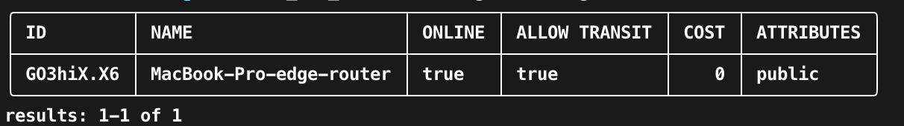

This page is intended to explain the steps that happen automatically when the expressInstall function is executed. 
The [Local - No Docker](/docusaurus/docs/learn/quickstarts/network/local-no-docker.md), 
[Local - With Docker](/docusaurus/docs/learn/quickstarts/network/local-with-docker.md), 
[Local - Docker Compose](/docusaurus/docs/learn/quickstarts/network/local-docker-compose.md), and 
[Host OpenZiti Anywhere](/docusaurus/docs/learn/quickstarts/network/hosted.md) quickstarts all run the `expressInstall` 
function. Each version varies slightly. This page will focus on the Host OpenZiti Anywhere quickstart.

## The General Process
1. Establish environment variables
2. Create a directory for network related files
3. Obtain the Ziti binary
4. Create a PKI
5. Create a Controller configuration
6. Initialize the Controller
7. Start the Controller
8. Create a Router configuration
9. Create a Router entity on the network (via the Controller)
10. Enroll the Router previously created
11. Run the Router
12. Add default Edge Router and Service Edge Router policies.

## General Environment Setup

### Declare Variables

The first thing `expressInstall` will do is establish numerous environment variables used throughout the script. Some 
important variables are listed below.

- `ZITI_HOME` is the directory `expressInstall` will use to create and store the network files. The directory will be 
created if it does not exist already.
- `ZITI_BIN_DIR` is the directory where the ziti binary will be downloaded and extracted
- `ZITI_USER` is the username for the controller's admin user, this value defaults to `admin`
- `ZITI_PWD` is the password that will be used when logging into the controller as the default user (admin).
- `ZITI_NETWORK` is used throughout the setup for naming files, network elements, etc. This value defaults to the 
hostname of the device the network is being installed on. 

```
export ZITI_HOME="${HOME}/.ziti"
export ZITI_BIN_DIR="${ZITI_HOME}/ziti_bin"
export ZITI_USER=admin
export ZITI_PWD=admin2
export ZITI_NETWORK=$(hostname -s)
```

### Create Directory

Create a directory where the network files will be stored.

```
mkdir -p "${ZITI_HOME}"
```

### Obtain Ziti Binary

The ziti binary is required to set up the network. The `expressInstall` function will call `getZiti` to obtain the Ziti 
binary. The `getZiti` function detects your OS type and architecture to craft the specific download URL for the binary. 
The binary is downloaded, and extracted to the location specified by the `ZITI_BIN_DIR` environment variable. Visit the 
[releases](https://github.com/openziti/ziti/releases) page to get the appropriate URL.
:::note
you don't have to always run expressInstall when running the quickstart. you can source the ziti-cli-function.sh file 
and run getZiti to get the latest version of ziti installed quickly and easily
:::

```
mkdir -p "${ZITI_BIN_DIR}"
curl -L <release-url> -o "${ZITI_BIN_DIR}/ziti-bin.gz"
tar -xf "${ZITI_BIN_DIR}/ziti-bin.gz" --directory "${ZITI_BIN_DIR}"
chmod +x "${ZITI_BIN_DIR}/ziti"
```

## Create PKI

As part of the `expressInstall` a PKI is generated automatically. The following represents the process of generating 
the PKI. The PKI consists of a root CA, three intermediate CAs (one for each of the controller's config sections. 
Additionally, an extra intermediate CA is created on the signing cert to demonstrate that arbitrary cert chain lengths 
are acceptable.)

### Setup

Set some initial environment variables for setting up the PKI. The `CA_NAME` values can be any name of your choosing.

- `ZITI_PKI` is the directory where your PKI files will be stored
- `ZITI_ROOT_CA_NAME` is the name of the root CA.
- `ZITI_EXTERNAL_CA_INTERMEDIATE_NAME` is the name of an intermediate CA.
- `ZITI_CTRL_CA_NAME` is the name of the control plane CA.
- `ZITI_EDGE_CA_NAME` is the name of the HTTP API CA
- `ZITI_SIGN_CA_NAME` is the name of the signer CA used to sign identities created for the network.

```
export ZITI_PKI="${ZITI_HOME}/pki"
export ZITI_ROOT_CA_NAME="my.root.ca"
export ZITI_EXTERNAL_CA_INTERMEDIATE_NAME="intermediate.from.external.ca"
export ZITI_CTRL_CA_NAME="${ZITI_NETWORK}-network-components"
export ZITI_EDGE_CA_NAME="${ZITI_NETWORK}-edge"
export ZITI_SIGN_CA_NAME="${ZITI_NETWORK}-identities"
```

### Creating the Certificate Authorities

The following creates all of the CAs and files using the environment variables set up previously.

```
"${ZITI_BIN_DIR}/ziti" pki create ca \
  --pki-root="${ZITI_PKI}" \
  --ca-name "${ZITI_ROOT_CA_NAME}" \
  --ca-file "${ZITI_ROOT_CA_NAME}"
  
"${ZITI_BIN_DIR}/ziti" pki create intermediate \
  --pki-root="${ZITI_PKI}" \
  --ca-name "${ZITI_ROOT_CA_NAME}" \
  --intermediate-name "${ZITI_EXTERNAL_CA_INTERMEDIATE_NAME}" \
  --intermediate-file "${ZITI_EXTERNAL_CA_INTERMEDIATE_NAME}" \
  --max-path-len "2"

"${ZITI_BIN_DIR}/ziti" pki create intermediate \
  --pki-root="${ZITI_PKI}" \
  --ca-name "${ZITI_EXTERNAL_CA_INTERMEDIATE_NAME}" \
  --intermediate-name "${ZITI_CTRL_CA_NAME}" \
  --intermediate-file "${ZITI_CTRL_CA_NAME}" \
  --max-path-len "1"
  
"${ZITI_BIN_DIR}/ziti" pki create intermediate \
  --pki-root="${ZITI_PKI}" \
  --ca-name "${ZITI_EXTERNAL_CA_INTERMEDIATE_NAME}" \
  --intermediate-name "${ZITI_EDGE_CA_NAME}" \
  --intermediate-file "${ZITI_EDGE_CA_NAME}" \
  --max-path-len "1"
  
"${ZITI_BIN_DIR}/ziti" pki create intermediate \
  --pki-root="${ZITI_PKI}" \
  --ca-name "${ZITI_EXTERNAL_CA_INTERMEDIATE_NAME}" \
  --intermediate-name "${ZITI_SIGN_CA_NAME}" \
  --intermediate-file "${ZITI_SIGN_CA_NAME}" \
  --max-path-len "1"
```

### Create Server and Client Certs for the Control Plane

Set up some initial values for the server and client certificates.

- `ZITI_NETWORK_COMPONENTS_PKI_NAME` is the key file name.
- `ZITI_NETWORK_COMPONENTS_ADDRESSES` is a comma-separated list of DNS names to add to the SANs.
- `ZITI_NETWORK_COMPONENTS_IPS` is a comma-separated list of IPs to add to the SANs.

```
ZITI_NETWORK_COMPONENTS_PKI_NAME="ziti.network.components"
ZITI_NETWORK_COMPONENTS_ADDRESSES="localhost,${ZITI_NETWORK},some.other.name,and.another.name"
ZITI_NETWORK_COMPONENTS_IPS="127.0.0.1,127.0.21.71,192.168.100.100"
```

Now we’ll create the key, client, and server certs for the control plane.

```
"${ZITI_BIN_DIR}/ziti" pki create key \
  --pki-root="${ZITI_PKI}" \
  --ca-name "${ZITI_CTRL_CA_NAME}" \
  --key-file "${ZITI_NETWORK_COMPONENTS_PKI_NAME}"

"${ZITI_BIN_DIR}/ziti" pki create server \
  --pki-root="${ZITI_PKI}" \
  --ca-name "${ZITI_CTRL_CA_NAME}" \
  --key-file "${ZITI_NETWORK_COMPONENTS_PKI_NAME}" \
  --server-file "${ZITI_NETWORK_COMPONENTS_PKI_NAME}-server" \
  --server-name "${ZITI_NETWORK_COMPONENTS_PKI_NAME}-server" \
  --dns "${ZITI_NETWORK_COMPONENTS_ADDRESSES}" \
  --ip "${ZITI_NETWORK_COMPONENTS_IPS}"

"${ZITI_BIN_DIR}/ziti" pki create client \
  --pki-root="${ZITI_PKI}" \
  --ca-name "${ZITI_CTRL_CA_NAME}" \
  --key-file "${ZITI_NETWORK_COMPONENTS_PKI_NAME}" \
  --client-file "${ZITI_NETWORK_COMPONENTS_PKI_NAME}-client" \
  --client-name "${ZITI_NETWORK_COMPONENTS_PKI_NAME}"
```

### Create Server and Client Certs for the HTTP API

Set up some initial values for the server and client certificates. As with the control plane, these are for the key file name, DNS, and IP SANs. The DNS and IP lists are reused from the control plane cert generation.

```
ZITI_EDGE_API_PKI_NAME="ziti.edge.controller"
ZITI_EDGE_API_ADDRESSES="${ZITI_NETWORK_COMPONENTS_ADDRESSES}"
ZITI_EDGE_API_IPS="${ZITI_NETWORK_COMPONENTS_IPS}"
```

Now we’ll create the key, client, and server certs for the HTTP API.

```
"${ZITI_BIN_DIR}/ziti" pki create key \
  --pki-root="${ZITI_PKI}" \
  --ca-name "${ZITI_EDGE_CA_NAME}" \
  --key-file "${ZITI_EDGE_API_PKI_NAME}"
  
"${ZITI_BIN_DIR}/ziti" pki create server \
  --pki-root="${ZITI_PKI}" \
  --ca-name "${ZITI_EDGE_CA_NAME}" \
  --key-file "${ZITI_EDGE_API_PKI_NAME}" \
  --server-file "${ZITI_EDGE_API_PKI_NAME}-server" \
  --server-name "${ZITI_EDGE_API_PKI_NAME}-server" \
  --dns "${ZITI_EDGE_API_ADDRESSES}" \
  --ip "${ZITI_EDGE_API_IPS}"

"${ZITI_BIN_DIR}/ziti" pki create client \
  --pki-root="${ZITI_PKI}" \
  --ca-name "${ZITI_EDGE_CA_NAME}" \
  --key-file "${ZITI_EDGE_API_PKI_NAME}" \
  --client-file "${ZITI_EDGE_API_PKI_NAME}-client" \
  --client-name "${ZITI_EDGE_API_PKI_NAME}"
```

### Update the CA Bundle

The latest tunnelers require full and complete PKIs, not arbitrary trust anchors. Therefore, the root and intermediate 
CAs must be added to the CA bundle. Additionally, the file is copied for the HTTP API CA bundle.

```
cat "${ZITI_PKI}/my.root.ca/certs/my.root.ca.cert" > "${ZITI_PKI}/${ZITI_NETWORK}-network-components/cas.pem"
cat "${ZITI_PKI}/my.root.ca/certs/intermediate.from.external.ca.cert" >> "${ZITI_PKI}/${ZITI_NETWORK}-network-components/cas.pem"
cp "${ZITI_PKI}/${ZITI_NETWORK}-network-components/cas.pem" "${ZITI_PKI}/${ZITI_NETWORK}-edge/edge.cas.pem"
```

## Create Controller

### Setup

Declare some environment variables used to generate the controller config file. Some environment variables used were already set previously.

- `ZITI_CTRL_ADVERTISED_ADDRESS` is the address for the controller’s control plane
- `ZITI_CTRL_EDGE_ADVERTISED_ADDRESS` is the address for the HTTP API
- `ZITI_CTRL_ADVERTISED_PORT` is the port for the control plane
- `ZITI_CTRL_EDGE_ADVERTISED_PORT` is the port for the HTTP API

The following are locations of PKI files.

- `ZITI_PKI_CTRL_KEY`
- `ZITI_PKI_CTRL_SERVER_CERT`
- `ZITI_PKI_CTRL_CERT`
- `ZITI_PKI_CTRL_CA`
- `ZITI_PKI_EDGE_KEY`
- `ZITI_PKI_EDGE_SERVER_CERT`
- `ZITI_PKI_EDGE_CERT`
- `ZITI_PKI_EDGE_CA`
- `ZITI_PKI_SIGNER_KEY`
- `ZITI_PKI_SIGNER_CERT`

```
export ZITI_CTRL_ADVERTISED_ADDRESS="${ZITI_NETWORK}"
export ZITI_CTRL_EDGE_ADVERTISED_ADDRESS="${ZITI_NETWORK}"
export ZITI_CTRL_ADVERTISED_PORT=8440
export ZITI_CTRL_EDGE_ADVERTISED_PORT=8441

export ZITI_PKI_CTRL_KEY="${ZITI_PKI}/${ZITI_CTRL_CA_NAME}/keys/${ZITI_NETWORK_COMPONENTS_PKI_NAME}.key"
export ZITI_PKI_CTRL_SERVER_CERT="${ZITI_PKI}/${ZITI_CTRL_CA_NAME}/certs/${ZITI_NETWORK_COMPONENTS_PKI_NAME}-server.chain.pem"
export ZITI_PKI_CTRL_CERT="${ZITI_PKI}/${ZITI_CTRL_CA_NAME}/certs/${ZITI_NETWORK_COMPONENTS_PKI_NAME}-client.cert"
export ZITI_PKI_CTRL_CA="${ZITI_PKI}/${ZITI_CTRL_CA_NAME}/cas.pem"

export ZITI_PKI_EDGE_KEY="${ZITI_PKI}/${ZITI_EDGE_CA_NAME}/keys/${ZITI_EDGE_API_PKI_NAME}.key"
export ZITI_PKI_EDGE_SERVER_CERT="${ZITI_PKI}/${ZITI_EDGE_CA_NAME}/certs/${ZITI_EDGE_API_PKI_NAME}-server.chain.pem"
export ZITI_PKI_EDGE_CERT="${ZITI_PKI}/${ZITI_EDGE_CA_NAME}/certs/${ZITI_EDGE_API_PKI_NAME}-client.cert"
export ZITI_PKI_EDGE_CA="${ZITI_PKI}/${ZITI_EDGE_CA_NAME}/edge.cas.pem"

export ZITI_PKI_SIGNER_KEY="${ZITI_PKI}/${ZITI_SIGN_CA_NAME}/keys/${ZITI_SIGN_CA_NAME}.key"
export ZITI_PKI_SIGNER_CERT="${ZITI_PKI}/${ZITI_SIGN_CA_NAME}/certs/${ZITI_SIGN_CA_NAME}.chain.pem"
```

### Create the Controller Config File

The controller config file is populated based on the values of environment variables set up to this point.

```
"${ZITI_BIN_DIR}/ziti" create config controller >${ZITI_HOME}/${ZITI_NETWORK}.yaml
```

### Initialize the Controller

Initializing the controller initializes the database.

```
mkdir ${ZITI_HOME}/db
"${ZITI_BIN_DIR}/ziti" controller edge init "${ZITI_HOME}/${ZITI_NETWORK}.yaml" -u $ZITI_USER -p $ZITI_PWD
```

### Run the Controller

```
"${ZITI_BIN_DIR}/ziti" controller run ${ZITI_HOME}/${ZITI_NETWORK}.yaml &> ${ZITI_HOME}/${ZITI_NETWORK}.log &
```

### Wait for the Controller

The controller is used to create the router identity and therefore, must be up and running, ready to receive commands.

```
while [[ "$(curl -w "%{http_code}" -m 1 -s -k -o /dev/null https://${ZITI_CTRL_ADVERTISED_ADDRESS}:${ZITI_CTRL_EDGE_ADVERTISED_PORT}/edge/client/v1/version)" != "200" ]]; do
  echo "waiting for https://${ZITI_CTRL_ADVERTISED_ADDRESS}:${ZITI_CTRL_EDGE_ADVERTISED_PORT}"
  sleep 1
done
```

## Create Router

### Create the Router Config File

Just as with the controller, we need to create a router config file. The router config also uses values set in environment variables up to this point.

```
"${ZITI_BIN_DIR}/ziti" create config router edge --routerName ${ZITI_NETWORK}-edge-router >${ZITI_HOME}/${ZITI_NETWORK}-edge-router.yaml
```

### Create the Router Entity

The router needs to be created through the controller. This will generate a one-time token to be used during enrollment.

```
# We have to log in first
"${ZITI_BIN_DIR}/ziti" edge login ${ZITI_CTRL_ADVERTISED_ADDRESS}:${ZITI_CTRL_EDGE_ADVERTISED_PORT} -u admin -p $ZITI_PWD -y

"${ZITI_BIN_DIR}/ziti" edge create edge-router ${ZITI_NETWORK}-edge-router -o ${ZITI_HOME}/${ZITI_NETWORK}-edge-router.jwt -t -a public
```

### Enroll the Router with the Controller

Enroll the router with the controller utilizing the config file and enrollment token previously generated.

```
"${ZITI_BIN_DIR}/ziti" router enroll ${ZITI_HOME}/${ZITI_NETWORK}-edge-router.yaml --jwt ${ZITI_HOME}/${ZITI_NETWORK}-edge-router.jwt
```

### Run the Router

```
"${ZITI_BIN_DIR}/ziti" router run "${ZITI_HOME}/${ZITI_NETWORK}-edge-router.yaml" &> ${ZITI_HOME}/${ZITI_NETWORK}-edge-router.log &
```

## Confirm the Network is Up

Log in and run a command to list the edge routers and we should see a single edge router showing `ONLINE`.

```
# The session may have expired, log in just to be safe
"${ZITI_BIN_DIR}/ziti" edge login ${ZITI_CTRL_ADVERTISED_ADDRESS}:${ZITI_CTRL_EDGE_ADVERTISED_PORT} -u admin -p $ZITI_PWD -y
"${ZITI_BIN_DIR}/ziti" edge list edge-routers
```

