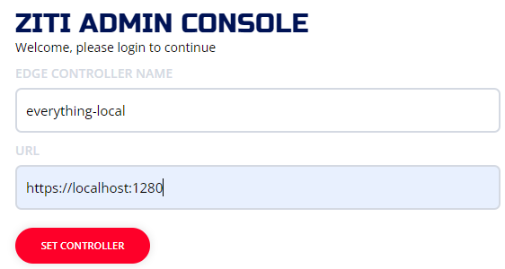
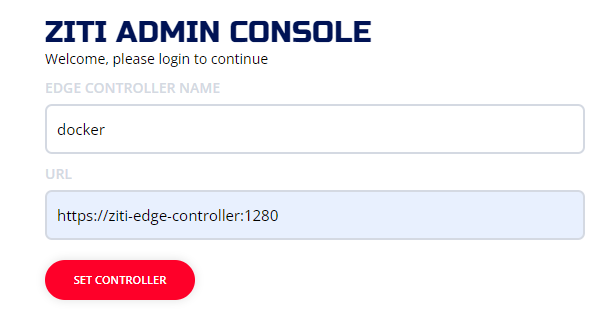

import Wizardly from '@site/src/components/Wizardly';

The Ziti Administration Console (ZAC) is a web UI provided by the OpenZiti project which will allow you to configure and
explore a [network](/learn/introduction/index.mdx).

## Overview

 These steps enable the console for a quickstart controller. Run these commands with a shell like `bash` in a Windows Subsystem for Linux (WSL), macOS, or Linux.

## Downloading From GitHub

With ZAC 3.0+, the ZAC has been transformed to a single-page-application (SPA) allowing you to download an artifact 
from GitHub and host the ZAC however you like. The controller was also modified to allow the ZAC to be hosted by the 
controller. These steps are applicable to both the [Local - No Docker](/learn/quickstarts/network/local-no-docker) 
and the [hosted yourself](/learn/quickstarts/network/hosted) deployments. When complete, the controller will host
the ZAC on the management API web binding.

1. On the controller host, download any console version >= 3.0.0 from GitHub.

    ```text
    wget https://github.com/openziti/ziti-console/releases/latest/download/ziti-console.zip
    ```

1. Ensure `ZITI_HOME` is set to your quickstart working directory and exported to forked processes. You can always restore the quickstart environment variables by sourcing the environment file.

   ```text
   source ${HOME}/.ziti/quickstart/$(hostname)/$(hostname).env
   echo $ZITI_HOME
   ```

1. Unzip the console in the controller's working directory.

    ```text
    unzip -d ${ZITI_HOME}/console ./ziti-console.zip
    ```

1. In **${ZITI_HOME}/$(hostname -s).yaml**, add a web API binding `zac` in the list containing `edge-management`.

    ```text
          - binding: zac
            options:
              location: ./console
              indexFile: index.html
    ```

1. Restart the controller service to apply the changes.

    ```text
    sudo systemctl restart ziti-controller.service
    ```

1. Navigate to the console in your web browser using whatever port the management API is configured for. Depending 
   on which quickstart you have used, the port may be different. The "Local" quickstart defaults to port 1280 while 
   the "Host OpenZiti Anywhere" quickstart defaults to 8441 and is customizable by you. Make sure you are using the 
   advertised host and port for your managment API, e.g., `https://ctrl.ziti.example.com:1280/zac/`

## Using Docker

### Copy PKI From Controller

It's a good idea to use TLS everywhere. To do this, you'll need to provide ZAC a key and a certificate.
If you have used the [Local - With Docker](/learn/quickstarts/network/local-with-docker) quickstart to start
the network you can copy the certificates generated when the controller started.
Shown is an example which copies the certs from the OpenZiti container and uses them with ZAC. We'll copy the files
from the docker named volume `myPersistentZitiFiles` and put them into a folder at `$HOME/.ziti/zac-pki`.

```text
mkdir -p $HOME/.ziti/zac-pki

docker run -it --rm --name temp \
  -v myPersistentZitiFiles:/persistent \
  -v $HOME/.ziti/zac-pki:/zac-pki busybox \
  cp /persistent/pki/ziti-edge-controller-intermediate/keys/ziti-edge-controller-server.key /zac-pki
  
docker run -it --rm --name temp \
  -v myPersistentZitiFiles:/persistent \
  -v $HOME/.ziti/zac-pki:/zac-pki busybox \
  cp /persistent/pki/ziti-edge-controller-intermediate/certs/ziti-edge-controller-server.chain.pem /zac-pki
```

### Starting ZAC

With the certificates copied, you will be able to start the ZAC using one Docker command. Also notice the command
will expose the ZAC http and https ports to your local computer so that you can access the ZAC from outside of Docker.
If you customized any of these paths, you'll need to replace the paths specified accordingly (the '-v' lines).

 ```text
 docker run --rm \
        --name zac \
        -p 1408:1408 \
        -p 8443:8443 \
        -v "$HOME/.ziti/zac-pki/ziti-edge-controller-server.key":/usr/src/app/server.key \
        -v "$HOME/.ziti/zac-pki/ziti-edge-controller-server.chain.pem":/usr/src/app/server.chain.pem \
        openziti/zac
 ```

:::note
Do note that if you are exposing ports as shown above, you will need to ensure that `ziti-edge-controller` is
addressable by your machine in order to use Docker in this way. This guide does not go into how to do this in depth.
One easy, and common mechanism to do this would be to edit the 'hosts' file of your operating system. A quick
internet search should show you how to accomplish this.
:::

## Docker Compose

If you have followed the [Local - Docker Compose](/learn/quickstarts/network/local-docker-compose) quickstart you will have the ZAC
running already. It's now included with both the default docker-compose file and the simplified-docker-compose file.
Both compose files will start and expose the ZAC ports on 1408/8443.

:::note
Do note that if you are exposing ports as shown above, you will need to ensure that `ziti-edge-controller` is
addressable by your machine in order to use Docker in this way. This guide does not go into how to do this in depth.
One easy, and common mechanism to do this would be to edit the 'hosts' file of your operating system. A quick
internet search should show you how to accomplish this.
:::

## Kubernetes

[Kubernetes deployment guide](/docs/guides/deployments/30-kubernetes//kubernetes-console.mdx).

## Login and use ZAC

1. At this point you should be able to navigate to: `https://${ZITI_CTRL_EDGE_ADVERTISED_ADDRESS}:8443`and see the ZAC login
   screen. (The TLS warnings your browser will show you are normal - it's because these steps use a self-signed certificate
   generated during the installation process)

   :::note
   If you are using docker-compose to start your network, when you access ZAC for the first time you will need to
   specify the url of the controller. Since everything is running **in** docker compose this url is relative to the
   internal docker compose network that is declared in the compose file. You would enter
   `https://ziti-edge-controller:1280` as the controller's URL
   :::

2. Set the controller as shown (use the correct URL):

    1. Example using the "everything local" quickstart:
       

    2. Example using the "docker-compose" quickstart:
       

    3. Example using AWS "host it anywhere":
       

3. Optionally, [**change admin's password**](/learn/quickstarts/network/help/change-admin-password#ziti-console)

<Wizardly></Wizardly>
