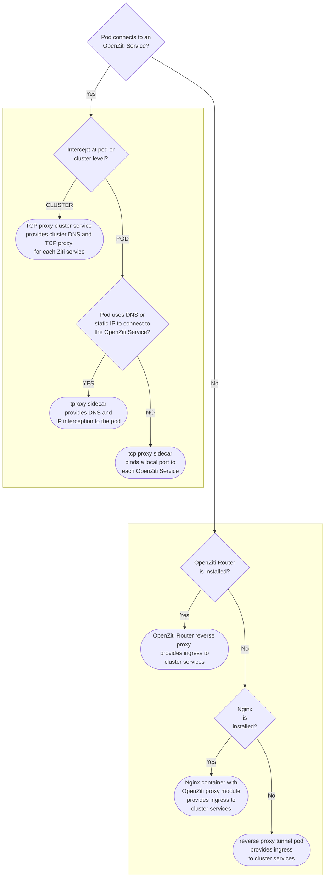

This guide will help you discover the best strategy and tool for connecting a Kubernetes workload. This overview page links to child pages for each strategy and tool, and a summary of each is provided in the sections below. Click on the chart's outcomes to see the corresponding documentation.

## Strategies and Solutions

In the chart above, there are several strategies and solutions for connecting a Kubernetes workload. The following sections describe each strategy and solution in more detail. These are organized into two main categories: ingress to cluster services, and intercepting pod egress.

### Intercepting Pod Egress

An OpenZiti Tunneler can be used to intercept pod egress. One important thing to know is that the OpenZiti Tunneler that is used in this way may also be used to "host" OpenZiti Services in order to provide ingress to cluster services.

<!-- #### [Node Proxy Daemonset](./kubernetes-daemonset.md)

Deploying a daemonset of privileged `ziti-edge-tunnel run` pods on selected nodes is a simple way to enable OpenZiti services in a cluster. The daemonset pods intercept egress from pods and provide a DNS nameserver for CoreDNS. Like any other OpenZiti Tunneler, the OpenZiti Identity used by the daemonset may be configured to host OpenZiti Services, i.e. provide OpenZiti ingress to cluster services. For more information, see the [node proxy](./kubernetes-daemonset.md) page. -->

#### [Transparent Proxy Sidecar](./kubernetes-sidecar.md)

You can deploy a transparent proxy sidecar to intercept pod egress. The sidecar provides a DNS nameserver that is used by the workload application to resolve OpenZiti Service addresses. The sidecar container runs `ziti tunnel tproxy` to create IPTables TPROXY rules in the pod. For more information, see the [transparent proxy sidecar](./kubernetes-sidecar.md) quickstart.

#### [TCP Proxy Sidecar](./kubernetes-sidecar.md)

You can deploy a loopback proxy sidecar for pod egress to OpenZiti Services. The sidecar binds OpenZiti Services to a local port on the pod's loopback interface, e.g., 127.0.0.1:8443. The workload application must be configured to connect to the local port. This mode of operation has a few differences in comparison to the [transparent proxy sidecar](./kubernetes-sidecar.md) quickstart.

1. The sidecar container runs `ziti tunnel proxy` instead of `ziti tunnel tproxy`.
2. The sidecar container does not need the CAP_NET_ADMIN capability.
3. The sidecar container does not need a `dnsPolicy` or explicit nameserver.

#### [TCP Proxy Cluster Service](/guides/deployments/30-kubernetes//kubernetes-router.mdx)

The OpenZiti Router can be deployed to provide a cluster-wide proxy for OpenZiti Services, optionally exposing the Ziti Services' proxy ports with an Ingress or LoadBalancer. This is accomplished by first creating the router with tunnel mode enabled, then deploying the router Helm chart with input values specifying each Ziti Service for which the router's tunnel identity is authorized by a Dial Service Policy. For more information, see the [OpenZiti Router](/guides/deployments/30-kubernetes//kubernetes-router.mdx) page. 

### Ingress to Cluster Services

Any OpenZiti Tunneler can be used to "host" an OpenZiti Service. This hosting begins a few moments after an OpenZiti Service becomes authorized for the OpenZiti Identity in use by the SDK. This section is about different ways to deploy an OpenZiti Tunneler to provide ingress to cluster services.

#### [Reverse Proxy Router Pod](/guides/deployments/30-kubernetes//kubernetes-router.mdx)

The OpenZiti Router's built-in tunneler can reverse-proxy cluster services for Ziti clients. This is accomplished by creating the router with tunneler mode enabled, and then installing the OpenZiti Router Helm chart with the tunneler mode set to `host` (the default). For more information, see the [OpenZiti Router](/guides/deployments/30-kubernetes//kubernetes-router.mdx) page.

#### [Nginx Proxy Module](/reference/tunnelers/90-nginx.mdx)

The OpenZiti Nginx Proxy Module can be used to provide ingress to cluster services. The module binds OpenZiti Services to an Nginx stream context and forward requests to the configured upstreams. Unlike the rest of these solutions, the Nginx module is not a full tunneler. The main difference for writing OpenZiti configurations for the module is that it will honor the upstreams that are set in the Nginx configuration, ignoring the `host.v1` addresses set in the OpenZiti config. For more information, see the [Nginx Proxy Module guide](/reference/tunnelers/90-nginx.mdx).

#### [Reverse Proxy Tunnel Pod](./kubernetes-host.mdx)

The `ziti-host` Helm chart deploys a headless service and can be used to provide ingress cluster services. The pod runs `ziti-edge-tunnel run-host` to bind OpenZiti Services and forwards requests arriving via OpenZiti to their configured host addresses inside the cluster. For more information, see the [ziti-host](./kubernetes-host.mdx) page.
